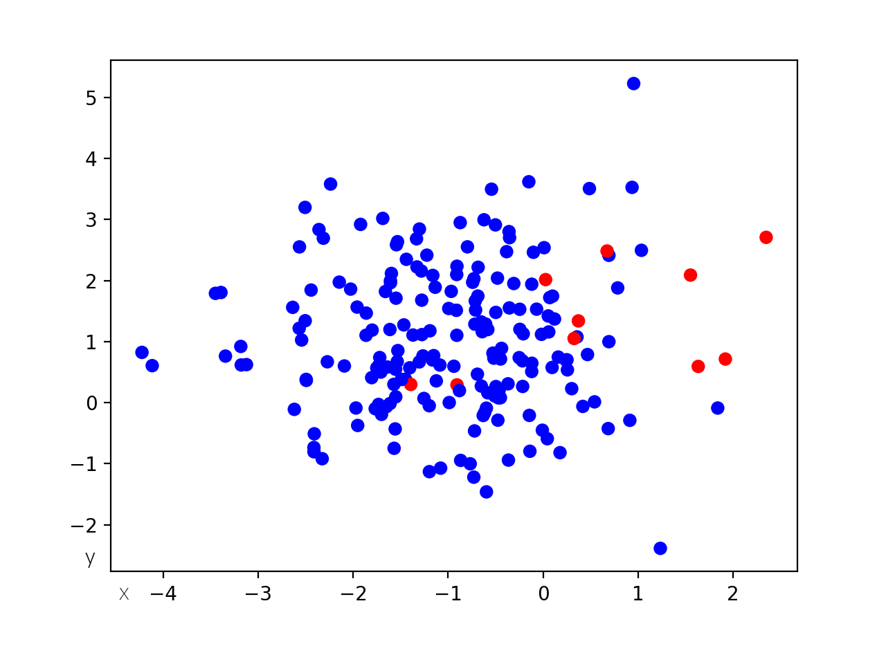

\newtheorem{theorem}{Twierdzenie}
<!-- -------------------------------- -->

\tableofcontents

\newpage\null\newpage

# Wstęp

## Wprowadzenie

__Celem pracy jest porównanie różnych metod selekcji cech w problemie trenowania algorytmów uczenia maszynowego na danych niezbalansowanych. W jej ramach, przedstawione i opisane zostaną popularne obecnie metody selekcji oraz przeprowadzone zostaną eksperymenty dla przykadowych zbiorów danych, zarówno rzeczywistych jak i syntetycznych, celem których będzie stworzenie rankingu algorytmów. Autor sprawdził, jak właściwie przeprowadzona selekcja wpływa na jakość wyników dostarczanych przez klasyfikator i jak przytoczone przez niego metody radzą sobie z danymi, w których występuje znaczna przewaga liczebności jednej
bądź kilku klas. Aspekt inżynieryjny polegał na implementacji zaproponowanych w pracy eksperymentów, co pozwoliło na kompleksowe porównanie algorytmów.__

\vspace{3mm}
Praca swoim zakresem objęła porównanie popularnych metod selekcji cech w ramach kilku wybranych zbiorów danych. Napisany w jej ramach program pozwala na kompleksowe porównanie wyników różnych algorytmów przetestowanych na kilku zestawach danych. Dane te posłużyć mogą do wyboru najodpowiedniejszej metody we wszelkich problemach klasyfikacyjnych, w których elementy wykazują szczególną nadreprezentacje jednej bądź kilku klas. Zawarte w pracy podsumowanie zawrze wyniki przeprowadzonych przez autora badań.

\vspace{3mm}
__Praca składa się z czterech rozdziałów:__

<!-- TODO: za dużo słów rozdział -->

\vspace{3mm}
__Rozdział pierwszy__: Na rozdział pierwszy skłądają się omówienie analizy wybranego problemu, przedstawienie motywacji podjęcia tego tematu oraz przegląd literatury. Zostały opisane w nim również podstawowe metody selekcji cech i wyjaśnienie różnicy pomiędzy selekcją oraz ekstrakcją. Szczegółowa charakterystyka zagadnienia opisana w rozdziale zawiera opis problemu jakim jest niezrównoważnony rozkład klas w algorytmie uczenia maszynowego. Rozdział zawiera też szczegółowy opis poszczególnych, wykorzystanych później metod selekcji, wraz z ich matematyczną interpretacją.

\vspace{3mm}
__Rozdział drugi__: Założenia i plan eksperymentu. W rodziale drugim zawarte zostaną informacje związane z inżynieryjnym aspektem pracy, czyli projekt systemu, plan poszczególnych ekpserymentów i opis danych, jakie użyte zostaną podczas doświadczeń. Swoim zakresem rozdział obejmie krótki opis użytych przez autora bibliotek oraz wykorzystywanych funkcji. Znajdą się tutaj również instrunkcje instalacji i wdrożenia systemu dla potencjalnych środowisk docelowych.

\vspace{3mm}
__Rozdział trzeci__: Rozdział zawiera podsumawnie uzyskanyh wyników oraz przedstawienie ich w czytelny i zrozumiały sposób. 
<!-- TODO: -->

\vspace{3mm}
__Rozdział czwarty__: W rozdziale piątym zawarta zostanie interpretacja oraz konfrontacja wyniki z hipotezą postawioną na początku pracy. Przedstawione zostaną ewentualne możliwości rozwoju projektu.
<!-- TODO: -->

\vspace{3mm}
Udało się zrealizować wszystkie postawione cele.

\newpage\null\newpage

# Analiza problemu

__Uczenie maszynowe to bardzo dynamicznie rozwijająca się gałąź informatyki. Niezwykła ekspansja wynika z zapotrzebowania na wykrywanie prawidłowości, uogólnianie oraz precyzowanie danych. Takie możliwości pozwoliły znaleźć zastosowanie dla algorytmów sztucznej inteligencji w bardzo wielu różnych branżach - począwszy od medycyny, poprzez finanse, produkcję i branżę rozrywkową. Tak duży przekrój różnych zastosowań wymaga ciągłego ulepszania istniejących już wzorców oraz wymyślania nowych, lepszych i bardziej efektywnych algorytmów. W większości praktycznych problemów do klasyfikacji obiektów, autor programista na dużej liczbie cech. Warto jednak pamiętać, że w tym przypadku wiele, nie oznacza lepszych rezultatów. Należy przytoczyć pojęcie "przekleństwa wielowymiarowości"[9]. Oznacza ono, że większy wymiar wymaga od programisty znacznie większej liczby danych, oraz wraz ze wzrostem liczby cech wykładniczo rośnie liczba możliwych wariantów dopasowań, co znacznie zwiększa złożoność obliczeniową naszych algorytmów.__

\vspace{3mm}
Aby uniknąć problemów generowanych przez zbyt dużą ilość cech, a jednocześnie wykorzystać cech, które zapewniają jak najlepszą separowalność klas, zazwyczaj pierwszym krokiem w zadaniu klasyfikacji jest selekcja lub ekstrakcja najodpowiedniejszych cech [17].

## Przegląd literatury

Zarówno sam problem selekcji cech jak i sposoby radzenia sobie z nierównomiernym rozkładem klas to - szczególnie w ostatnich latach - często poruszany problem, co skutkuje dużym przekrojem prac, również w ujęciu czysto dziedzinowym - jak wykorzystanie konkretnych algorytmów dla bardzo konkretnych zastosowań.

<!-- TODO: Do poprawy -->
Wstępną analizę problemu przedstawił Jakub Piątkowski w pracy _Analiza i rozwój metod doboru cech dla dużych problemów klasyfikacyjnych_. Autor wymiania istniejące metody doboru cech i szczegółowo je opisuje [7]. Jest to dobre wprowadzenie do problematyki klasyfikacji i selekcji cech, a każda przytoczona metoda ma również podłoże matematyczne opisane odpowienimi wzorami. W podobnej pracy _Redukcja wymiarowości i selekcja cech w zadaniach klasyfikacji i regresji z wykorzystaniem uczenia maszynowego_, twórca zacytował wyniki swoich eksperymentów, które pozwoliły mu na tworzenie rankingów algorytmów [10]. Szczegółowo do problemu podszedł mgr Wiesław Chmielnicki, w swojej rozprawie: _Efektywne metody selekcji cech i rozwiązywania problemu wieloklasowego w nadzorowanej klasyfikacji danych_. Oprócz opisu znanych metod, artykuł zawiera również sugestie dotyczące nowych algorytmów hybrydowych, które w niektórych przypadkach dają lepsze wyniki niż metody tradycyjne [17]. Mark A. Hall porusza interesujący temat w swojej książce _Correlation-based Feature Selection for Machine Learning_, badając wartość zestawu cech na podstawie korelacji pomiędzy nimi. Autor przeprowadził szereg eksperymentów, porównał swoją metodę z metodami powszechnie stosowanymi, starając się między innymi wyodrębnić problemy, dla których jego algorytm jest najbardziej skuteczny [3]. Twórcy pracy _A Survey on Evolutionary Computation Approaches to Feature Selection_ zajęli się przeglądem znanych metod tworząc dokument podsumowujący każdą z nich, z jej wadami oraz zaletami. Artykuł jest oparty na przeglądzie najnowszych prac w zadanej dziedzinie i pozwala na dobranie odpowiedniej metody do zadanego zadania [2]. Ważna dla tematu tej pracy jest również rozprawa _Zastosowanie wybranych metod przekształcania i selekcji danych oraz konstrukcji cech w zadaniach klasyfikacji i klasteryzacji_ mgr inż. Piotra Płońskiego, podsumowująca niejako cały proces uczenia maszynowego i roli, jaką pełni selekcja cech w kontekscie dobrze działającego systemu analizy danych [6]. W 2008 roku Chen Xuewen i Michael Wasikowski zaproponowali metodę zwaną FAST, która opiera się na powierzchni pod krzywą ROC, która jest generowana przez równomierne rozłożenie progów granicy decyzyjnej klasyfikatora pojedynczej cechy [11]. W 2014 roku D. Tiwari opisał algorytm wyboru cech dla niezrównoważonych zbiorów danych modyfikując popularny algorytm RELIEFF, aby rozwiązać problem nierównowagi klas [12]. W przypadku klas mniejszościowych metoda ta nadaje większą wagę atrybutom, co skutkuje wyższą wagą tych klas podczas samej klasyfikacji. Inna analiza CoIL Challenge 2000 przeprowadzona przez Elkana wykazała, że zwykłe algorytmy selekcji cech nie były wystarczająco dobre do zadania klasyfikacji danych niezbalansowanych [13]. Na etapie selekcji należało rozważyć interakcję między różnymi cechami. Największą wadą, jaką znalazł w przypadku większości stosowanych metod selekcji cech, jest to, że nie rozważali oni wybierania wysoce skorelowanych cech, ponieważ uważano je za zbędne. Guyon i Elisseeff przeprowadzili solidną analizę teoretyczną. Wykazali, że same nieistotne cechy mogą być przydatne w połączeniu z innymi cechami, a połączenie dwóch silnie skorelowanych cech może być lepsze niż każda z nich niezależnie [14].

## Cel selekcji cech

Selekcja cech polega na identyfikacja tych elementów puli cech, które uznawane są za najlepsze deskryptory rozważanych kategorii. Zaletą selekcji jest możliwość zbadania tych deskryptorów, które są istotne z punktu widzenia danego zadania klasyfikacji, czyli jednocześnie zrozumienia różnic między analizowanymi kategoriami. Poprzez proces ekstrakcji cech tracimy niestety bezpowrotnie część początkowych cech. Z tego powodu nie ekstrakcja, a selekcja cech jest obecnie najpowszechniejszą strategią służącą przygotowaniu reprezentacji analizowanych danych [17].

Selekcja cech jest odpowiedzialna za wybór najbardziej istotnych atrybutów badanych obiektów, co przekłada się bezpośrednio na poprawne działanie klasyfikatora. Dyspozycja coraz większymi bazami danych zmusza do optymalizacji tego procesu. Gwałtownie rosnąca liczba cech stanowi poważny problem - powoduje nie tylko wydłużenie procesu uczenia oraz wzrost złożoności klasyfikatora, ale niesie ze sobą także ryzyko spadku prawdopodobieńśtwa poprawnej klasyfikacji. Związane jest to z tak zwanym ”przekleństwem wymiarowości” [15]. Zjawisko to zachodzi, gdy liczba cech znacznie przewyższa liczebność samego zbioru danych.
Zadaniem selekcji cech jest również lepsze zrozumienie problemu oraz zmniejszenie kosztów archiwizacji przyszłych danych. W kolejnych rozdziałach opisane zostaną trzy główne metody tworzenia algorytmów selekcji: metody rankingowe - zwane filtrami, metody opakowane oraz metody wbudowane. Dla każdej z wymienionych metod zostanie określona idea, oraz przedstawione zostaną algorytmy reprezentujące daną metodologie.

## Podstawowy podział

W kolejnych rozdziałach opisane zostaną trzy główne metody tworzenia algorytmów selekcji: metody rankingowe - zwane filtrami, metody opakowane oraz metody wbudowane [34]. Dla każdej z wymienionych metod zostanie określona idea, oraz przedstawione zostaną algorytmy reprezentujące daną metodologie [7, 10, 3].

### Metody rankingowe

Najprostsze podejście do problemu selekcji cech reprezentowane jest właśnie poprzez metody rankingowe, nazywane też filtrami [34]. Jak sama nazwa wskazuje do zadania selekcji przy pomocy metod rankingowych podchodzimy wyróżniając w zbiorze cech następujące grupy: cechy istotne, nieistotne i redundantne. Istotne to takie cechy, które odróżniają od siebie klasy, nieistotne to takie, które nie niosą informacji dla problemu klasyfikacji, a cechy redundantne to takie których role z powodzeniem mogą przejąć inne cechy. Metody rankingowe polegają więc na znalezieniu pewnej miary pozwalającej stworzyć taki ranking cech, a potem wybrać najlepsze cechy, a odrzucić najgorsze. Metody rankingowe zazwyczaj są najszybsze i - co istotne - nie zależą one od używanej metody analizy danych [4, 17]. Ich istotną wadą stanowi brak możliwości uwzględnienia zależności pomiędzy cechami [16]. Kolejne opisane typy metod selekcji cech tej wady nie posiadają. 

### Metody opakowane

Podstawowymi metodami selekcji cech są metody opakowane, tak zwane wrappery [34]. W przeciwieństwie do metod rankingowych, w których selekcja cech i klasyfikator pozostają niezależne, w algorytmach opakowanych selekcji, ocena atrybutów dokonuje się przy użyciu konkretnego modelu. To właśnie efektywność samego klasyfikatora służy za miarę skuteczności metody. Zaletą tej metody jest jej uniwersalność i dokładność, natomiast wadą - wysoka złożoność obliczeniowa [34]. Dla efektywności tych algorytmów istotny jest sposób ustalania podzbioru cech [4, 17]. Wśród wielu metod wyszukiwania tegoż, wyróżnić można najprostszą - przeszukanie całego zbioru podzbiorów. Jest to jednak rozwiązanie bardzo kosztowne. Wobec tego typowymi strategiami są: przeszukiwanie w przód, przeszukiwanie wstecz oraz tworzenie indywidualnego rankingu [6].

### Metody wbudowane

Metody wbudowane zawierają się w algorytmie klasyfikacji i to na etapie tworzenia modelu przypisuje się poszczególnym cechom wagi lub przeprowadza się ich eliminację. Do algorytmów klasyfikacji z wbudowaną metodą selekcji zaliczyć można popularne LASSO i RIDGE [2, 35, 36]. W literaturze natknąć się też można na podpięcie do tej kategorii metody wektorów nośnych (SVM) czy też analizy składowych głównych (PCA) [2]. Zaletą tych metod jest ich szybkość, ponieważ użycie ich nie wiąże się z dodatkowymi operacjami na zbiorze [2, 34, 36].

## Selekcja cech a ekstrakcja

Selekcja cech ma na celu wybranie pewnych atrybutów opisujących dane pod kątem tego, czy nadają się one do dalszego wykorzystania w klasyfikacji, przy jednoczesnym odrzuceniu innych danych [37]. Zawsze rozważana jest ona w kontekście kolejnych zadań i nie można oceniać jej skuteczności w oderwaniu od wyników metody klasyfikacji wykorzystującej wybrane cechy. W większości przypadków budowany jest złożony model, który może zawierać jeden lub więcej algorytmów selekcji i co najmniej jeden klasyfikator. Ekstrakcja cech natomiast polega na utworzeniu nowego zestawu atrybutów poprzez liniową lub nieliniową kombinację oryginalnych danych. W przeciwieństwie do selekcji, gdzie celem jest zawsze uzyskanie podzbioru wszystkich atrybutów, wykorzystanie ekstrakcji wiąże się z wymiarem przestrzennym mniejszym, równy lub nawet większy od wymiaru przestrzeni startowej [37].

## Problem niezrównoważonego rozkładu klas

Wsród wielu dobrze zbadanych i szeroko wykorzystywanych rozwiązań bazujących na uczeniu maszynowym, najbardziej obiecującymi są te, mające ratować ludzkie życie.
Złożone choroby, takie jak rak mózgu, stanowią poważne dla niego zagrożenie. Postęp w dziedzinie sztucznej inteligencji i metodach statystycznych stworzyły nowe możliwości klasyfikacji i diagnozy najbardziej śmiertelnych chorób, takich jak rak, choroba Alzheimera, cukrzyca itp [17]. Z przypadkami takimi wiąże się jednak problem niezrównoważonej dystrybucji klas [38].

Niezrównoważony rozkład klas ma miejsce, gdy co najmniej jedna klasa jest niewystarczająco reprezentowana i przytłoczona przez inne klasy. Model klasyfikacji dla niezrównoważonych danych stwarza wiele przeszkód w uczeniu się algorytmów i przedstawia liczne konsekwencje dla rzeczywistych zastosowań. Ten problem powoduje niedocenianie przykładów klas mniejszościowych i powoduje niedokładne wyniki klasyfikacji w stosunku do przykładów klas większościowych. Klasyfikacja  niezrównoważonego zbioru danych staje się trudniejsza przy ograniczonej liczbie próbek i ogromnej liczbie cech. Przykład takiego problemu zaobserwować można na poniższej grafice.
<!-- TODO: Grafika z numerkiem -->
Zawiera ona 200 elementów z których tylko 5% należy do klasy mniejszościowej - czerwonej.

Taka sytuacja jest problemem, ponieważ większość tradycyjnych algorytmów uczenia maszynowego trenowana na podobnym zbiorze, obciążona jest w stosunku do klasy bardziej licznej [19]. Jednocześnie, zazwyczaj lepsze zrozumienie klas mniej licznych jest istotniejsze z punktu widzenia problemu w ujęciu biznesowym [38]. Problemem jest również określenie jakości wyników algorytmu. Jakość klasyfikacji czyli dokładność - używana jako metryka ewaluacji może być w takim przypadku niewystarczająca, gdyż nawet model o skuteczności 95% - co jest na ogół wartością bardzo dobrą - mógłby nie rozpoznawać żadnego elementu klasy mniejszościowej [19].

## Metody klasyfikacji danych niezbalansowanych

Problem nierównoważnego rokładu przyciąga w ostatnim czasie zainteresowanie dużej części społeczności zajmującej się uczeniem maszynowym i eksploracją danych, zarówno ze środkowik akademickich jak i w przemyśle co znajduje odbicie w dużej liczbie statupów opierających swoje produkty i usługi na rozwiązaniach _machine-learningowych_. W ciągu kilkunastu ostatnich lat wyklarowały się trzy główne podejścia do uczenia modeli na danych niezbalansowanych [20-23]. Są to metody na poziomie danych, metody na poziomie algorytmów oraz metody hybrydowe.

### Metody na poziomie danych

Metody na poziomie danych (Data-level methods), modyfikują dostępne instancje problemu w celu jego zbalansowania. Można je dalej podzielić na podgrupy: metody próbkowania danych (data-sampling) i metody wyboru cech (feature selection methods) [18]. Metody nadpróbkowania i podpróbkowania stanowią dwie podgrupy metod próbkowania danych, w których próbkowanie danych z danego zbioru danych odbywa się losowo lub z wykorzystaniem określonego algorytmu. W procesie oversamplingu (nadpróbkowania) do danego zbioru danych dodawane są instancje klasy mniejszościowej (poprzez replikację), gdzie replikacja odbywa się losowo lub z wykorzystaniem algorytmów takich jak ADASYN [39]. W procesie undersamplingu natomiast, większość wystąpień klasy zostanie usuniętych z danego zbioru danych, a usuwanie odbywa się w dużej mierze losowo. SMOTE (Synthetic Minority Over-Sampling), to technika próbkowania polegająca na sztucznym ponownym próbkowaniu zbioru danych. Końcowym jej wynikiem jest zbiór danych o zrównoważonym rozkładzie [21]. Chociaż metody te mogą skutkować znacznie lepszymi wynikami w porównaniu z oryginalnym zestawem danych, istnieją poważne problemy związane z jej wykorzystaniem [9]. Po pobraniu zbyt małej liczby próbek wydajność klasyfikatora może ulec pogorszeniu z powodu potencjalnej utraty przydatnych przykładów klasy większości. Podobnie dodatkowe przypadki szkoleniowe wprowadzone przez nadmierne próbkowanie mogą zwiększyć złożoność obliczeniową klasyfikatora. W najgorszym przypadku dokładne kopie przykładów po nadmiernym próbkowaniu mogą prowadzić do nadmiernego dopasowania klasyfikatora [18]. Chociaż metody selekcji cech są powszechnie stosowane w celu poprawy wyników klasyfikacji, mogą one również pomóc w wyborze najbardziej wpływowych cech w celu wygenerowania unikalnej wiedzy do klasyfikacji. Zmniejsza to niekorzystny wpływ nierównowagi klas na wyniki klasyfikacji [18].

### Metody na poziomie algorytmów

Metody na poziomie algorytmów (Algorithm-level methods), modyfikują istniejące algorytmy uczenia maszynowego. Można je podzielić na metody wrażliwe na koszty (cost-sensitive methods) i metody zintegrowane [18]. Pierwsza z nich opiera się na zasadzie przypisywaniu większej wagi instancjom w przypadku błędnej klasyfikacji. Na przykład fałszywie negatywnym przewidywaniom można przypisać wyższy koszt niż fałszywie dodatnim przewidywaniom. Metody zintegrowane mogą być również stosowane jako metody wrażliwe na koszty, w przypadku których wynikiem klasyfikacji jest pewna kombinacja wielu klasyfikatorów zbudowanych na zbiorze danych [18]. Bagging i Boosting to dwa powszechne typy metod uczenia zintegrowanego [40]. Bagging minimalizuje wariancję, generując kilka zestawów uczących z danego zestawu danych i generując klasyfikator dla każdego zestawu uczącego, a następnie łącząc ich modele w celu ostatecznej klasyfikacji. Algorytmy wykorzystujące Boosting, podobne do algorytmu AdaBoost, tworzą serię klasyfikatorów, wszystkie stosowane do tego samego zestawu danych [41]. Algorytm AdaBoost  wybiera tylko te cechy, o których wiadomo, że poprawiają moc predykcyjną modelu, zmniejszając wymiarowość i potencjalnie poprawiając czas wykonania, ponieważ nieistotne cechy nie muszą być obliczane. Na początku algorytm nadaje wszystkim próbkom równe wagi i prawdopodobieństwa wylosowania w kolejnej iteracji. Po każdej iteracji prawdopodobieństwa są aktualizowane. Próbka, która została poprawnie sklasyfikowana, ma mniejsze prawdopodobieństwo, że zostanie wylosowana w następnej iteracji, a błędnie sklasyfikowana próbka ma większe prawdopodobieństwo. W rezultacie klasyfikator w dalszej części serii tworzy zestaw treningowy składający się z trudnych do sklasyfikowania próbek. Metody uczenia jednoklasowego (OOC) - czyli mającego na celu identyfikacje obiektu jednej, określonej klasy, poprzez uczenie się przede wszystkim ze zbioru zawierającego tylko obiekty tej klasy, mają na celu zwalczenie problemu overfittingu. Występije on przypadku większości klasyfikatorów uczących się na niezrównoważonych danych. Osiągane jest to poprzez podejście do tego problemu z punktu widzenia uczenia nienadzorowanego [24-26]. Algorytmy jednoklasowe są kontruowane w taki sposób, aby rozpoznawać próbki z danej klasy i odrzucać próbki z innych klas. 

### Podejścia hybrydowe

Metody hybrydowe mają na celu rozwiązanie znanych problemów spowodowanych metodami próbkowania danych, metodami wyboru cech, metodami wrażliwymi na koszty i podstawowymi algorytmami uczenia się (takimi jak Naive Bayes [42]). W niektórych przypadkach podgrupy metod na poziomie danych lub podgrupy metod na poziomie algorytmu można łączyć jako ogólną metodę rozwiązywania problemu niezbalansowania klas. Na przykład popularny klasyfikator losowego lasu (Random Forest) jest wersją oryginalnego algorytmu losowego lasu decyzyjnego (Random Decision Forest) i jest zintegrowanym algorytmem uczenia się, który dodatko implementuje Bagging [43].

## Metody oparte o selekcję cech

Pojęcie przekleństwo wymiarowości mówi, że jeśli wiele cech jest zaszumionych, koszt użycia klasyfikatora może być bardzo wysoki, a wydajność może być poważnie zaniżona [9]. Ponieważ problemowi z nierównowagą klas często towarzyszy problem dużej wymiarowości zbioru danych, zastosowanie technik selekcji cech jest koniecznym działaniem [9]. Pomysłowe techniki próbkowania i metody algorytmiczne mogą nie wystarczyć do walki z wysokowymiarowymi problemami nierównowagi klas. Van der Putten i van Someren przeanalizowali zbiory danych z CoIL Challenge 2000 i stwierdzili, że wybór cech był bardziej istotny dla dobrych wyników niż wybór algorytmu klasyfikacji i najbardziej pomogły w walce z problemem nadmiernego dopasowania [26]. Forman odnotował podobną obserwację dotyczącą wysoce niezrównoważonych problemów klasyfikacji tekstu i stwierdził, że „żaden stopień sprytnej indukcji nie może zrekompensować braku sygnału predykcyjnego w przestrzeni wejściowej” [27-29]. Badania te pokazują, że w wielowymiarowych zbiorach danych, sam dobór cech może zwalczyć problem nierównowagi klas. 

W ostatnich latach, radzenie sobie z niezrównoważonymi zbiorami danych za pomocą selekcji cech stało się popularne wśród społeczności zajmujących się eksploracją danych i uczeniem maszynowym [13]. Wspomniane wcześniej techniki koncentrują się na próbkowaniu danych uczących w celu przezwyciężenia niezrównoważonego rozkładu klas. Metoda redukcji cech, taka jak selekcja cech, przyjmuje inne podejście do przezwyciężenia problemu. Ogólna koncepcja polega na uzyskaniu podzbioru cech, które optymalnie korygują dysproporcje między klasami w zbiorze danych i wybierają najlepsze cechy, które reprezentują obie klasy.

Przedstawione w rozdziale `2.7.1` algorytmy należą do tradycyjnych, szeroko używanych metod selekcji cech [8]. Omówione strategie należą do tak zwanych filtrów, czyli metod rankingowych. Jest to najbardziej naturalne podejście do rozpatrywanego tematu, gdyż opisane algorytmy nie są zależne od wbudowanego klasyfikatora. Pozwoli to również na ich kompleksowe i obiektywne porównanie. 

### Correlation coefficient

Korelacja to miara liniowej zależności pomiędzy dwoma zmiennymi losowymi. Jest to więc poniekąd miara tego, jak silnie jedna zmienna zależy od drugiej. Jest to zazwyczaj bardzo użyteczna właściwość - w przypadku dwóch, silnie skorelowanych zmiennych, posiadając informacje o jednej zmiennej można przewidzieć wartości innej zmiennej. W przypadku liniowych modeli uczenia maszynowego, częstym celem będzie znalezienie elementów silnie skorelowanych ze zmienną losową opisującą przynależność do klasy. Jednakże, dwie silnie skorelowane ze sobą zmienne dostarczają też redundantnych informacji. Zasadniczo można dokonać poprawnego sklasyfikowania z pomocą tylko jednej z tych atrybutów. Usunięcie drugiej może więc pomóc w zmniejszeniu wymiarowości i zbędnego szumu [32].

Współczynnik korelacji Pearsona to algorytm, który określa poziom zbieżnośli liniowej pomiędzy zmiennymi. Wynikiem tej metody są wartości od -1 do 1. Bezwzględna wartość współczynnika określa siłę zależności liniowej - wartości bliższe 1 wskazują na silniejszy związek. Znak współczynnika wskazuje kierunek zależności: znak dodatni wskazuje, że dwie zmienne rosną lub maleją względem siebie (pod wsględem korelacji), a znak ujemny wskazuje, że jedna zmienna rośnie, a druga maleje [8].

Ogólna postać testu wygląda następująco:

<!-- TODO: Numerowanie algorytmów -->
$$ r={\frac {\sum _{i=1}^{n}(x_{i}-{\overline {x}})(y_{i}-{\overline {y}})}{{\sqrt {\sum _{i=1}^{n}(x_{i}-{\overline {x}})^{2}}}{\sqrt {\sum _{i=1}^{n}(y_{i}-{\overline {y}})^{2}}}}}, $$

gdzie:

* $n$ jest liczebnością próbki
* $x_i$ oraz $y_i$ są indywidualnymi próbkami ideksowanymi po $i$
* ${\bar {x}}={\frac {1}{n}}\sum _{i=1}^{n}x_{i}$ - jest średnią arytmetyczną (podobnie dla ${\bar {y}}$)

Współczynnik korelacji Pearsona można wykorzystać do oceny związku między więcej niż dwiema zmiennymi.

Można to zrobić, obliczając macierz relacji między każdą parą zmiennych w zbiorze danych. Rezultatem jest symetryczna macierz zwana macierzą korelacji.

### Chi-square
Chi-kwadrat jest testem statystycznym mierzącym niezalożność cechy od etykiety klasy. Test chi-kwadrat mierzy zależność między zmiennymi stochastycznymi, więc użycie tej metody "usuwa: cechy, które z największym prawdopodobieństwem są niezależne od klasy, a zatem nie mają znaczenia dla klasyfikacji. Metoda polega na obliczeniu metryki $\chi^2$ pomiędzy wartością docelową a cechą i wyborze zmienniej o maksymalnym wyniku testu [30, 31].

Ogólna postać testu wygląda następująco:

$$ \chi^{2}=\sum _{i=1}^{n}\left({\frac {O_{i}-E_{i}}{E_{i}}}\right)^{2}, $$

gdzie:

* $O_i$ jest wartością mierzoną
* $E_i$ jest wartością oczekiwaną
* $n$ jest liczbą pomiarów.

Forman zauważył, że ten test może zachowywać się nieprawidłowo, gdy spodziewana jest niewielka liczba cech; jest to dość powszechne w przypadku niezrównoważonych zbiorów danych [28]. Chociaż test chi-kwadrat dobrze uogólnia dane dyskretne, nie radzi sobie dobrze się podczas testowania danych ciągłych [12]. 

### Information Gain

<!-- https://stackoverflow.com/questions/46752650/information-gain-calculation-with-scikit-learn -->
Entropia warunkowa to entropia po podziale zbioru przy pomocy danego atrybytu [12]. Dla danego atrybutu $a$, entropia warunkowa wyraża się wzorem:

$$ Ent(S | a) = \sum_{j=1}^{p}\frac{n_{s_j}}{n}Ent(S_j), $$

gdzie:

* $p$ to liczba wartości atrubutu a
* $S_j$ to zbiór przykładów z wartością atrygutu $v_j$
* $n_{s_j}$ to liczebność zbioru $S_j$
* $Ent(S_j)$ to entropia zbioru $S_j$, wyrażona wzorem:

$$ Ent(S) = - \sum_{i=1}^{k}p_ilog_2p_i, $$

gdzie:

* $p_i$ to prawdopodobieństwo przynależności do klasy $i-tej$ 
* $S$ to zbiór przykładów
* $k$ liczba klas

Innymi słowy, im mniejsza wartość entropii warunkowej, tym większa jednorodność podziału [32]. Information Gain mierzy różnicę między entropią etykiet klas a entropią warunkową etykiet klas dla danej cechy [12]. Metoda ta ocenia przyrost informacji przy użyciu atrybutu. Dla danego atrybutu $a$:

$$ IG(S, a) = Ent(S) - Ent(S | a) $$

Podobnie jak test chi-kwadrat, uogólnia atrybuty dyskretne, ale nie radzi sobie atrybutami z danymi ciągłymi. Ponadto preferuje atrybuty o dużej liczbie warości i może prowadzić do przeuczenia [32]. Problemy te rozwiązuje zmodyfikowana wersja algorytmu - Gain Ratio.

### RELIEF i RELIEFF

Algorytmy RELIEF są jednym z najskuteczniejszych, opracowanych dotychczas metod filtrujących [12]. Większość metod filtrowania opracowanych w eksploracji danych i uczeniu maszynowym zakłada warunkową niezależność atrybutów. Algorytmy RIELIEF są bardzo przydatne, ponieważ nie zakładają, że atrybuty są od siebie niezależne. Te algorytmy są zależne od kontekstu. Kiedy istnieje silny związek między atrybutami, jakość atrybutów może być poprawnie oszacowana, co sprawia, że algorytm ten jest jednym z najbardziej efektywnych algorytmów przetwarzania wstępnego [12].

### Odds Ratio

\newpage\null\newpage

# Założenia i plan eksperymentu

__Obiektywne porównanie przytoczonych algorytmów cech wymaga przeprowadzenia szeregu eksperymentów porównujących skuteczność popularnych metod selekcji cech. Praca swoim zakresem obejmie eksperymenty przeprowadzone na kilku, wybranych zbiorach danych. Zakłada się użycie zbiorów rzeczywistych - to znaczy zebranych w ramach rzeczywistych pomiarów. Bazy danych, użyte w ramach badań implikują skupienie się zarówno na problemach wieloklasowych, których elementy są opisywane przez dużą liczbę cech jak i problemach dwuklasowych. Hipoteza, z którą twórca będzie konfrontować wyniki eksperymentów, to założeniem że wszystkie, badane metody selekcji poradzą sobie podobnie z postawionym zadaniem, a poza względami wydajnościowymi, nie ma znaczenia funkcja, która zostanie użyta. Technologia, w jakiej zostaną przeprowadzone doświadczenie to jezyk Python w wersji `3.8` oraz biblioteki `sckit-learn` (`http://scikit-learn.org`) i `numpy` (`https://numpy.org`).__

## Generowanie wyników

Wybrane przez autora metody selekcji cech należą do grupy tak zwanych filtrów. Tworzą one ranking cech, przydatny do zdefiniowania cech, które będą używane przez algorytm w celu przeprowadzenia klasyfikacji. Do prawidłowego porównania badanych algorytmów należy sprawdzić ich wyniki w połączeniu z całym procesem klasyfikowania. Zdecydowano się na klasyfikator KNN - K Najbliższych Sąsiadów. W metodzie tej, klasyfikowany obiekt przydzielany jest do klasy, do której należy większość z jego sąsiadów.

_Opis algorytmu_

## Ocena działania algorytmów

Określenie jakości działania algorytmu może stanowić badanym przypadku problemem. Dokładność (accuracy) używana jako metryka ewaluacji może być w takim przypadku niewystarczająca, gdyż nawet model o skuteczności 95% - co jest na ogół wartością bardzo dobrą - mógłby nie rozpoznawać żadnego elementu klasy mniejszościowej (w przypadku rozkładu 5 - 95). Metrykami, które dostarczą bardziej wartościowe dane są:

- Macierz konfuzji: tabela pokazująca prawidłowe prognozy i typy nieprawidłowych przewidywań.
- Precyzja: liczba prawdziwie pozytywnych wyników podzielona przez wszystkie pozytywne przewidywania. Precyzja jest również nazywana pozytywną wartością predykcyjną. Jest miarą dokładności klasyfikatora. Niska precyzja wskazuje na dużą liczbę fałszywych wyników.
- Czułość: liczba prawdziwie pozytywnych wyników podzielona przez liczbę dodatnich wartości w danych testowych. Jest miarą kompletności klasyfikatora. Niska czułość wskazuje na dużą liczbę fałszywie negatywnych wyników.
- F1 Score: średnia ważona precyzji i czułości, wyrażona wzorem:

$$ F1 Score = \frac{2 * (Recall * Precision)}{Recall + Precision} .$$

Pod uwagę brane będą funkcja straty (loss), która informuje o dopasowaniu modelu do danych, oraz dokładności (accuracy), która określa skuteczność klasyfikacji. Porównany zostanie również ranking cech uzyskany przez każdą z metod. W celu określenia, która z testowanych metod daje najlepsze wyniki klasyfikacji wykorzystany zostanie test statystyczny - test Wilcoxona [44]. Do jego wykonania użyte zostaną wartości dokładności uzyskane dla każdej z badanych metod.

\newpage\null\newpage

# Wyniki

\newpage\null\newpage

# Wnioski

\newpage\null\newpage

# Bibliografia

[1] \hspace{3mm} Feature Selection for High-Dimensional and Imbalanced Biomedical Data Based on Robust Correlation Based Redundancy and Binary Grasshopper Optimization Algorithm, Garba Abdulrauf Sharifai and Zurinahni Zaino; 2020

[2] \hspace{3mm} A Survey on Evolutionary Computation Approaches to Feature Selection, Bing Xue; Mengjie Zhang; Will N. Browne; Xin Yao, 2015

[3] \hspace{3mm} Correlation-based Feature Selection for Machine Learning, Mark A Hall, University of Waikato, 1999

[4] \hspace{3mm} Efektywne metody selekcji cech i rozwiazywania problemu wieloklasowego w nadzorowanej klasyfikacji danych, Wieszław Chmielnicki, IPPT PAN, 2012

[6] \hspace{3mm} Zastosowanie wybranych metod przekształcania i selekcji danych oraz konstrukcji cech w zadaniach klasyfikacji i klasteryzacji, Piotr Płoński, Politechnika Warszawka, 2016.

[7] \hspace{3mm} Analiza i rozwój metod selekcji cech dla dużych problemów klasyfikacyjnych, Jakub Piątkowski, Uniwersytet Mikołaja Kopernika, 2006

[8] \hspace{3mm} Feature Selection in Imbalance data sets, International Journal of Computer Science Issues, 2013

[9] \hspace{3mm} G. Weiss and F. Provost, “Learning when Training Data Are Costly: The Effect of Class Distribution on Tree Induction,” J. Artificial Intelligence Research, vol. 19, 2003

[10] \hspace{3mm} Paweł Ziemba, Redukcja  wymiarowości  i  selekcja  cech  w zadaniach klasyfikacji i regresji z wykorzystaniem uczenia maszynowego, 2012

[11] \hspace{3mm} Wasikowski, M.; Chen, X.-w. Combating the small sample class imbalance problem using feature selection. IEEE Trans. Knowl. Data Eng. 2009

[12] \hspace{3mm} Deepika Tiwari, Handling Class Imbalance Problem Using Feature Selection. International Journal of Advanced Research in
Computer Science & Technology, June 2014

[13] \hspace{3mm} C. Elkan, "Magical Thinking in Data Mining: Lessons from CoIL Challenge 2000" Proc. ACM SIGKDD ’01, 2001

[14] \hspace{3mm} Isabelle Guyon & Andre Elisseeff, An Introduction to Variable and Feature Selection, Journal of Machine Learning Research, 2003

[15] \hspace{3mm} Moayedikia; Yeoh W.G.; Jensen R; Feature selection for high dimensional imbalanced class data using harmony search. Eng. Appl. Artif. Intell. 2017

[16] \hspace{3mm} Miron Bartosz Kursa, Stabilne i wydajne metody selekcji cech z wykorzystaniem systemów uczących się, 13 października 2016

[17] \hspace{3mm} Wiesław Chmielnicki, Katarzyna Stąpor, Efektywne metody selekcji cech i rozwiązywania problemu wieloklasowego w nadzorowanej klasyfikacji danych, Kraków 2012

[18] \hspace{3mm} Joffrey L. Leevy, Taghi M. Khoshgoftaar, Richard A. Bauder, A survey on addressing high-class imbalance in big data, Nov 2018

[19] \hspace{3mm} Silva, D.A.; Souza, L.C.; Motta, G.H. An instance selection method for large datasets based on markov geometric diffusion. Data Knowl. Eng. 2016

[20] \hspace{3mm} Han, Wang, Mao, Borderline-SMOTE: A new over-sampling method in imbalanced data sets learning. In Proceedings of the International Conference on Intelligent Computing, Hefei, China, 23–26 August 2005; Springer: Berlin/Heidelberg, Germany, 2005

[21] \hspace{3mm} Chawla, N.V.; Bowyer, K.W.; Hall, L.O.; Kegelmeyer, W.P. SMOTE: Synthetic minority over-sampling technique. J. Artif. Intell. Res. 2002

[22] \hspace{3mm} Yen S-J.; Lee Y-S. Cluster-based under-sampling approaches for imbalanced data distributions. Expert Syst. Appl. 2009

[23] \hspace{3mm} He H.; Bai Y.; Garcia E.; Li, S.A., Adaptive synthetic sampling approach for imbalanced learning. In Proceedings of the IEEE International Joint Conference on Neural Networks, 2008 (IEEE World Congress on Computational Intelligence), Hong Kong, China, 1–8 June 2008

[24] \hspace{3mm} Hempstalk, K.; Frank, E.; Witten, I.H. One-class classification by combining density and class probability estimation. In Proceedings of the Joint European Conference on Machine Learning and Knowledge Discovery in Databases, Antwerp, Belgium, 14–18 September 2008; Springer: Berlin/Heidelberg, Germany, 2008

[25] \hspace{3mm} Shin, Eom, Kim, One-class support vector machines—an application in machine fault detection and classification. Comput. Ind. Eng. 2005

[26] \hspace{3mm} Ertekin, S.; Huang, J.; Bottou, L.; Giles, L. Learning on the border: Active learning in imbalanced data classification. In Proceedings of the Sixteenth ACM Conference on Information and Knowledge Management, Lisbon, Portugal, 6–10 November 2007; ACM: New York, NY, USA, 2007

[26] \hspace{3mm} P.V. der Putten and M. van Someren, “A Bias-Variance Analysis of a Real World Learning Problem: The CoIL Challenge 2000,” Machine Learning, 2004

[27] \hspace{3mm} D. Mladeni_c and M. Grobelnik, “Feature Selection for Unbalanced Class Distribution and Naive Bayes,” Proc. 16th Int’l Conf. Machine Learning, 1999

[28] \hspace{3mm} G. Forman, “An Extensive Empirical Study of Feature Selection Metrics for Text Classification,” J. Machine Learning Research, 2003

[29] \hspace{3mm} Z. Zheng, X. Wu, and R. Srihari, “Feature Selection for Text Categorization on Imbalanced Data,” ACM SIGKDD Explorations Newsletter, 2004

[30] \hspace{3mm} Jacek Biesiada and Włodzisław Duch, Feature Selection for High-Dimensional Data: A Pearson Redundancy Based Filter

[31] \hspace{3mm} Rahul Agarwal, Popularne metody selekcji cech w Data Science, 09.2019

[32] \hspace{3mm} Younes Charfaoui, Hands-on with Feature Selection Techniques: Filter Methods, 01.2020

[32] \hspace{3mm} Witold Andrzejewski & Paweł Boiński, Drzewa Decyzyjne, Politechnika Poznańska, Wydział Informatyki

[33] \hspace{3mm} Krzysztof Krawiec, Wybrane zagadnienia uczenia maszynowego, Politechnika Poznańska, Wydział Informatyki

[34] \hspace{3mm} Girish Chandrashekar, Ferat Sahin, A survey on feature selection methods, Electrical and Microelectronic Engineering, Rochester Institute of Technology, Rochester, NY 14623, USA

[35] \hspace{3mm} Jose Manuel Pereira, Mario Bastoa Amelia, Ferreira da Silva, The Logistic Lasso and Ridge Regression in Predicting Corporate Failure, Procedia Economics and Finance Volume 39, 2016

[36] \hspace{3mm} L.E. Melkumova, S. Ya. Shatskikh, Comparing Ridge and LASSO estimators for data analysis, Procedia Engineering Volume 201, 2017

[37] \hspace{3mm} Hiroshi Motoda, Huan Li, Feature Selection Extraction and Construction, January 2002

[38] \hspace{3mm} Luis J. Mena, Jesus A. Gonzalez, Machine Learning for Imbalanced Datasets: Application in Medical Diagnostic, Conference: Proceedings of the Nineteenth International Florida Artificial Intelligence Research Society Conference, Melbourne Beach, Florida, USA, May 11-13, 2006

[39] \hspace{3mm} LHaibo He, Yang Bai, Edwardo A. Garcia, and Shutao Li, ADASYN: Adaptive Synthetic Sampling Approach for Imbalanced Learning

[40] \hspace{3mm} J R Quinlan, Bagging Boosting and C4.5, University of Sydney, Sydney Australia 2006

[41] \hspace{3mm} Tu Chengsheng, Liu Huacheng, Xu Bing, AdaBoost typical Algorithm and its application research, January 2017MATEC Web of Conferences

[42] \hspace{3mm} Mostafa Langarizadeh, Fateme Moghbeli, Applying Naive Bayesian Networks to Disease Prediction: a Systematic Review, 1Acta Inform Med. 2016 Oct

[43] \hspace{3mm} Taghi M. Khoshgoftaar, Moiz Golawala, Jason Van Hulse, Empirical Study of Learning from Imbalanced Data Using Random Forest, 19th IEEE International Conference on Tools with Artificial Intelligence(ICTAI 2007)

[44] \hspace{3mm} Francis Sahngun Nahm, Nonparametric statistical tests for the continuous data: the basic concept and the practical use, 2016 Feb

\newpage\null\newpage

# Zawartość płyty CD

Do pracy dołączono płytę CD o następującej zawartości:

- kod źródłowy programu znajdujący się w folderze `/src`
\vspace{3mm}
- katalog `/docs` zawierający kod źródłowy tej pracy
\vspace{3mm}
- plik w formacie `pdf` zawierający tą pracę
