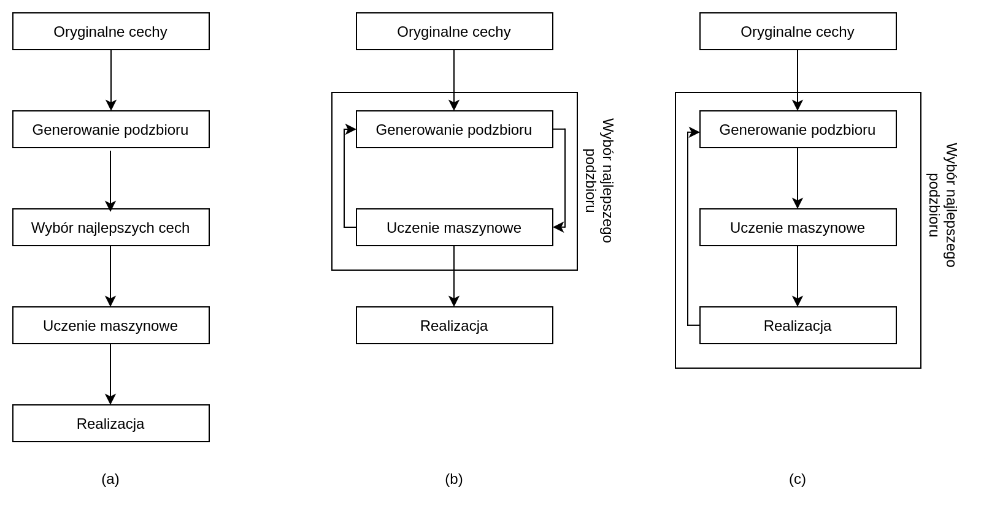
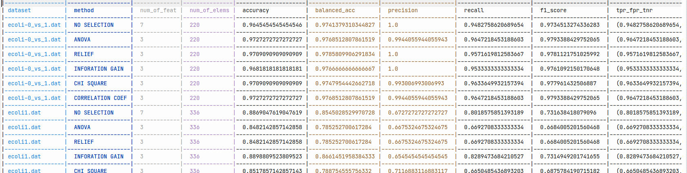
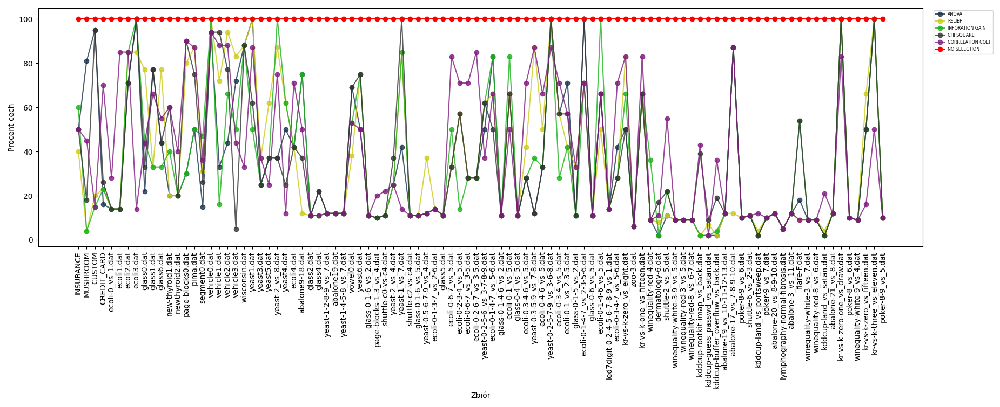
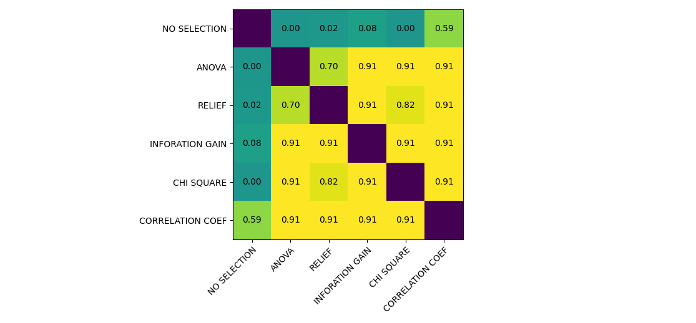
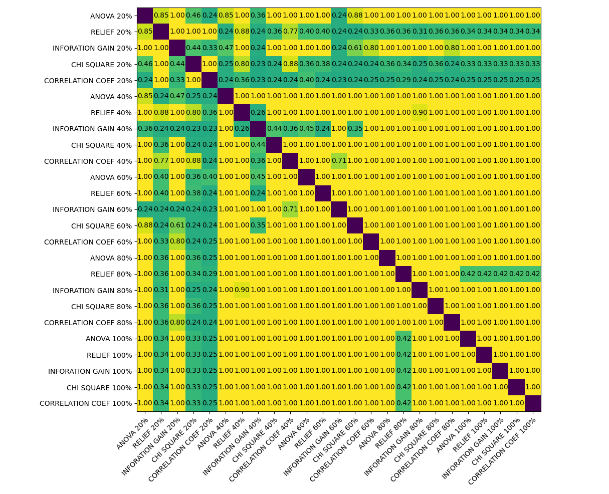

\newtheorem{theorem}{Twierdzenie}
<!-- -------------------------------- -->

\tableofcontents

\newpage

\listoffigures

\newpage

\listoftables

\newpage\null\newpage

# Wstęp

## Wprowadzenie

__Celem pracy było porównanie różnych metod selekcji cech w problemie trenowania algorytmów uczenia maszynowego na danych niezbalansowanych. W jej ramach, przedstawione i opisane zostały popularne obecnie metody selekcji oraz przeprowadzone zostały eksperymenty dla przykadowych zbiorów danych, zarówno rzeczywistych jak i syntetycznych, celem których było stworzenie rankingu algorytmów. Autor sprawdził, jak właściwie przeprowadzona selekcja wpływa na jakość wyników dostarczanych przez program klasyfikujący dane i jak przytoczone przez niego metody radzą sobie z danymi, w których występuje znaczna przewaga liczebności jednej klasy. Aspekt inżynieryjny polegał na implementacji zaproponowanych w pracy eksperymentów, co pozwoliło na kompleksowe porównanie algorytmów.__

__The purpose of this paper was to compare different feature selection methods in the problem of training machine learning algorithms on imbalanced datasets. As part of it, currently popular selection methods were presented and described, and experiments were conducted for example datasets - both real and synthetic, with the goal of which was to create a ranking of algorithms. The author of the paper examined how properly performed selection affects the quality of results provided by a data classification program and how methods cited by him deal with data in which one class is significantly imbalanced. The engineering aspect consisted in the implementation of the experiments proposed in the paper, which allowed for a comprehensive comparison of algorithms.__

\vspace{3mm}
Praca swoim zakresem objęła porównanie popularnych metod selekcji cech w ramach kilkuset wybranych zbiorów danych. Napisana w jej ramach biblioteka pozwoliła na stworzenie eksperymentów kompleksowo porównujących wyniki różnych algorytmów. Dane te posłużyć mogą do wyboru najodpowiedniejszej metody we wszelkich problemach klasyfikacyjnych, w których elementy wykazują szczególną nadreprezentację jednej bądź kilku klas. Zamieszczone w pracy podsumowanie zawiera wyniki przeprowadzonych przez autora badań.

\vspace{3mm}
__Praca składa się z czterech rozdziałów:__

\vspace{3mm}
__Rozdział pierwszy__: Omówiono analizę wybranego problemu, przedstawiono motywację podjęcia tematu oraz przegląd literatury. Opisano podstawowe metody selekcji cech i wyjaśnieniono różnicę pomiędzy selekcją oraz ekstrakcją cech. Zawarto opis szczegółowej charakterystyki zagadnienia i problemu jakim jest niezrównoważony rozkład klas w algorytmach uczenia maszynowego. Zamieszczono szczegółowy opis poszczególnych, wykorzystanych później metod selekcji, wraz z ich matematyczną interpretacją.

\vspace{3mm}
__Rozdział drugi__: Założenia i plan eksperymentu. W rozdziale zawarto informacje związane z inżynieryjnym aspektem pracy - czyli projekt systemu, szczegółowy plan poszczególnych eksperymentów i opis zbiorów danych, jakie użyto podczas doświadczeń. Swoim zakresem rozdział objął krótki opis użytych przez autora bibliotek oraz wykorzystywanych funkcji.

\vspace{3mm}
__Rozdział trzeci__: Podsumowanie uzyskanych wyników. W rozdziale zawarto rezultaty eksperymentów oraz testów opisanych w rozdziale drugim. Rozdział zawiera również opisy metod użytych w ramach porównywania rezultatów. Zamieszczone table i wykresy pozwalają na czytelną interpretacje danych.

\vspace{3mm}
__Rozdział czwarty__: W czwartym czwartym zawarto interpretację wyników oraz konfrontację ich z hipotezą postawioną na początku pracy. Wyjaśniono potencjalne zastosowanie przeprowadzonych w ramach pracy eksperymentów. Przedstawiono możliwości rozwoju projektu.

\vspace{3mm}
Udało się zrealizować wszystkie postawione cele.

\newpage\null\newpage

# Analiza problemu

__Uczenie maszynowe to bardzo dynamicznie rozwijająca się gałąź informatyki. Niezwykły rozwój wynika z zapotrzebowania na wykrywanie prawidłowości, na uogólnianie oraz precyzowanie danych. Takie możliwości pozwoliły na znalezienie zastosowania dla algorytmów sztucznej inteligencji w wielu różnych branżach - począwszy od medycyny, poprzez finanse, produkcję i przemysł rozrywkowy. Tak duży przekrój różnych zastosowań wymaga ciągłego ulepszania istniejących już wzorców oraz tworzenia nowych, lepszych i bardziej efektywnych algorytmów. W większości praktycznych problemów klasyfikacji obiektów, autor operuje na dużej liczbie cech. Warto jednak pamiętać, że w tym przypadku "wiele" - nie oznacza lepszych rezultatów. Należy przytoczyć pojęcie "_przekleństwa wielowymiarowości_" [@weissgary2003]. Oznacza ono, że większy wymiar wymaga od programisty znacznie większej liczby danych, dodatkowo wraz ze wzrostem liczby cech wykładniczo rośnie liczba możliwych wariantów dopasowań, co znacznie zwiększa złożoność obliczeniową algorytmów.__

\vspace{3mm}
Aby uniknąć problemów generowanych przez zbyt dużą liczbę atrybutów, a jednocześnie wykorzystać te, które zapewniają jak najlepszą separowalność klas, zazwyczaj pierwszym krokiem w zadaniu klasyfikacji jest selekcja lub ekstrakcja najodpowiedniejszych cech [@hallmark].

## Przegląd literatury

Zarówno sam problem selekcji cech jak i sposoby radzenia sobie z nierównomiernym rozkładem klas to - szczególnie w ostatnich latach - często poruszany temat. Skutkuje to dużym przekrojem prac, również w ujęciu czysto dziedzinowym, jak wykorzystanie konkretnych algorytmów dla bardzo konkretnych zastosowań.

Wstępną analizę problemu przedstawili Garba Abdulrauf Sharifai i Zurinahni Zainol w pracy _Feature Selection for High-Dimensional and Imbalanced Biomedical Data Based on Robust Correlation Based Redundancy and Binary Grasshopper Optimization Algorithm_ [@genes11070717]. Autorzy opisali problem niezbalansowania danych i podejścia do niego, bazujące na istniejących metodach doboru cech. Skupili się szczególnie na zaproponowanej przez siebie metodzie mającej łaczyć różne metody filtrujące. Jest to dobre wprowadzenie do zadania selekcji cech i problemu radreprezentacji klas, a przytoczone metody są szczegółowo opisane co pozwala na dogłębne zrozumienie tematu. W podobnej pracy _Feature selection for high-dimensional imbalanced data_, twórcy - Liuzhi Yin, Yong Ge, Keli Xiao, Xuehua Wang i Xiaojun Quan [@YIN20133] przyjrzeli się wpływowi, jaki na udaną selekcję ma zbiór danych. Postanowili przeprowadzić szereg eksperymentów, w szczególności dzieląc duże klasy na stosunkowo mniejsze pseudo-klasy i sztucznie generując ich etykiety. Na podstawie swoich badań zaprezentowali nową metodę selekcji opartą na tak zwanej _odległości Helingera_. Testy autorów pracy badają skuteczność tej metody na tle znanych już metod redukcji atrybutów. Twórcy pracy _A Survey on Evolutionary Computation Approaches to Feature Selection_ [@7339682] zajęli się przeglądem znanych metod tworząc dokument podsumowujący każdą z nich, z jej wadami oraz zaletami. Punktem, na jakim szczególnie skupili swoją uwagę są nowoczesne techniki oparte o algorytmy ewolucyjne. Artykuł zawiera kompleksowy przegląd prac naukowych dotyczących tematu oraz a przytoczone badania pozwalają na dobranie odpowiedniej metody do zadanego zadania. W 2014 roku Deepika Tiwari opisała w artykule _Handling Class Imbalance Problem Using Feature Selection_ [@TiwariDeepika] działanie kulku algorytmów wyboru cech dla niezrównoważonych zbiorów danych. W swoich eksprymentach skupiła się na uzyskaniu jak najlepszych wyników, co uzyskała modyfikując popularny algorytm RELIEFF, aby rozwiązać problem nierównowagi klas. W 2008 roku Chen Xuewen i Michael Wasikowski zaproponowali w swojej pracy _Combating the Small Sample Class Imbalance Problem Using Feature Selection_ [@Wasikowski2010CombatingTS] porównanie różnych algorytmów stworzonych pierwotnie na potrzeby zadań klasyfikacji tekstu. Na uwagę zasługuje przytoczona przez autorów metoda nazwana _FAST_, która jest ich zdaniem doskonałym sposobem redukcji cech, zwłaszcza w przypadku zbiorów o niewielkiej ich liczbie. Mark A. Hall poruszył temat selekcji cech w swojej książce _Correlation-based Feature Selection for Machine Learning_ [@hallmark], badając wartość zestawu cech na podstawie korelacji pomiędzy nimi. Autor przeprowadził szereg eksperymentów i porównał wymyśloną przez metodę opartą o współczynnik korelacji z metodami powszechnie stosowanymi, starając się między innymi wyodrębnić problemy, dla których jego algorytm jest najbardziej skuteczny. Analiza _CoIL Challenge 2000_ [@CoILDataMining] przeprowadzona przez Elkana Charlesa wykazała, że zwykłe algorytmy selekcji cech nie były wystarczająco dobre do zadania klasyfikacji danych niezbalansowanych. Stwierdził on, że na etapie selekcji należy rozważyć interakcję między różnymi cechami, a największą wadą, jaką znalazł w przypadku większości stosowanych metod selekcji cech, jest fakt, że nie rozważają wysoce skorelowanych cech. Isabelle Guyon i André Elisseeff przeprowadzili solidną analizę teoretyczną w pracy _An Introduction of Variable and Feature Selection_ [@GuyonIntroduction]. Wykazali w niej, że same nieistotne cechy mogą być przydatne w połączeniu z innymi cechami, a połączenie dwóch silnie skorelowanych cech może być lepsze niż każda z nich niezależnie.

Warto zwrócić uwagę, że niewiele jest prac naukowych badających skuteczność selekcji cech w zadaniu klasyfikacji danych niezbalanowanych. W szczególności, większość twórców skupia się na uzyskaniu jak najlepszych wyników, implementując w tworzone przez siebie algorytmy inne metody radzenia sobie z niezbalansowaniem, takie jak _oversampling_ albo _boosting_. Autorzy artykułów posługują się w badaniach niewielką liczbą specjalnie przystosowanych zbiorów, co nie pozwala na obiektywne i kompleksowe porówanie różnych metod. Motywacją tej pracy było uzupełnienie istniejących w aktualnym stanie wiedzy luk. W ramach testów zbadane zostały przytoczone w analizie literatury algorytmy, a duża liczba zróżnicowanych zbiorów danych pozwoliła na otrzymanie prawidłowych wyników.

## Cel selekcji cech

Selekcja cech polega na identyfikacji elementów puli atrybutów, które uznawane są za najlepsze deskryptory rozważanych kategorii. Zaletą selekcji jest możliwość zbadania tych deskryptorów, które są istotne z punktu widzenia danego zadania klasyfikacji, czyli jednocześnie zrozumienie różnic między analizowanymi kategoriami. Wybór najbardziej istotnych atrybutów badanych obiektów przekłada się bezpośrednio na poprawne działanie klasyfikatora [@hallmark]. Dyspozycja coraz większymi bazami danych zmusza do optymalizacji procesu. Gwałtownie rosnąca liczba cech stanowi poważny problem - powoduje nie tylko wydłużenie procesu uczenia oraz wzrost złożoności klasyfikatora, ale niesie ze sobą także ryzyko spadku prawdopodobieństwa poprawnej klasyfikacji. Związane jest to z tak zwanym "przekleństwem wymiarowości" [@ziebapawel]. Zjawisko to zachodzi zazwyczaj, gdy liczba cech znacznie przewyższa liczebność samego zbioru danych. Zadaniem selekcji jest również lepsze zrozumienie problemu oraz zmniejszenie kosztów archiwizacji przyszłych danych.

W kolejnych rozdziałach opisano trzy główne metody tworzenia algorytmów selekcji: metody rankingowe - zwane filtrami, metody opakowane oraz metody wbudowane [@10.1016/j.compeleceng.2013.11.024]. Dla każdej z wymienionych metod została nakreślona idea, oraz przedstawione zostały algorytmy reprezentujące daną metodologie [@hallmark][@GuyonIntroduction][@ziebapawel].

## Podstawowy podział

W rozdziałach @sec:rank - @sec:embeded opisano trzy główne metody tworzenia algorytmów selekcji. Podział ten i działanie każdej z metod obrazuje rysunek @fig:methods.

{#fig:methods}

### Metody rankingowe {#sec:rank}

Najprostsze podejście do problemu selekcji cech reprezentowane jest poprzez metody rankingowe, nazywane też filtrami [@10.1016/j.compeleceng.2013.11.024]. Jak sama nazwa wskazuje, do zadania selekcji przy pomocy metod rankingowych należy podejść wyróżniając w zbiorze cech następujące grupy: cechy istotne, nieistotne i redundantne. Istotne to takie, które odróżniają od siebie klasy, nieistotne nie niosą informacji dla problemu klasyfikacji, a cechy redundantne to atrybuty których role z powodzeniem mogą przejąć inne cechy.

Metody rankingowe polegają więc na znalezieniu pewnej miary pozwalającej stworzyć ranking cech, a następnie wybrać najlepsze i odrzucić najgorsze atrybuty. Algorytmy te zazwyczaj są najszybsze i - co istotne - nie zależą one od używanej metody analizy danych [@10.1016/j.compeleceng.2013.11.024]. Ich istotną wadę stanowi brak możliwości uwzględnienia zależności pomiędzy cechami [@TiwariDeepika]. Kolejne opisane typy metod selekcji tej wady nie posiadają. Istnieje wiele popularnych filtrów, wśród których wyróżnić można najbardziej popularne - _chi-kwadrat_, _ANOVA_ oraz _RELIEF_ [@TiwariDeepika]. Podejście rankingowe do selekcji cech zostało zobrazowane na rysunku @fig:methods, w podpunkcie (a).

### Metody opakowane {#sec:wrapper}

Podstawowymi i najpopularniejszymi metodami selekcji cech są metody opakowane, tak zwane wrappery [@10.1016/j.compeleceng.2013.11.024]. W przeciwieństwie do metod rankingowych, w których algorytm selekcji i klasyfikator pozostają niezależne, w algorytmach opakowanych, ocena atrybutów dokonuje się przy użyciu konkretnego modelu. To właśnie efektywność samego klasyfikatora służy za miarę skuteczności algorytmu. Zaletą metody jest jej uniwersalność i dokładność, natomiast wadą - wysoka złożoność obliczeniowa [@10.1016/j.compeleceng.2013.11.024]. Dla efektywności tych algorytmów istotny jest sposób ustalania podzbioru cech [@10.1016/j.compeleceng.2013.11.024]. Wśród wielu sposobów wyszukiwania właściwego podzbioru, wyróżnić można najprostszy - przeszukanie całego zbioru podzbiorów. Jest to jednak rozwiązanie bardzo kosztowne. Wobec tego typowymi strategiami są: przeszukiwanie w przód, przeszukiwanie wstecz oraz tworzenie indywidualnego rankingu [@MALDONADO20092208]. Popularnym algorytmem implementującym metodę opakowaną jest _RFE_ - _Rekurencyjna eliminacja cech_ [@10.1016/j.compeleceng.2013.11.024]. Podejście opakowane do selekcji cech zostało zobrazowane na rysunku @fig:methods, w podpunkcie (b).

### Metody wbudowane {#sec:embeded}

Metody wbudowane zawierają się w algorytmie klasyfikacji i to na etapie tworzenia modelu przypisuje się poszczególnym cechom wagi lub przeprowadza się ich eliminację. Do algorytmów klasyfikacji z wbudowaną metodą selekcji zaliczyć można popularne LASSO i RIDGE [@7339682][@PEREIRA2016634][@MELKUMOVA2017746]. W literaturze natknąć się też można na przypasowanie do tej kategorii metody wektorów nośnych (SVM) czy też analizy składowych głównych (PCA) [@7339682]. Zaletą tych metod jest ich szybkość, ponieważ użycie nie wiąże się z dodatkowymi operacjami na zbiorze [@10.1016/j.compeleceng.2013.11.024][@7339682][@MELKUMOVA2017746]. Podejście wbudowane do selekcji cech zostało zobrazowane na rysunku @fig:methods, w podpunkcie (c).

## Selekcja cech a ekstrakcja

Selekcja cech ma na celu wybranie pewnych atrybutów opisujących dane pod kątem tego, czy nadają się one do dalszego wykorzystania w klasyfikacji, przy jednoczesnym odrzuceniu innych danych [@HiroshiMotodaLiu]. Zawsze rozważana jest ona w kontekście kolejnych zadań i nie można oceniać jej skuteczności w oderwaniu od wyników metody klasyfikacji wykorzystującej wybrane cechy. W większości przypadków budowany jest złożony model, który może zawierać jeden lub więcej algorytmów selekcji i co najmniej jeden klasyfikator.

Ekstrakcja cech natomiast polega na utworzeniu nowego zestawu atrybutów poprzez liniową lub nieliniową kombinację oryginalnych danych. W przeciwieństwie do selekcji, gdzie celem jest zawsze uzyskanie podzbioru wszystkich atrybutów, wykorzystanie ekstrakcji wiąże się z wymiarem przestrzennym mniejszym, równym lub nawet większym od wymiaru przestrzeni startowej [@SOPHIAN200337][@HiroshiMotodaLiu]. Poprzez proces ekstrakcji, część początkowych cech zostaje utracona. Z tego powodu nie ekstrakcja, a selekcja cech jest obecnie najpowszechniejszą strategią służącą przygotowaniu reprezentacji analizowanych danych [@SOPHIAN200337].

## Problem niezrównoważonego rozkładu klas

Wśród wielu dobrze zbadanych i szeroko wykorzystywanych rozwiązań bazujących na uczeniu maszynowym, najbardziej obiecującymi są te, mające ratować ludzkie życie. Postęp w dziedzinie sztucznej inteligencji i metodach statystycznych stworzyły nowe możliwości klasyfikacji i diagnozy najbardziej złożonych i śmiertelnych chorób, takich jak rak, choroba Alzheimera, cukrzyca itp, których wykrycie w początkowych stadiach stanowi problem [@genes11070717]. Między innymi z takimi przypadkami wiąże się problem niezrównoważonej dystrybucji klas [@MenaLuisGonzalezJesus].

Niezrównoważony rozkład ma miejsce, gdy co najmniej jedna z klas jest niewystarczająco reprezentowana i przytłoczona przez inne klasy. Algorytmy klasyfikacji często nie radzą sobie z niezrównoważonymi danymi, co stwarza wiele przeszkód w uczeniu się algorytmów i implikuje liczne konsekwencje dla rzeczywistych zastosowań. Problem objawia się niedocenianiem przykładów klas mniejszościowych i powoduje niedokładne wyniki klasyfikacji w stosunku do przykładów klas większościowych. Klasyfikacja niezrównoważonego zbioru danych staje się trudniejsza przy ograniczonej liczbie próbek i ogromnej liczbie cech. Przykład takiej sytuacji zaobserwować można na rysunku @fig:imbalanced. Ilustracja przedstawia 200 elementów z których tylko 5% należy do klasy mniejszościowej - czerwonej.

{#fig:imbalanced}

Sytuacja przedstawiona na grafice jest dla algorytmu niewygodna, ponieważ większość tradycyjnych algorytmów uczenia maszynowego trenowana na podobnym zbiorze, obciążona zostanie w stosunku do klasy bardziej licznej [@SILVA201624]. Jednocześnie, zazwyczaj lepsze zrozumienie klas mniej licznych jest istotniejsze z punktu widzenia problemu w ujęciu biznesowym [@MenaLuisGonzalezJesus]. Problemem jest również określenie wartości wyników algorytmu. Jakość klasyfikacji - czyli dokładność, używana jako metryka ewaluacji może być w takim przypadku niewystarczająca, gdyż nawet model o skuteczności 95% - co jest na ogół wartością bardzo dobrą - mógłby w tym przypadku nie rozpoznawać żadnego elementu klasy mniejszościowej [@SILVA201624].

## Metody klasyfikacji danych niezbalansowanych

Problem nierównoważnego rozkładu przyciągnął w ostatnim czasie zainteresowanie dużej części społeczności zajmującej się uczeniem maszynowym i eksploracją danych, zarówno ze środowisk akademickich jak i środowisk związanych z przemysłem. Znajduje to odbicie w dużej liczbie startupów opierających swoje produkty i usługi na rozwiązaniach _machine-learningowych_. W ciągu kilkunastu ostatnich lat wyklarowały się trzy główne podejścia do uczenia modeli na danych niezbalansowanych. Są to metody na poziomie danych, metody na poziomie algorytmów oraz metody hybrydowe [@10.1007/11538059_91][@smote][@YenCluster][@adasyn].

### Metody na poziomie danych

Metody na poziomie danych (Data-level methods), modyfikują dostępne instancje problemu w celu jego zbalansowania. Można je podzielić na podgrupy: metody próbkowania danych (data-sampling) i metody wyboru cech (feature selection methods) [@Leevy2018].

Metody nadpróbkowania i podpróbkowania stanowią dwie podgrupy metod próbkowania danych, w których próbkowanie dla danego zbioru danych odbywa się losowo lub z wykorzystaniem innego, zdefiniowanego wcześniej algorytmu. W procesie nadpróbkowania (oversamplingu) do danego zbioru danych dodawane są instancje klasy mniejszościowej poprzez replikację, która odbywa się z wykorzystaniem algorytmów takich jak ADASYN [@adasyn]. W procesie podpróbkowania (undersamplingu) natomiast, większość wystąpień klasy zostanie usuniętych z danego zbioru danych. Usuwanie odbywa się w dużej mierze losowo.

SMOTE (Synthetic Minority Over-Sampling), to technika próbkowania polegająca na sztucznym ponownym próbkowaniu zbioru danych. Końcowym jej wynikiem jest zbiór danych o zrównoważonym rozkładzie [@smote]. Chociaż metoda może skutkować znacznie lepszymi wynikami w porównaniu z oryginalnym zestawem danych, istnieją poważne problemy związane z jej wykorzystaniem po pobraniu zbyt małej liczby próbek. Wydajność klasyfikatora może wtedy ulec pogorszeniu z powodu potencjalnej utraty przydatnych przykładów klasy większościowej [@weissgary2003]. Podobnie, dodatkowe przypadki szkoleniowe wprowadzone przez nadmierne próbkowanie mogą zwiększyć złożoność obliczeniową klasyfikatora. W najgorszym przypadku, dokładne kopie przykładów po nadmiernym próbkowaniu mogą prowadzić do nadmiernego dopasowania klasyfikatora [@Leevy2018].

Chociaż metody selekcji cech są powszechnie stosowane w celu poprawy wyników klasyfikacji, mogą one również pomóc w wyborze najbardziej wpływowych cech w celu wygenerowania unikalnej wiedzy w ramach klasyfikacji. Zmniejsza to niekorzystny wpływ nierównowagi klas na wyniki klasyfikacji [@Leevy2018].

### Metody na poziomie algorytmów

Metody na poziomie algorytmów (Algorithm-level methods), modyfikują istniejące algorytmy uczenia maszynowego. Można je podzielić na metody wrażliwe na koszty (cost-sensitive methods) i metody zintegrowane (integrated methods) [@Leevy2018].

Pierwsza z nich opiera się na zasadzie przypisywania większej wagi instancjom w przypadku błędnej klasyfikacji. Na przykład fałszywie negatywnym przewidywaniom można przypisać wyższy koszt niż fałszywie dodatnim.

Metody zintegrowane mogą być również stosowane jako metody wrażliwe na koszty, w przypadku których wynikiem klasyfikacji jest pewna kombinacja wielu klasyfikatorów zbudowanych na zbiorze danych [@Leevy2018]. Dwa powszechne typy metod uczenia zintegrowanego to Bagging i Boosting [@Quinlan96bagging]. Bagging minimalizuje wariancję, generując kilka zestawów uczących dla zestawu danych i tworząc klasyfikator dla każdego zestawu uczącego, a następnie łącząc ich modele w celu ostatecznej klasyfikacji. Algorytmy wykorzystujące Boosting, takie jak algorytm _AdaBoost_, tworzą serię klasyfikatorów, wszystkie stosowane na tym samym zestawie danych [@adaboost]. _AdaBoost_  wybiera tylko te cechy, o których wiadomo, że poprawiają moc predykcyjną modelu, zmniejszając wymiarowość i potencjalnie poprawiając czas wykonania, ponieważ nieistotne cechy nie muszą być obliczane. Na początku algorytm nadaje wszystkim próbkom równe wagi i prawdopodobieństwa wylosowania w kolejnej iteracji. Po każdej iteracji prawdopodobieństwa są aktualizowane. Próbka, która została poprawnie sklasyfikowana, ma mniejsze prawdopodobieństwo, że zostanie wylosowana w następnej iteracji, a błędnie sklasyfikowana próbka ma większe prawdopodobieństwo. W rezultacie klasyfikator w dalszej części serii tworzy zestaw treningowy składający się z trudnych do sklasyfikowania próbek.

Metody uczenia jednoklasowego (OOC) - czyli mającego na celu identyfikacje obiektu jednej, określonej klasy, poprzez uczenie się przede wszystkim ze zbioru zawierającego tylko obiekty tej klasy, mają na celu zwalczenie problemu nadmiernego dopasowania. Występuje on przypadku większości klasyfikatorów uczących się na niezrównoważonych danych. Osiągane jest to poprzez podejście do tego problemu z pomocą uczenia nienadzorowanego [@HempstalkOne][@SHIN2005395][@ErtekinSeyda]. Algorytmy jednoklasowe są konstruowane w taki sposób, aby rozpoznawać próbki z danej klasy i odrzucać próbki z innych klas. 

### Podejścia hybrydowe

Metody hybrydowe mają na celu rozwiązanie znanych problemów spowodowanych metodami próbkowania danych, metodami wyboru cech, metodami wrażliwymi na koszty i podstawowymi algorytmami uczenia się (takimi jak Naive Bayes [@LangarizadehMostafa]). W niektórych przypadkach podgrupy metod na poziomie danych lub podgrupy metod na poziomie algorytmu można łączyć jako ogólną metodę rozwiązywania problemu niezbalansowania klas. Na przykład popularny klasyfikator losowego lasu (Random Forest) jest wersją oryginalnego algorytmu losowego lasu decyzyjnego (Random Decision Forest) i jest zintegrowany z algorytmem uczenia się, który dodatkowo implementuje Bagging [@forest].

## Metody oparte o selekcję cech

Pojęcie przekleństwo wymiarowości mówi, że jeśli wiele cech jest zaszumionych, czyli wprowadza do zbioru dane redundantne lub nawet błędne, koszt użycia klasyfikatora może być bardzo wysoki, a wydajność może być poważnie zaniżona [@weissgary2003]. Ponieważ problemowi z nierównowagą klas często towarzyszy problem dużej wymiarowości zbioru danych, zastosowanie technik selekcji cech jest koniecznym działaniem [@weissgary2003]. Pomysłowe techniki próbkowania i metody algorytmiczne mogą nie wystarczyć do walki z wysokowymiarowymi problemami nierównowagi klas. 

Van der Putten i van Someren przeanalizowali zbiory danych z CoIL Challenge 2000 i stwierdzili, że wybór cech był bardziej istotny dla dobrych wyników niż wybór algorytmu klasyfikacji i najbardziej pomógł w walce z problemem nadmiernego dopasowania [@vanderPutten2004]. Forman odnotował podobną obserwację dotyczącą wysoce niezrównoważonych problemów klasyfikacji tekstu i stwierdził, że „żaden stopień sprytnej indukcji nie może zrekompensować braku sygnału predykcyjnego w przestrzeni wejściowej” [@DunjaMarko][@10.5555/944919.944974][@10.1145/1007730.1007741]. Badania te pokazują, że w wielowymiarowych zbiorach danych, sam dobór cech może zwalczyć problem nierównowagi klas. 

W ostatnich latach, radzenie sobie z niezrównoważonymi zbiorami danych za pomocą selekcji cech stało się popularne wśród społeczności zajmujących się eksploracją danych i uczeniem maszynowym [@CoILDataMining]. Wspomniane wcześniej techniki koncentrują się na próbkowaniu danych uczących w celu przezwyciężenia niezrównoważonego rozkładu klas. Metoda redukcji cech, taka jak selekcja cech, przyjmuje inne podejście do przezwyciężenia problemu. Ogólna koncepcja polega na uzyskaniu podzbioru cech, które optymalnie korygują dysproporcje między klasami w zbiorze danych i wybierają najlepsze cechy, które reprezentują obie klasy.

Przedstawione w rozdziałach @sec:cc - @sec:anova algorytmy należą do tradycyjnych, szeroko używanych metod selekcji cech [@jamali2013]. Omówione strategie należą do tak zwanych filtrów, czyli metod rankingowych. Jest to najbardziej naturalne podejście do rozpatrywanego tematu, gdyż opisane algorytmy nie są zależne od wbudowanego klasyfikatora. Pozwala to również na ich kompleksowe i obiektywne porównanie. 

### Correlation coefficient {#sec:cc}

Korelacja to miara liniowej zależności pomiędzy dwoma zmiennymi losowymi. Jest to więc poniekąd miara tego, jak silnie jedna zmienna zależy od drugiej. Jest to zazwyczaj bardzo użyteczna właściwość - w przypadku dwóch, silnie skorelowanych zmiennych, posiadając informacje o jednej zmiennej można przewidzieć wartości drugiej. W przypadku liniowych modeli uczenia maszynowego, częstym celem będzie znalezienie elementów silnie skorelowanych ze zmienną losową opisującą przynależność do klasy. Jednocześnie, dwie silnie skorelowane ze sobą zmienne dostarczają też redundantnych informacji. Zasadniczo można dokonać poprawnego sklasyfikowania z pomocą tylko jednego z tych atrybutów. Usunięcie drugiego może wręcz pomóc w zmniejszeniu wymiarowości i zbędnego szumu [32].

Współczynnik korelacji Pearsona to algorytm, który określa poziom zbieżności liniowej pomiędzy zmiennymi. Wynikiem tej metody są wartości od -1 do 1. Bezwzględna wartość współczynnika określa siłę zależności liniowej - wartości bliższe 1 wskazują na silniejszy związek [@10.1007/978-3-540-75175-5_30]. Znak współczynnika wskazuje kierunek zależności: znak dodatni informuje, że dwie zmienne rosną lub maleją względem siebie (pod względem korelacji), a znak ujemny wskazuje, że jedna zmienna rośnie, a druga maleje [@jamali2013]. Interpretacje wyników korelacji na przykładowych zbiorach danych zostały przedstawione na rysunku @fig:correlation_coef.

{#fig:correlation_coef}

Ogólna postać współczynnika przedstawiona została w równaniu @eq:correlation_coefficient:

$$ r={\frac {\sum _{i=1}^{n}(x_{i}-{\overline {x}})(y_{i}-{\overline {y}})}{{\sqrt {\sum _{i=1}^{n}(x_{i}-{\overline {x}})^{2}}}{\sqrt {\sum _{i=1}^{n}(y_{i}-{\overline {y}})^{2}}}}}, $$ {#eq:correlation_coefficient}

gdzie:

* $n$ jest liczebnością próbki,
* $x_i$ oraz $y_i$ są indywidualnymi próbkami indeksowanymi po $i$,
* ${\bar {x}}={\frac {1}{n}}\sum _{i=1}^{n}x_{i}$ - jest średnią arytmetyczną (podobnie dla ${\bar {y}}$).

Współczynnik korelacji Pearsona można wykorzystać do oceny związku między więcej niż dwiema zmiennym obliczając macierz relacji między każdą parą zmiennych w zbiorze danych. Rezultatem jest symetryczna macierz zwana macierzą korelacji.

### Chi-square {#sec:chi2}

Chi-square (chi-kwadrat lub $\chi^{2}$) jest testem statystycznym mierzącym niezależność cechy od etykiety klasy. Mierzy on zależność między zmiennymi stochastycznymi. Uużycie tej metody "usuwa" cechy, które z największym prawdopodobieństwem są niezależne od klasy, a zatem nie mają znaczenia dla klasyfikacji. Metoda polega na obliczeniu metryki $\chi^2$ pomiędzy wartością docelową a cechą i wyborze zmiennej o maksymalnym wyniku testu [@10.1007/978-3-540-75175-5_30].

Ogólna postać testu została przedstawiona w równaniu @eq:chi_square:

$$ \chi^{2}=\sum _{i=1}^{n}\left({\frac {O_{i}-E_{i}}{E_{i}}}\right)^{2}, $$ {#eq:chi_square}

gdzie:

* $O_i$ jest wartością mierzoną,
* $E_i$ jest wartością oczekiwaną,
* $n$ jest liczbą pomiarów.

Forman zauważył, że ten test może zachowywać się nieprawidłowo, gdy spodziewana jest niewielka liczba cech. Jest to dość powszechne w przypadku niezrównoważonych zbiorów danych [@10.5555/944919.944974]. Chociaż test chi-kwadrat zadowalająco uogólnia dane dyskretne, nie radzi sobie dobrze się podczas testowania danych ciągłych [@TiwariDeepika]. 

### Information Gain {#sec:ig}

Entropia warunkowa to entropia po podziale zbioru przy pomocy danego atrybutu [@TiwariDeepika]. Dla danego atrybutu $a$, entropia warunkowa wyraża się wzorem @eq:con_entropy:

$$ Ent(S | a) = \sum_{j=1}^{p}\frac{n_{s_j}}{n}Ent(S_j), $$ {#eq:con_entropy}

gdzie:

* $p$ to liczba wartości atrybutu a,
* $S_j$ to zbiór przykładów z wartością atrybutu $v_j$,
* $n_{s_j}$ to liczebność zbioru $S_j$,
* $Ent(S_j)$ to entropia zbioru $S_j$, wyrażona wzorem @eq:entropy:

$$ Ent(S) = - \sum_{i=1}^{k}p_ilog_2p_i, $$  {#eq:entropy}

gdzie:

* $p_i$ to prawdopodobieństwo przynależności do klasy $i-tej$ ,
* $S$ to zbiór przykładów,
* $k$ liczba klas.

Im mniejsza wartość entropii warunkowej, tym większa jednorodność podziału [32]. Information Gain mierzy różnicę między entropią etykiet klas a entropią warunkową etykiet klas dla danej cechy [@TiwariDeepika]. Metoda ta ocenia przyrost informacji przy użyciu atrybutu. Dla danego atrybutu $a$:

$$ IG(S, a) = Ent(S) - Ent(S | a) $$ {#eq:information_gain}

Podobnie jak test _Chi-square_, metoda _Information Gain_ dobrze uogólnia atrybuty dyskretne, ale nie radzi sobie z atrybutami danych ciągłych. Ponadto preferuje atrybuty o dużej liczbie wartości i może prowadzić do przeuczenia [32]. Problemy te rozwiązuje zmodyfikowana wersja algorytmu - _Gain Ratio_, wykorzystująca taka zwaną _wartość wewnętrzną_, która koryguje obciążenie poprzez dostarczenie danych o wielkości zbioru.

### Relief i ReliefF {#sec:relief}

Grupa algorytmów _Relief_ jest jednym z najskuteczniejszych przedstawicieli opracowanych dotychczas metod filtrujących [@TiwariDeepika]. Większość metod filtrowania opracowanych w celach eksploracji danych i uczenia maszynowego zakłada warunkową niezależność atrybutów. Algorytmy Relief są pod tym względem rewolucyjne, ponieważ nie zakładają, że atrybuty są od siebie niezależne. Te algorytmy są zależne od kontekstu. Kiedy istnieje silny związek między atrybutami, jakość atrybutów może być poprawnie oszacowana, co sprawia, że algorytm ten jest jednym z najbardziej efektywnych algorytmów przetwarzania wstępnego [@TiwariDeepika].

Podstawową ideą algorytmów Relief jest oszacowanie jakości cech na podstawie tego, jak dobrze cecha może rozróżniać instancje, które są blisko siebie. Relief oblicza punktację dla każdej cechy, którą można następnie zastosować do selekcji cech. Punktacja opiera się na wyliczeniu różnic wartości cechy między parami najbliższych sąsiadów. Jeśli różnica wartości cechy zostanie zaobserwowana w sąsiedniej parze instancji z tą samą klasą, wynik funkcji maleje. Jeżeli natomiast różnica wartości cechy zostanie zaobserwowana w sąsiedniej parze instancji z różnymi wartościami klas, wynik funkcji rośnie [@reliefart]. Algorytm został pierwotnie zaprojektowany do zastosowań w problemach klasyfikacji binarnej. Relief zainspirował rodzinę algorytmów wyboru cech - RBA (Relief Based Alghoritms), w tym metodę ReliefF [@reliefart]. Jest ona dodatkowo przystosowana do działania w problemach wieloklasowych lub zbiorach z niekompletnymi danymi.

Metoda na wejściu przyjmuje wektor wartości cechy i klasy. Algorytm będzie powtarzany $m$ razy i rozpoczyna się z tablicą wag $W$ o długości równej liczbie cech, wypełnioną zerami. Podczas każdej iteracji, algorytm rozpatruje wektor cech $X$ należący do losowej instancji i wektory cech instancji najbliższe $X$ (według odległości euklidesowej) z każdej cechy. Najbliższa instancja tej samej klasy nazywana jest _prawie trafioną_ (_near hit_), natomiast najbliższa instancja innej klasy - _prawie spudłowaną_ (_near miss_). Wektor wag aktualizowany jest według wzoru @eq:relief:

$$ W_i = W_i - (x_i - nearHit_i)^2 + (x_i - nearMiss_i)^2, $$ {#eq:relief}

gdzie:

* $W_i$ to $i-ty$ element wektora wag $W$,
* $x_i$ to $i-ty$ element wektora $X$,
* $nearHit_i$ to $i-ty$ element wektora _near hit_,
* $nearMiss_i$ to $i-ty$ element wektora _near miss_.

{#fig:relief width=250px}

Waga danej cechy maleje, jeżeli różni się ona od tej cechy w pobliskich instancjach tej samej klasy bardziej, niż pobliskie instancje innych klas, a wzrasta w przeciwnym przypadku. Po $m$ iteracjach, każdy element wektora $W$ jest dzielony przez $m$. W taki sposób, tworzy on ranking cech [@reliefart].

Zaletą metod RBA jest to, że nie są one zależne od heurystyki, działają w czasie wielomianowym niskiego rzędu, są odporne na zakłócenia, a także nadają się do danych binarnych lub ciągłych [@URBANOWICZ2018189][@KIRA1992249].

### ANOVA {#sec:anova}

ANOVA pochodzi od angielskiego "analysis of variance", czyli analiza wariancji. Jest to metoda, która wyjaśnia, z jakim prawdopodobieństwem wyodrębnione czynniki mogą być powodem różnic między obserwowanymi średnimi grupowymi. Algorytm polega na porównaniu wariancji międzygrupowej do wariancji wewnątrzgrupowej. ANOVA to jeden z algorytmów statystyki F (F-test) - od nazwiska twórcy, Ronalda Fishera [@KumarMukeshRath].

Analizę wariancji można podzielić na trzy grupy analiz:

* __jednoczynnikowa analiza wariancji__ - wpływ jednego czynnika międzygrupowego na zmienną zależną
* __wieloczynnikowa analiza wariancji__ - wpływ kliku czynników międzygrupowych na zmienną zależną
* __analiza wariancji dla czynników wewnątrzgrupowych__ - wpływ czynnika wewnątrzgrupowego na zmienną zależną, tzw. "powtarzane pomiary"

Analiza wariancji to stosunek wariancji, obliczona pomiędzy badanymi grupami a średnią wariancją, zaobserwowaną wewnątrz grup. Analiza ta jest metodą statystyczną pozwalającą na podział zaobserwowanej wariancji wyników na oddzielne części. Analizowana jest wariancja przypadająca na każdy z analizowanych czynników jak również wariancja błędu. Idealna sytuacja ma miejsce wtedy, gdy wariancja międzygrupowa jest duża, natomiast wariancja wewnątrzgrupowa - mała [@KumarMukeshRath][@anovavariance].

\newpage\null\newpage

# Założenia i plan eksperymentu

__Obiektywne porównanie przytoczonych algorytmów cech wymagało przeprowadzenia szeregu eksperymentów porównujących skuteczność popularnych metod selekcji cech. Praca swoim zakresem objęła eksperymenty przeprowadzone na kilkuset wybranych zbiorach danych. Użyto zarówno zbiorów rzeczywistych - to znaczy zebranych w ramach rzeczywistych pomiarów jak i syntetycznych - wygenerowanych przez algorytm. Bazy danych, użyte w ramach badań implikują skupienie się na problemach dwuklasowych. Hipoteza, z którą twórca konfrontuje wyniki eksperymentów, to założenie że wszystkie, badane metody selekcji poradzą sobie podobnie z postawionym zadaniem, a poza względami wydajnościowymi, nie ma znaczenia funkcja, która zostanie użyta. Technologia, w jakiej zostaną przeprowadzone doświadczenie to jezyk Python w wersji `3.8` oraz biblioteki `sckit-learn` (`https://scikit-learn.org`), `numpy` (`https://numpy.org`). i `pandas` (`https://pandas.pydata.org/`)__

## Generowanie wyników

Wybrane przez autora metody selekcji cech należą do grupy tak zwanych filtrów. Tworzą one ranking cech, przydatny do zdefiniowania atrybutów, które będą używane przez algorytm w celu przeprowadzenia klasyfikacji. W celu prawidłowego porównania badanych algorytmów należy sprawdzić ich wyniki w połączeniu z całym procesem klasyfikowania. Zdecydowano się na klasyfikator KNN - K Najbliższych Sąsiadów. W metodzie tej, badany obiekt przydzielany jest do klasy, do której należy większość z jego sąsiadów [@KumarMukeshRath][@10.1007/978-3-540-39964-3_62].

{#fig:knn}

Algorytm przyjmuje zbiór danych uczących zawierający elementy. Każdy element ma przypisaną klasę oraz wektor cech. Dany jest element $C$ z przypisanym wektorem cech $X_{1}\dots X_{n}$ dla którego prognoza odbywa się w następujący sposób:

1. Porównanie wartości cech dla elementu $C$ z wartościami cech dla każdego elementu w zbiorze uczącym.
2. Wybór $k$ (ustalona z góry liczba) najbliższych do $C$ elementów zbioru uczącego.
3. Uśrednienie wartości klasy dla wybranych elementów, w wyniku czego uzyskiwana jest prognoza.

## Ocena działania algorytmów

Określenie jakości działania algorytmu stanowi w badanych przypadkach problem. Dokładność (accuracy) używana jako metryka ewaluacji może być w takim wypadku niewystarczająca, gdyż nawet model o skuteczności 95% - co jest na ogół wartością bardzo dobrą - w przypadku rozkładu 5/95 mógłby nie rozpoznawać żadnego elementu klasy mniejszościowej. Metrykami, które dostarczą bardziej wartościowe dane są:

- Macierz konfuzji: tabela pokazująca prognozy prawidłowe i nieprawidłowe z podziałem na klasyfikacje pozytywne i negatywne.
- Precyzja: liczba prawdziwie pozytywnych wyników podzielona przez wszystkie pozytywne przewidywania. Precyzja jest również nazywana pozytywną wartością predykcyjną. Jest miarą dokładności klasyfikatora. Niska precyzja wskazuje na dużą liczbę fałszywych wyników.
- Czułość: liczba prawdziwie pozytywnych wyników podzielona przez liczbę dodatnich wartości w danych testowych. Jest miarą kompletności klasyfikatora. Niska czułość wskazuje na dużą liczbę fałszywie negatywnych wyników.
- _F1 Score_: średnia harmoniczna precyzji i czułości, wyrażona wzorem @eq:f1:

$$ F1 Score = \frac{2 * (Recall * Precision)}{Recall + Precision}. $$ {#eq:f1}

Na podstawie macierzy konfuzji została obliczona także krzywa ROC (ang. Receiver Operating Characteristic), która opisuje zależność między czułością (sensitivity), a dokładnością (specificity) modelu. Czułość i dokładność będą wyznaczane kolejno przy pomocy wzorów:

$$TPR = \frac{TP}{TP+FN},$$ {#eq:tpr}

gdzie $TP$ to liczba wyników _True Positive_, a $FN$ to liczba wyników _False Negative_ w macierzy konfuzji.

$$FPR = \frac{FP}{TN+FP},$$ {#eq:fpr}

gdzie $FP$ to liczba wyników _False Positive_, a $TN$ to liczba wyników _True Negative_ w macierzy konfuzji.

Z pomocą tych wartości wylicza się również tak zwana dokładność zbalansowana (balanced accuracy). Normalizuje ona przawdziwie pozytywne i prawdziwie negatywne prognozy odpowienio przez liczbę próbek dodatnich i ujemnych i dzieli ich sumę przez dwa:

$$bACC = \frac{TPR + TNR}{2},$$ {#eq:bACC}

gdzie $TNR$ oznacza _True Negative Rate_ i jest równe $1 - FPR$.

Pod uwagę wzięty został również ranking cech wygenerowany przez poszczególne metody na poszczególnych zbiorach. W celu określenia, która z testowanych metod daje najlepsze wyniki klasyfikacji wykorzystany zostanie test statystyczny - test Wilcoxona [@NahmFrancis]. Do jego wykonania użyto wartości _F1 Score_ uzyskanych dla każdej z badanych metod.

## Generowanie zbioru treningowego i testowego {#sec:train_test}

W początkowym etapie uczenia maszynowego, programista dysponuje jedynie spójnym zbiorem danych. Jednym z kluczowych kroków w procesie jest podział zbioru na podzbiory: treningowy i testowy. Jest to konieczne w celu wydzielenia fragmentów, na których klasyfikator będzie się uczył i tych, na których nastąpi testowanie wyuczonego już klasyfikatora. Pominięcie tego kroku może skutkować błędnymi, wysokimi wynikami dokładności.

Istnieje kilka metod podziału zbioru. Najprostszym możliwym podejściem jest losowy podział zbioru na dwie części z zachowaniem proporcji ilościowej. Pozwala to na uzyskanie dwóch podzbiorów, lecz istnieje przy tym ryzyko, że losowość dokonała się w sposób, który wykaże błędną, zawyżoną dokładność. Rozwiązaniem tego problemu jest wielokrotny podział. Metodą, która zapewnia wielokrotny, sprawiedliwy podział, eliminujący prawdopodobieństwo występowania tych samych próbek w różnych zbiorach uczących jest _K-Fold Cross-Validation_, czyli tak zwana _walidacja krzyżowa_ [@10.1080/10485252.2017.1404598].

W algorytmie walidacji krzyżowej (rys. @fig:kfoldcross), zbiór dzielony jest losowo na $k$ równych podzbiorów. Następnie kolejno każdy z nich używany jest jako zbiór testowy, a połączona reszta - jako zbiór uczący. Finalnie, rezultaty uśrednia się w celu uzyskania jednorodnego wyniku.

{#fig:kfoldcross}

W ramach przeprowadzonych eksperymentów posłużono się funkcją _KFold_ z biblioteki _scikit-learn_ [@scikit_k_fold]. Podobnie jak inne funkcje z tej biblioteki, umożliwia ona zadeklarowanie ziarna losowości, co zapewnia możliwość powtórzenia użyskanych w ten sposób wyników.

## Zbiory danych

W ramach przeprowadzonych doświadczeń posłużono się 115 zbiorami danych. Wszystkie charakteryzowały się wysokim niezbalansowaniem i wykazywały nadreprezentację jednej z klas. Rozdziały @sec:ccfd - @sec:custom zawierają szczegółowy opis dużych, starannie przygotowanych w ramach pracy zbiorów z różnych dziedzin nauki. Bazy te prezentują najbardziej typowe przypadki wykorzystania różnych metod selekcji cech. Rozdział @sec:keel skrótowo opisuje pozostałe zbiory danych, uzyskane za pośrednictwem platformy _KEEL_.

### Wykrywanie oszustw kredytowych {#sec:ccfd}

Zbiór danych "Credit Card Fraud Detection" (_CCFD_) zawiera informacje o transakcjach dokonanych kartami kredytowymi we wrześniu 2013 roku, przez europejskich posiadaczy kart. Baza składa się z zapisów transakcji, które odbyły się ciągu dwóch dni, w trakcie których miały miejsce 492 oszustwa z 284 807 wszystkich operacji. Zbiór jest wysoce niezbalansowany, a klasa pozytywna (oszustwa) stanowi 0,172% wszystkich transakcji [@ulb_2018].

Elementy zbioru składają się jedynie z danych liczbowych, które są wynikiem transformacji PCA. Jest to podyktowane względami poufności - twórcy nie są w stanie dostarczyć oryginalnych wartości ani dodatkowych informacji o danych. Cechy $V1, V2,… V28$ są głównymi składnikami uzyskanymi za pomocą analizy składowych głównych, jedynymi cechami, które nie zostały przekształcone są "_Time_" i "_Amount_". Warość "_Time_" zawiera sekundy, które upłynęły między każdą transakcją a pierwszą transakcją w zbiorze danych. Funkcja "_Amount_" to kwota transakcji. Cecha "_Class_" jest zmienną odpowiedzi i przyjmuje wartość 1 w przypadku oszustwa i 0 w innym przypadku. Dystrybucja klas oraz danych została ukazana na rysunku @fig:ccfd_distribution. W celu ukazania dystrybucji danych na dwuwymiarowym wykresie, zastosowano ekstrakcję cech metodą _2-PCA_.

{#fig:ccfd_distribution}

Zbiór został pozyskany za pośrednictwem platformy `Kaggle` (`https://www.kaggle.com/`).

### Ubezpiecznia zdrowotne {#sec:hics}

Zbiór "Health Insurance Cross Sell" (_HICS_) został pierwotnie stworzony w ramach konkursu. Celem wyzwania było przewidywanie prawdopodobieństwa, że klienci firmy ubezpieczeniowej będą zainteresowani ubezpieczeniem komunikacyjnym oferowanym przez firmę [@kumar_2020]. Każdy wiersz odpowiada określonemu posiadaczowi polisy, a kolumny opisują ich cechy. Zmienna docelowa jest tu nazywana wynikiem (_result_) i wskazuje, czy ubezpieczający będzie zainteresowany zakupem polisy.

Zbiór danych został dobrze udokumentowany przez twórców. Każdy klient został opisany dwunastoma cechami i są to: płeć (_gender_), wiek (_age_), posiadanie prawa jazdy (_driving_license_), region zamieszkania klienta (_region_code_), informacja o poprzednim ubezpieczeniu (_previously_insured_), wiek pojazdu (_vehicle_age_), informacja o uszkodzeniach pojazdu (_vehicle_damage_), koszty ubezpieczenia (_annual_premium_), kanał kontaktu z klientem (_policy_sales_channel_) i czas jaki klient jest związany z firmą (_vintage_). Dane o płci, wieku samochodu i uszkodzeniach pojazdu są danymi tekstowymi. Dystrybucja klas oraz danych została ukazana na rysunku @fig:hics_distribution. W celu ukazania dystrybucji danych na dwuwymiarowym wykresie, zastosowano ekstrakcję cech metodą _2-PCA_.

{#fig:hics_distribution}

Zbiór został pozyskany za pośrednictwem platformy `Kaggle` (`https://www.kaggle.com/`).

### Klasyfikacja grzybów {#sec:mushroom}

Zestaw danych "Mushroom Classification" zawiera opisy próbek różnych gatunków grzybów, zaczerpnięte z The Audubon Society Field Guide to North American Mushrooms (1981) [@learning_2016]. Każdy gatunek jest określony jako zdecydowanie jadalny, zdecydowanie trujący lub o nieznanej jadalności (niezalecany). Ta ostatnia klasa została połączona z klasą trującą. Przewodnik jasno stwierdza, że nie ma prostej zasady określania jadalności grzyba co powinno uniemożliwić skuteczną klasyfikację. Każdy gatunek grzyba opisany jest za pomocą 23 cech, wśród których znajdują się cechy takie jak rozmiar i kształt kapelusza, rozmiar blaszek i przerw pomiędzy nimi, kolor, wysokość, typ pierścienia wokół pnia itd. Wszystkie cechy opisane są zmiennymi tekstowymi. Sam zbiór nie wykazuje cech niezbalansowania. Został odpowiednio dostosowany do celów eksperymentu. Proces ten opisano w rozdziale @sec:mushroom_pre.

Dystrybucja klas oraz danych została ukazana na rysunku @fig:mushroom_distribution. W celu ukazania dystrybucji danych na dwuwymiarowym wykresie, zastosowano ekstrakcję cech metodą _2-PCA_.

{#fig:mushroom_distribution}

Zbiór został pozyskany za pośrednictwem platformy `Kaggle` (`https://www.kaggle.com/`).

### Dane wygenerowane syntetycznie {#sec:custom}

Zbiór "Custom" został wygenerowany syntetycznie z pomocą funkcji _make_classification_ biblioteki _scikit-learn_ [@scikitmakeclass]. Pozwoliło to na dobranie parametrów w taki sposób, aby zbiór odpowiadał jak najlepiej założeniom projektowym. Baza składa się 100000 elementów. Kolumna _target_ wskazuje na przypasowanie elementu do jednej z dwóch klas. Zbiór jest niezbalansowany, jedynie 10% elementów należy do klasy pozytywnej. Każdy element opisany jest za pomocą 20 cech, z czego trzy z nich są najbardziej informatywne, a jedna jest zupełnie zbędna. Zbiór nie zawiera pustych danych. Dystrybucja klas oraz danych została ukazana na rysunku @fig:custom_distribution. W celu ukazania dystrybucji danych na dwuwymiarowym wykresie, zastosowano ekstrakcję cech metodą _2-PCA_.

{#fig:custom_distribution}

### Pozostałe zbiory danych {#sec:keel}

W celu poprawnego i obiektywnego porównania wszystkich metod selekcji wykonano eksperymenty na dodatkowych 111 zbiorach udostępnionych przez platformę KEEL [@sci2s]. W tym celu stworzono program automatycznie importujący i przygotowujący zbiór do wykorzystania przez testowane algorytmy. Każdy ze zbiorów posiada pewne cechy wspólne - wszystkie one zostały stworzone w podobnym formacie, zawierają w większości cechy opisane numerycznie i jedynie dwie klasy - opisane za pomocą etykiet "_positive_" oraz "_negative_". Ponadto, klasą mniejszościową jest zawsze klasa "_positive_".

## Przygotowanie danych

Modele predykcyjne wymagają zazwyczaj danych  wysokiej jakości. Wstępne przetwarzanie i czyszczenie danych to ważne zadania, które należy wykonać, zanim zestaw danych będzie mógł zostać użyty do uczenia modelu. Nieprzetworzone dane są zwykle zaszumione i mogą zawierać błędne wartości lub luki. Modelowanie przy użyciu tego typu danych może dawać mylące wyniki. Szczególnie na takie zagrożenia narażone są dane rzeczywiste i zbiory zbierane z różnych źródeł. Typowe problemy z jakością danych to:

* niekompletność: dane nie mają atrybutów lub zawierają brakujące wartości,
* zakłócenia: dane zawierają błędne rekordy lub elementy odstające,
* niespójność: dane zawierają rekordy powodujące niezgodności.

W celu odpowiedniego, wstępnego przetworzenia danych, do każdego zbioru należy podejść indywidualnie. Są jednak metody, które pozwalają poradzić sobie z większością napotkanych problemów. Do popularnych metod radzenia sobie z problemami wynikającymi ze źle przygotowanymi bazami danych należą:

* uzupełnienie brakujących wartości,
* likwidowanie wartości odstających (ang. outliers),
* standaryzacja poprzez normalizację lub dyskretyzację,
* redukcja wymiarów poprzez selekcję i ekstrakcję cech,
* równoważenie danych poprzez usuwanie przypadków klas większościowych lub nadpróbkowanie klas mniejszościowych,
* transformacja zmiennych (np. liniowa),
* dodawanie nowych zmiennych w celu zwiększenia liczby cech (np. iloczyny istniejących zmiennych),
* podział danych na dane treningowe i dane testowe.

Zbiory użyte w ramach eksperymentów należało w większości poddać wstępnej obróbce. Rozdziały @sec:ccfd_pre - @sec:keel_pre opisują działania podjęte w celu poprawienia jakości danych.

### Przygotowanie zbioru CCFD {#sec:ccfd_pre}

W zbiorze _Credit Card Fraud Detection_ nie występują puste wartości. Większość cech została wcześniej poddana transformacji metodą PCA czego efektem ubocznym jest ich wyskalowanie, które konieczne jest w przypadku użycia tej metody. Cechami wyróżniającymi się są _"Time"_ oraz _"Amount"_. Dystrybucja wartości dla tych cech ukazana jest na rysunku @fig:ccfd_t_m_distribution.

{#fig:ccfd_t_m_distribution}

Wartości te należało przeskalować, aby nie odstawały od innych danych. Użyto w tym celu metody _RobustScaler_ z biblioteki _scikit-learn_ [@scikit_robust].

### Przygotowanie zbioru HICS {#sec:hics_pre}

W zbiorze _Health Insurance Cross Sell_ nie występują puste wartości. Większość cech to cechy binarne, które nie potrzebują obróbki. Jak wspomniano w rozdziale @sec:hics, dane o płci, uszkodzeniach pojazdu i wieku samochodu są danymi tekstowymi. Kolumna _gender_ przyjmuje wartości _Male_ oraz _Female_, natomiast kolumna _vehicle_damage_ - _yes_ oraz _no_. Wartości te zostały przepisane na dane binarne: "_0_" i "_1_". Kolumna opisująca wiek pojazdu posiada 3 możliwe wartości tekstowe, które zostały przepisane na wartości liczbowe: "_0_", "_1_" i "_2_".

### Przygotowanie zbioru Mushroom {#sec:mushroom_pre}

Zbiór _Mushroom_ był początkowo zbiorem zbalansowanym. W celu niezbalansowania go, usunięto 90% elementów zakwalifikowanych jako grzyby trujące (zostawiając co dziesiąty element oznaczony klasą nawaną '_p_'). Ponadto, wszystkie cechy zbioru opisane zostały etykietami słownymi. Stworzyło to konieczność przepisania wszystkich elementów zbioru na etykiety numeryczne. Posłużono się w tym celu funkcją _LabelEncoder_ z biblioteki _scikit-learn_ [@scikitlabelenc]. Metoda ta podmienia każdy element listy na wartość pomiędzy 0 a n-1, gdzie $n$ to liczba wariantów cechy.

### Przygotowanie zbioru Custom {#sec:custom_pre}

Ponieważ zbiór _Custom_ został wygenerowany sztucznie, wszystkie parametry zostały dobrane tak, by nie zachodziła potrzeba jego ponownej obróbki. 

### Przygotowanie zbiorów biblioteki KEEL {#sec:keel_pre}

Zbiory z bazy danych _KEEL_ zostały przez twórców przygotowane do testów, bez konieczności uprzedniego nadmiernego poprawiania danych. Z pośród 111 zbiorów, istniało jedynie kilkanaście, zawierających wartości cech w formacie tekstowym. Funkcja przygotowująca sprawdziła każdy zbiór pod kątem takich przypadków i w razie potrzeby podmieniła takie atrybuty na dane numeryczne. Użyta została w tym celu metoda _LabelEncoder_ z biblioteki _scikit-learn_ [@scikitlabelenc]. Preprocessing pozostałych zbiorów ograniczył się do podmiany wartości "_positive_" oraz "_negative_" na wartości "_1_" i "_0_" na etapie parsowania zbioru.

## Eksperymenty

W celu wykonania analizy, przy pomocy bibliotek _scikit-learn_ oraz _pandas_, zaimplementowano metody opisane w rozdziałach @sec:cc - @sec:anova. Algorytmy _ANOVA_, _chi$^2$_ oraz _Information Gain_ mają gotową implementację w bibliotece _scikit-learn_ - kolejno funkcje _f_classif_ [@scikit_f_class], _chi2_ [@scikit_chi2] i _mutual_info_classif_ [@scikit_m_i_classif]. Zostały one wykorzystane w ramach funkcji _SelectKBest_, umożliwiającej zdefiniowanie metody selekcji cech oraz docelowej liczby atrybutów. Algorytm _Relieff_ wdrożony został przy użyciu biblioteki _scikit-feature_ [@li2018feature][@jundongl]. Metoda _Correlation Coefficient_ zrealizowana została przy użyciu funkcji _corr_ z pakietu _pandas_, zwracającej korelację Pearsona pomiędzy parami wszystkich kolumn danego zbioru [@pandascorr]. Obie funkcje dostosowano tak, by odpowiadały swoim działaniem oraz API pozostałym trzem metodom. Eksperymenty zostały powtórzone wiele razy z różnymi ustawieniami w celu ustalenia optymalnej liczby cech dla każdego zbioru.

W celu ułatwienia sprawnego i obiektywnego porównania wszystkich metod, w ramach pracy stworzono bibliotekę zawierającą fukcje przygotowujące dane, dzielące zbiór na podzbiory (walidacja krzyżowa), przeprowadzające klasyfikacje oraz wyliczające i prezentujące wyniki eksperymentów. Rezultatem każdego doświadczenia jest plik w formacie _.csv_. Plik ten zawiera nazwę zbioru użytego do klasyfikacji, nazwę metody selekcji, sumaryczną liczbę cech oraz liczbę cech po przeprowadzonej selekcji, dokładność, zbalansowaną dokładność, precyzję, czułość, wynik testu _F1 Score_, wartość _FPR_, _TPR_ i _TNR_, macierz konfuzji i cechy wybrane w ramach selekcji w 6 wariantach - przed selekcją i dla każdej użytej metody.

{#fig:csv_res}

W czasie pracy wykorzystana została pięciokrotnie powtórzona metoda dwukrotnej walidacji krzyżowej. W ramach wszystkich zbiorów danych przeprowadzony został eksperyment badający skuteczność klasyfikacji bez wykonywania wcześniejszej selekcji cech oraz biorący pod uwagę różną liczbę cech w procesie klasyfikacji.

Liczba cech użyta do eksperymentów została wybrana na podstawie różnych kryteriów - w zależności od rodzaju eksperymentu. W większości przypadków posłużono się testem Wilcoxona w taki sposób, aby klasyfikacja zbiorów bez użycia selekcji cech i po jej użyciu dawała rezultaty bez zmian statysycznie istotnych.

Łącznie przeprowadzono około 6900 eksperymentów, po _115_ $\cdot$ _liczba cech zbioru_ dla każdej opisanej metody selekcji cech. Eksperymenty zawierają każdą permutację z zadanych zagadnień:

* porównanie wyników dla każdego z 115 zbiorów danych,
* porównanie wyników dla każdej z 5 metod selekcji,
* porównanie wyników dla danych nie poddanych selekcji cech,
* porównanie wyników każdej ilości liczby cech w ramach każdej metody,
* porównanie wydajności poszczególnych algorytmów.

Pliki źródłowe zawierające kod biblioteki, która została napisana do wygenerowania wyników znajduje się w załączonym do pracy katalogu _src_. Bazy danych, na których przeprowadzane były doświadczenia zostały również zamieszczone i znajdują się w folderze _data_. Rezultaty eksperymentów opisane zostały w rozdziale @sec:results - Wyniki.

\newpage\null\newpage

# Wyniki {#sec:results}

Badania zostały przeprowadzone zgodnie z zaplanowanym schematem. Dla każdej testowanej metody obliczono dokładność zbalansowaną, precyzję, czułość oraz wynik testu _F1 score_. Dane te policzono __przyjmując jako elementy pozytywne macierzy konfuzji instancje klas mniej licznych__. Dalsza część rozdziału zawiera wykresy oraz tabele porównujące testowane metody.

## Badanie optymalnej liczby cech i wyników klasyfikacji dla poszczególnych metod {#sec:feat_num}

W celu przeprowadzenia klasyfikacji, pierwszym krokiem jaki należało podjąć w ramach każdej analizy było określeniej właściwej liczby cech dla badanych algorytmów i zbiorów. Zdecydowano się na przeprowadzenie badań w trzech kierunkach:

* zbadanie każdej kombinacji liczby cech dla każdej metody,
* zbadanie, dla jakiej liczby cech metoda jest w stanie uzyskać wynik klasyfikacji podobny do wyniku uzyskanego przeprowadzając klasyfikację na pełnym zbiorze,
* zbadanie, jak poszczególne metody radzą sobie w ramach takiej samej, uprzednio wybranej liczby cech.

Szczegóły dotyczące doświadczeń oraz rezultaty zostały opisane w rozdziałach @sec:best_feats - @sec:const_feats_nb. Pełny zestaw wygenerowanych wyników został załączony do pracy na płycie CD i znajduje się w katalogu _results_. Foldery _f1_best_, _f1_wilcoxon_ oraz _percent_ reprezentują kolejne trzy przedstawione powyżej kierunki badań. Katalog _classic_ zawiera wyniki klasyfikacji przeprowadzonej dla trzech i pięciu naistotniejszych cech według każej metody selekcji - średniej liczby cech po podwyższeniu której obserwowano brak poprawy lub pogorszenie jakości klasyfikacji. W katalogu _f1_closest_ znajduje wariacja drugiego, opisanego powyżej doświadczenia, w którym zamiast wyniku testu Wilconxona, jako metrykę użyto _F1 Score_. Folder _time_ prezentuje wyniki pomiarów czasu dla poszczególnych eksperymentów. Pliki dostarczone zostały w formacie _csv_. Pierwszy rząd zawiera opis poszczególnych kolumn, pozostałe - wyniki badań.

### Kombinacja wszystkich metod i każdej możliwej liczby cech {#sec:best_feats}

Celem tego badania było sprawdzenie, jak każda z badanych metod może poprawić wyniki klasyfikacji. W ramach tego etapu przygotowano program, który dla każdego zbioru i dla każdej metody porównuje wyniki klasyfikacji każdej możliwej liczby cech. Po porównaniu wszystkich możliwości, algorytm zapisuje doświadczenie z najlepszym wynikiem. Kryterium obranym przy porównywaniu wyników było _F1 Score_. Wyniki, jakie udało się uzyskać dla każdego zbioru przedstawione zostały na rysunku @fig:f1_best_all. Jak można zaobserwować - selekcja cech poprawiła wyniki klasyfikacji w przypadku praktycznie każdego zbioru.

{#fig:f1_best_all}

Wykres @fig:best_feats_all prezentuje procentową liczbę cech w stosunku do liczby wszystkich cech, jaką posłużyła się dana metoda w celu wyodrębnienia najbardziej optymalnych według niej atrybutów. Rysunek zawiera porównanie dla wszystkich badanych zbiorów.

{#fig:best_feats_all}

Ponieważ w przypadku tego eksperymentu każdej metodzie selekcji pozwolono wybrać najoptymalniejszą według niej liczbę cech i najlepsze według niej cechy, a także wszystkie metody trenowano na tych samych zbiorach, można pokusić się o porównanie ich uśrednionych wyników. Wykres @fig:mean_best_rank przedstawia uśrednione rangi dla wyników _F1 Score_ oraz liczby cech, dla każdej metody i dla wszystkich 115 zbiorów. Rangi zostały przydzielone na podstawie każdego doświadczenia, w zależności od skuteczności metody. Najlepsza metoda została oznaczona rangą '5', metoda najgorsza - '0'. W przypadku badania liczby cech, za najlepszy wynik uznano ten z najmniejszą ich ilością. W przypadku, gdy dwie metody miały ten sam wynik, otrzymywały tę samą rangę. Kolorem czerwonym oznaczono rezultat uzyskany dla klasyfikacji bez użycia żadnych metod redukcji atrybutów.

{#fig:mean_best_rank}

Aby móc określić, ktora z badanych metod radzi sobie najlepiej, koniecznym krokiem było porównanie wyników z pomocą testu statystycznego, w celu określenia, czy pomiędzy rezultatami eksperymentów dla różnych metod występują istotne różnice statystyczne. Testem statystycznym użytym w badaniu był test Wilcoxona. Macierz prezentująca wyniki tego testu została przedstawiona na rysunku @fig:wilcoxon_best. Metryką użytą do sprawdzenia różnic statystycznych zostało _F1 Score_, natomiast metryką objaśniającą różnice statystyczne zostało _pvalue_. Aby uniknąć problemu porównań wielokrotnych wynikającego z jednoczesnego wykonywania wielu porównań z tej samej grupy hipotez zdecydowano się na skorzystanie z _metody Hommmela_, która przeciwdziała temu problemowi zmniejszając nominalny poziom dokładności każdego z testowanych zbiorów @hommelcomp. Metoda ta oparta jest na wskaźniku _FWER_ (family-wise error rate) i jest szeroko stosowana, zwłaszcza gdy tylko kilka hipotez jest testowanych jednocześnie.

{#fig:wilcoxon_best}

Rysunek @fig:wilcoxon_best potwierdza to, co można było przypuszczać analizując rysunki @fig:f1_best_all oraz @fig:mean_best_rank - wszystkie metody selekcji cech pozwalają na uzyskanie statystycznie podobnych wyników, a duże różnice istnieją jedynie pomiędzy wynikami klasyfikacji z użyciem dowolnej z metod a wynikami klasyfikacji bez redukcji cech. Wyniki testu Wilcoxona dla poszczególnych metod wskazują, że rezultaty uzyskane przez te metody nie wykazują znacznych różnic statystycznych. Żaden z wyników nie uzyskuje zwyczajowej wartości $0.05$ uznawanej za próg, po którym można uznać, że rezultaty eksperymentów pochodzą z różnych rozkładów. Z tego powodu, nie można z całą pewnością stwierdzić, która metoda daje najlepsze wyniki.

Odchylenie ćwiartkowe należy do pozycyjnych miar zmienności wyników. Definiuje się je jako połowę różnicy między kwartylem trzecim $Q_3$ i pierwszym $Q_1$. Interpretuje się je jako przeciętne zróżnicowanie badanych jednostek wokół mediany @domański2001metody. 

Tablica @tbl:mean_best_feats_part_1 zawiera porównanie średniej liczby cech w procentach, średni wyniki _F1 Score_ dla każdej metody oraz odchylenie ćwiartkowe wyników _F1 Score_, dla części badanych zbiorów (stopień niezbalansowania pomiędzy 1:1.5 a 1:9). Czcionką pogrubioną zaznaczono na tablicy wartości skrajne liczby cech. 

| Nazwa Metody            | Średnia liczba cech | Uśredniony wynik F1 Score  | Odchylenie ćwiartkowe wyników |
|-------------------------|-------------------- |--------------------------- |------------------------------ |
| Anova                   | 49.3%               | 0.739                      | 0.20758                       | 
| ReliefF                 | 63.3%               | 0.705                      | 0.16780                       | 
| Information Gain        | **47.8%**           | 0.711                      | 0.19409                       | 
| Chi Square              | 56.6%               | 0.732                      | 0.20135                       | 
| Correlation Coefficient | **67.5%**           | 0.680                      | 0.26457                       | 

Table: Porównanie średniej liczby wybranych cech, uśrednionego wyniku F1 Score oraz ochylenia ćwiarkowego wyników dla każdej z metod, dla części zbiorów (stopień niezbalansowania pomiędzy 1:1.5 a 1:9). {#tbl:mean_best_feats_part_1}

Badanie powtórzono dla wyników uzyskanych na czterech, największych zbiorach, opisanych w rozdziałach @sec:ccfd - @sec:custom. Zbiory te posiadały znacznie większą liczba atrybutów, a większy ich wymiar pozwala przypuszczać, że metody mogły lepiej dostosować się do danych. Wyniki tego badania prezentuje tablica @tbl:mean_best_feats_part_0.

| Nazwa Metody            | Średnia liczba cech | Uśredniony wynik F1 Score  | Odchylenie ćwiartkowe wyników |
|-------------------------|-------------------- |--------------------------- |------------------------------ |
| Anova                   | **60.8%**           | 0.709                      | 0.41904                       |
| ReliefF                 | **21.9%**           | 0.705                      | 0.55568                       |
| Information Gain        | 25.7%               | 0.742                      | 0.47614                       |
| Chi Square              | 47.4%               | 0.716                      | 0.42321                       |
| Correlation Coefficient | 45.1%               | 0.730                      | 0.49723                       |

Table: Porównanie średniej liczby wybranych cech, uśrednionego wyniku F1 Score oraz odchylenia ćwiartkowego wyników dla każdej z metod, najobszerniejsze zbiory danych. {#tbl:mean_best_feats_part_0}

Z danych, przedstawionych w tablicach @tbl:mean_best_feats_part_1 oraz @tbl:mean_best_feats_part_0 wynika, że w celu uzyskania podobnych wyników etykietowania metody potrzebowały średnio różnej liczby cech. Różnice te sięgają nawet czterdziestu punktów procentowych. Może to oznaczać, że nie jakość klasyfikacji a liczba cech potrzeba do osiągniecia jej zadowalającego poziomu powinna być wyznacznikiem przy doborze odpowiedniej metody selekcji.

Tablica @tbl:mean_best_feats prezentuje podobne badanie, tym razem z użyciem wszystkich zbiorów danch. Przy zastosowaniu większej, reprezentatywnej liczby zbiorów, dane dotyczące liczby cech dla różnych metod nie odbiegają od siebie. Oznacza to, że i pod tym wględem nie da się wskazać metody najlepszej - co potwierdza zakładaną początkowo hipotezę.

| Nazwa Metody            | Średnia liczba cech | Uśredniony wynik F1 Score  | Odchylenie ćwiartkowe wyników |
|-------------------------|-------------------- |--------------------------- |------------------------------ |
| Anova                   | 34.3%               | 0.497                      | 0.86015                       |
| ReliefF                 | 36.4%               | 0.472                      | 0.84210                       |
| Information Gain        | 34.4%               | 0.481                      | 0.85889                       |
| Chi Square              | 36.3%               | 0.498                      | 0.85783                       |
| Correlation Coefficient | 39.5%               | 0.432                      | 0.81990                       |

Table: Porównanie średniej liczby wybranych cech, uśrednionego wyniku F1 Score oraz odchylenia ćwiartkowego wyników dla każdej z metod, wszystkie zbiory danych. {#tbl:mean_best_feats}

Ponadto okazało się, że w 93% przypadków (459 / 490 wyników), selekcja cech pozwoliła uzyskać lepsze wyniki klasyfikacji. W 71% przypadków (351 / 490 wyników), zaledwie połowa oryginalnych cech pozwoliła uzyskać wynik klasyfikacji lepszy od tego, który uzyskał algorytm na pełnym zbiorze. Co zaskakujące, w przypadku aż 218 eksperymentów - czyli dla 44% wyników, rezultat lepszy od bazowego uzyskano wykorzystując zaledwie jedną cechę.

### Badanie liczby cech dla której wyniki odpowiadają wynikom klasyfikacji na pełnym zbiorze {#sec:closest_wilcoxon}

Celem tego badania było sprawdzenie, jaka liczba cech jest potrzebna poszczególnym metodom, aby wyniki klasyfikacji odpowiadały rezultatom badań bez przeprowadzonej redukcji atrybutów. Ma to znaczenie szczególnie wtedy, gdy od selekcji cech oczekuje się przede wszystkim zmniejszenia wymiaru wyjściowego zbioru w celu obniżenia kosztów jego archiwizacji i przetwarzania. Metryką na podstawie której badano, czy istnieje pomiędzy takimi wynikami statystycznie istotna zmiana było _F1 Score_. Badanie polegało na stworzeniu ośmiu różnych podzbiorów każdego oryginalnego zbioru i przeprowadzeniu selekcji cech oraz klasyfikacji na każdym z nich. Korzystając z wyników, zbadano z pomocą testu Wilcoxona różnice statystyczne pomiędzy rezutlatami klasyfikacji bez selekcji cech i dla każdej z metod. Przyjęto standardowe $pvalue$ wynoszące $0.05$ jako wystarczające, by uznać takie wyniki za podobne - szczególnie, że test przeprowadzany był z założeniem, że elementy pozytywne macierzy konfuzji to instancje klas mniej licznych, co powoduje, że nawet jedna instancja sklasyfikowana błędnie może znacząco wpłynąć na wynik testu. Program napisany w ramach tego etapu bada wszystkie permutacje liczby cech, począwszy od jednej cechy i zapisuje rezultat dla minimalnej liczby cech, dla której klasyfikacja osiąga rezultat porównywalny z założonym celem. Algorytm programu wygląda następująco:

1. Generowanie 8 pozdbiorów oryginalnego zbioru. Każdy zawiera wszystkie cechy oryginału ale różną się elementami.
2. Przeprowadzenie klasyfikacji bez redukcji atrybutów, osobno dla każdego zbioru, zapisanie każdego wyniku w tablicy.
3. Stworzenie pętli iterującej od $i = 1$ do $X$, gdzie $X$ to liczba cech zbioru, kolejno dla każdej metody.
4. Przeprowadzenie selekcji cech dla każdego podzbioru i liczby cech ustawionej na $i$ oraz wygenerowanie wyników klasyfikacji.
5. Przeprowadzenie testu Wilconxona pomiędzy wygenerowanymi wynikami a wynikami zapisanymi w tablicy.
6. Jeżeli warunek $pvalue > 0.05$ jest spełniony - przerwanie pętli i zapisanie wyniku, w przeciwnym wypadku kontynuacja obliczeń.

Doświadczenie pozwoliło sprawdzić, jaka liczba cech jest wymagana, aby pomiędzy zbiorem stworzonym przez redukcję atrybutów a zbiorem oryginalnym nie było istotnych różnic statystycznych. Drugim celem eksperymentu było badanie stabilności metod. Rysunek @fig:wilcoxon_feats_part_1 prezentuje, jaki procent cech był wymagany, aby wynik klasyfikacji zbioru przed selekcją nie odbiegał statystycznie od tego po selekcji. Wykres prezentuje wyniki dla części zbiorów danych (stopień niezbalansowania pomiędzy 1:1.5 a 1:9).

{#fig:wilcoxon_feats_part_1}

Z badania wynika, że zastosowanie selekcji cech pozwala uzyskać istotnie mniejszy wymiar zbioru przy jednoczesnym zachowaniu podobnej jakości klasyfikacji. Nie istnieje jednak jedna optymalna metoda. W ramach jednego zbioru należy przetestować kilka różnych algorytmów selekcji cech i wybrać ten, który najlepiej interpretuje dane.

### Porównanie metod w ramach ustalonej liczby cech {#sec:const_feats_nb}

Dla obiektywnego porównania algorytmów, zdecydowano się na wybór pięciu wartości liczby cech w dla każdej metody i każdego zbioru. Program napisany w ramach analizy przeprowadza test dla 20%, 40%, 60%, 80% i 100% liczby cech. Pozwoliło to na sprawdzenie, jak poszczególne algorytmy radzą sobie mając do dyspozycji stałą, określoną liczbę cech. Badanie pokazało, że nie zawsze większa liczba cech daje lepsze rezultaty, a podstawowy na to wpływ ma sam zbiór danych. Wyniki _F1 Score_ dla poszczególnych metod (rezultaty dla 20% i 60% cech) i części zbiorów danych (stopień niezbalansowania pomiędzy 1:1.5 a 1:9) przedstawione zostały na rysunku @fig:f1_results_part_1. W ramach eksperymentu wykonano również próbę klasyfikacji dla danych niepodlegających wcześniej selekcji cech. Linią czerwoną na rysunku oznaczono wyniki testu _F1_ dla klasyfikacji bez uprzedniej selekcji cech.

{#fig:f1_results_part_1}

Rezultaty podobnego badania, dla zbiorów o stopniu niezbalasowania wynoszącym od 1:20 do 1:100 przedstawiono na rysunku @fig:f1_results_part_3.

{#fig:f1_results_part_3}

Jak widać, w przypadku tak mocno niezbalansowanych zbiorów, mała liczba cech często nie pozwala na poprawną klasyfikację danych mniejszościowych - co tłumaczy duża ilość wyników równych zero, szczególnie dla przypadku dwudziestoprocentowego. Wyraźnie słabiej radzi sobie w tym przypadku również algorytm _Correlation Coefficient_, czego nie zaobserowowano na poprzednim wykresie.

Ponownie, badania powtórzono dla największych zbiorów danych - _CCFD_, _Mushroom_ oraz _Custom_. Ponieważ posiadają one znaczną liczba atrybutów oraz znacznie większy wymiar, istnieje możliwość, że metody selekcji cech lepiej dostosują się do danych. Rysunek @fig:f1_results_part_0 zawiera porównanie wyników testu F1 Score dla tych zbiorów, z uwzględnieniem pozostałych eksperymentów (40% i 80% cech).

{#fig:f1_results_part_0}

Selekcja cech praktycznie w każdym przypadku pozwoliła uzyskać lepsze rezultaty klasyfikacji. Ponownie wyróżniającą się metodą jest _Correlation Coefficient_. Słabe wyniki uzyskuje on jednak tylko w przypadku niewielkiej liczby cech, w zestawie _Custom_ natomiast, radzi sobie najlepiej, co jest prawdopodobnie podyktowane silnie skorelowanymi instancjami klas mniejszościowych w tym zbiorze.

Aby potwierdzić lub obalić hipotezę postawioną na początku pracy, postanowiono przeprowadzić test statystyczny - test Wilconxona, dla wygenerowanych danych. Rysunek @fig:wilcoxon_percent prezentuje macierz prezentującą te wyniki. Pokazuje ona prawdopodobieństwo, że rezultaty uzyskane dla każdej pary eksperymentów pochodzą z tej samej dystrybucji. Poszczególne komórki zawierają wynik _pvalue_, wartość mniejsza niż $0.05$ wskazuje na statystyczne różnice otrzymanych rezultatów tym samym odrzucając hipotezę. Podobnie jak w doświadczeniu opisanym w rodziale @sec:best_feats, podczas wykonywania testów skorzystano z poprawki przeciwdziałającej problemowi porównań wielokrotnych. Uważa się jednak, że _FWER_ jest zbyt konserwatywny w przypadkach, gdy liczba jednocześnie testowanych hipotez sięga już kilkuset @hommelcomp. Z uwagi na dużą ilość porównywanych zbiorów zdecydowano się na _metodę Benjamini i Yekutieli_, bazującą na innym wskaźniku - _FDR_ (false discovery rate), który jest mniej rygorystyczny i używa się go podczas testowania dużej liczby hipotez @hommelcomp.

{#fig:wilcoxon_percent}

Obserwując wykres, można generalizować, że różnice statystyczne pomiędzy metodami maleją wraz ze wzrostem liczby cech. Użycie już 40% cech odrzuca definitywnie hipotezę o niezależnych dystrybucjach, potwierdzając niejako, że każda z użytych metod skutkuje podobnymi wynikami. Ponadto, rezultaty przedstawione na rysunkach @fig:f1_results_part_1 - @fig:f1_results_part_0 dowodzą, że 20% to zazwyczaj liczba zbyt mała liczba cech do uzyskania stabilnych, dobrych wyników klasyfikacji. Wyniki eksperymentu świadczą za hipotezą postawioną na początku pracy. 

## Badanie różnic wydajnościowych

Podczas doświadczeń badano czas, jaki potrzebny jest poszczególnym eksperymentom na ukończenie obliczeń. Każdą z opisanych metod uruchomiono kilkuktrotnie na różnych zbiorach, a jako parametr określający liczba cech podano całkowitą liczbę cech w każdym zbiorze. Wyniki tych eksperymentów prezentuje tablica @tbl:time_table:

| Nazwa Metody            | Średni czas wykonywania (s) | Średni czas / (liczba cech * liczba elementów) | Złożoność czasowa       |
|-------------------------|---------------------------- |----------------------------------------------- |------------------------ |
| Anova                   | 0.00086405                  | 0.0000002                                      | $O(n)$                  |
| ReliefF                 | 2.62687309                  | 0.0001468                                      | $O(m^2 * n)$            |
| Information Gain        | 0.07214137                  | 0.0000094                                      | $O(m * n)$              |
| Chi Square              | 0.00167353                  | 0.0000004                                      | $O(n)$                  |
| Correlation Coefficient | 0.00315445                  | 0.0000006                                      | $O(n)$                  |

Table: Uśredniony czas wykonywania poszczególnych algorytmów oraz ich deklarowane złożoności czasowe. {#tbl:time_table}

Pod względem wydajności metody nie różnią się ze sobą znacząco - z dwoma wyjątkami. Metoda _ReliefF_ okazała się kilkusetkrotnie wolniejsza od konkurentów. Ma to swoje uzasadnienie w algorytmie tej metody - najbardziej obciążającym elementem programu jest konieczność stworzenia macierzy odległości typu _manhattan_ dla każdej cechy i każdej instancji, a następnie przeiterowania się po każdym elemencie tej macierzy. Zgadza się to z wyliczeniami twórców tego algorytmu - według nich _ReliefF_, posiada złożoność $O(m^2 * n)$, gdzie $m$ jest liczbą instancji, natomiast $n$ - liczbą cech @reliefbased. Drugim wyjątkiem jest metoda _Information Gain_, która przez konieczność "maksymalizowania zysku" osiąga złożoność $O(m * n)$, gdzie $m$ to liczba instancji, natomiast $n$ - liczba cech @RaschkaMirjalili2019 @fastdecisiontreelearning. Pozostałe algorytmy posiadają deklarowaną złożoność obliczeniową rzędu $O(n)$, co zgadza się z wynikami otrzymanymi w doświadczeniach @jcp1010011.

Hipoteza postawiona na początku pracy nie uwględniała różnic w czasie wykonywania algorytmu, ale jest to element na który zdecydowanie warto zwrócić uwagę decydując się na pracę z daną metodą.

\newpage\null\newpage

# Wnioski

**Przeprowadzone badania częściowo potwierdzają założoną hipotezę. Przy odpoowiednio dobranej liczbie cech wszystkie metody poradziły sobie dobrze z powierzonym zadaniem, a żaden algorytm pod względem jakości etykietowania nie odbiegał znacząco od pozostałych. Poprawa rezultatów klasyfikacji i możliwość zmniejszenia wymiaru zbioru bez szkody dla wyników świadczy o tym, że selekcja cech jest ważnym krokiem w procesie zadania klasyfikacji. Poniżej zaprezentowano interpretację wyników uzyskanych w rodziale @sec:results, a także opisano praktyczne zastosowanie przeprowadzonych analiz i dalsze możliwości rozwoju projektu.**

## Podsumowanie

Ekpseryment @sec:best_feats pokazał, że redukcja atrybutów może mieć bardzo pozytywny wpływ na wyniki klasyfikacji danych. Wśród rezultatów, w przypadku niektórych zbiorów zaobserwować można nawet stuprocentową poprawę jakości klasyfikacji dla danych mniejszościowych, a sama selekcja cech pozwoliła poprawić wyniki klasyfikacji w 95% przypadków, co potwierdzone zostało testami statystycznymi. Te same testy wykazały również, że wyniki poszczególnych metod pochodzą ze statystycznie podobnych rozkładów co potwierdza hipotezę postawioną przez autora. Warto jednak zwrócić uwagę, że doświadczenie opisane w tym rodziale ukazuje tak naprawdę najlepsze wyniki uzyskane przez każdą z metod dla każdego zbioru, a wyniki opisane w rodziałach @sec:closest_wilcoxon oraz w szczególności w @sec:const_feats_nb obrazują, że nawet niewielka zmiana w zbiorze może zmienić działanie algorytmu redukcji cech. W dodatku, dane w tablicach @tbl:mean_best_feats_part_1 i @tbl:mean_best_feats_part_0 dowodzą, że różne algorytmy, w ramach jednego zbioru, potrzebują czasem bardzo różnej liczby cech do osiągnięcia zadowalających wyników. Poprzestawanie na samej selekcji cech nie przyniesie tak dobrych rezulatatów jakościowych jak połączenie jej z innymi metodami, co - jak zostało to opisane w przeglądzie literatury - jest bardzo popularną praktyką wśród autorów podobnych prac.

Nie mniej istotnym aspektem jest liczba cech, jaka konieczna była do uzyskania takich wyników. W 44% przypadków, eksperyment wykazał wynik klasyfikacji taki sam lub lepszy już po użyciu jednej cechy. Pokazuje to, że istnieje możliwość zmniejszenia wymiarowości istniejących baz danych, co przekłada się bezpośrednio na krótszy czas klasyfikacji oraz mniejszą ilość miejsca zajmowanego na dyskach. Jest to jeden z najważniejszych wniosków płynących z tej pracy. Prezentuje to w szczególności własnie badanie opisane w akapicie @sec:closest_wilcoxon. Selekcja cech jest bardzo dobrym sposobem redukcji wymiarowości bez szkody dla istotnych danych. Doświadczenia przeprowadzone w ramach tego eksperymentu obrazują, że z użyciem ułamka początkowej liczby cech jest możliwe wygenerowanie znacznie mniejszego zbioru, nieróżniącego się statystycznie od pierwowzoru. W przypadku danych niezbalansowanych to nie poprawa jakości a zmniejszenie wymiaru jest prawdziwą wartością dodaną, pozwalającą na jednoczesne zarządzanie znacznie większymi bazami danych oraz na łatwiejsze ich magazynowanie.

Doświadczenia opisane w rozdziale @sec:const_feats_nb również dostyczą hipotezy postawionej na początku pracy. Eksperymenty te bezpośrednio porównują każdą z badanych metod, uruchomioną dla takiej samej liczby cech w ramach każdego zbioru. Algorytmy radziły sobie bardzo różnie, nie zawsze wynikiem ich działania było podniesienie jakości klasyfikacji. Nie da się też w łatwy sposób uogólnić działania poszczególnych metod, a nawet poszczególnych metod z poszczególną liczbą cech, co pokazuje macierz przedstawiona na rysunku @fig:wilcoxon_percent. Wśród przedstawionych wyników znaleźć można przykłady, w których mała liczba cech danej metody obniżyła wynik _F1 Score_ badania do poziomu najniższego ze wszystkich ekpserymentów, aby przy następnym zbiorze, doświadczenie z tymi samymi parametrami zaowocowało bardzo dobrymi rezultatami. Ważnym wnioskiem, wynikającym z tego doświaczenia jest opisany już przez autorów innych, wymienionych w przeglądzie literatury fakt, że wśród popularnych metod - nie tylko selekcji cech - nie da się w łatwy sposób wybrać lepszych oraz gorszych algorytmów. Do każdego zbioru danych należy podejść indywidualnie. To w sporej części wiedza dziedzinowa dotycząca wartości w zbiorze, pozwoli na wybór najlepszych narzędzi do pracy, co za tym idzie - uzyskanie najlepszych wyników. Badania skupiające się głównie nad zbiorami niezbalansowanymi jeszcze bardziej podkreślają ten fakt.

Warto mieć na uwadze, że selekcja cech nie zawsze ma pozytywny wpływ na jakość klasyfikacji, gdyż cechy czasem pozornie tylko nieistotne mogą mieć znaczenie dla poprawnego sklasyfikowania elementów. Pokazują to dobrze przykłady zobrazowane na rysunku @fig:f1_results_part_3. Niektóre algorytmy, mimo że zauważająco polepszyły wydajność kategoryzacji, to przyczyniły się też do spadku dokładności. Ważne jest odpowiednie dobranie metody i liczby cech - odpowiednio dobrany do problemu algorytm redukcji nie tylko nie wpłynie negatywnie na jakość klasyfikacji, ale może również - szczególnie w przypadku zbiorów zawierających dużą liczba elementów i klas - wpływać pozytywnie na czas działania algorytmu.

Analiza wszystkich doświadczeń uwidacznia jeszcze jeden fakt, zaprezentowany na przykład na rysunkach @fig:f1_best_all, @fig:f1_results_part_3 i @fig:f1_results_part_0. Selekcja cech dobrze sobie radzi w przypadku dużych zbiorów danych, nawet jeżeli posiadają bardzo wysoki stopień niezbalansowania (dla przykładu, w zbiorze _CCFD_, klasa mniejszościowa zajmowała zaledwie 0,172% całego zbioru, ale zbiór posiada 284807 elementów) oraz w przypadku małych zbiorów z niewielkim stopniem niezbalansowania. Jednakże, dla zbiorów o małym wymiarze (większość zbiorów z platformy _KEEL_ zawierała poniżej 2000 elementów) i wysokim stopniu niezbalasowania (1:100 - 1:400) nie należy oczekiwać dobrych wyników klasyfikacji, jeżeli to selekcja cech była głównym punktem przygotowania zbiorów. 

Jedynym kryterium, według którego możliwe jest obiektywne wskazanie faworytów jest kryterium wydajnościowe. Testowane metody odznaczają się różną złożonością co przekłada się na różny czas działania. W skrajnych przypadkach metoda _ReliefF_ potrafiła być kilka tysięcy razy wolniejsza od metod _Anova_, _Information Gain_ czy też _Correlation Coefficient_.

Podsumowując, podczas stosowania algorytmów uczenia maszynowego, należy pamiętać, że selekcja cech jest jedynie jednym z wielu dostępnych narzędzi i nie należy traktować jej jako złotego środka. Pozwala jednak, szczególnie dla dużych zbiorów danych, na wybór cech istotnych z punktu widzenia klasyfikacji, co może przysłużyć się nie tylko problemowi wydajności współczesnych komputerów, ale również optymalizacji baz danych, które mogą dzięki temu przechowywać jedynie dane ważne dla rozpatrywanego problemu.

## Praktyczne zastosowanie eksperymentów

Wykonana przez autora analiza pozwala świadomie stosować różne metody selekcji cech w projekcie wykorzystującym uczenie maszynowe. Badania przeprowadzone w ramach pracy umożliwiają uświadomienie sobie wagi tego etapu w procesie kasyfikacji danych szczególnie w przypadku zbiorów o dużej wymiarowości lub nierównomiernej dystrybucji klas. Zastosowanie dużej liczby zbiorów pozwala prześledzić, jak poszczególne metody radzą sobie z różnym stopniem niezbalansowania i z różnymi wymiarami bazy danych, analiza wyników daje pogląd na to, jak prawidłowo zestwiać rezultaty przeprowadzonych badań.

## Dalsze możlowości rozwoju

W ramach dalszego rozwoju pracy należałoby sprawdzić inne rodzaje metod selekcji cech - metody opakowane oraz metody wbudowane. Przy odpowiednim podejściu do testowania tych algorytmów, możliwe byłoby porównanie, jak radzą sobie one na tle przedstawionych metod rankingowych pod względem wydajności oraz jakości klasyfikacji. Ciekawym aspektem wartym uwagi jest również analiza porównawcza przytoczonych metod dla zbiorów wieloklasowych. Doświaczenia zorientowane w tym kierunku pozwoliłyby stwierdzić, czy większa liczba klas ma wpływ na klasyfikację danych mniejszościowych i jak selekcja cech może pomóc taki wypływ minimalizować.

\newpage\null\newpage

# Bibliografia

::: {#refs}
:::

<!-- 
[32] \hspace{3mm} Younes Charfaoui, Hands-on with Feature Selection Techniques: Filter Methods, 01.2020
[32] \hspace{3mm} Witold Andrzejewski & Paweł Boiński, Drzewa Decyzyjne, Politechnika Poznańska, Wydział Informatyki
[33] \hspace{3mm} Krzysztof Krawiec, Wybrane zagadnienia uczenia maszynowego, Politechnika Poznańska, Wydział Informatyki
 -->
\newpage\null\newpage

# Zawartość płyty CD {-}

Do pracy dołączono płytę CD o następującej zawartości:

- kody źródłowy biblioteki, programu eksperymentalnego i programów generujących wykresy znajdujące się w folderze `/src`,
\vspace{3mm}
- otwartoźródłowe dane użyte do trenowania sieci neuronowych w katalogu `/data`,
\vspace{3mm}
- katalog `/docs` zawierający kod źródłowy tej pracy,
\vspace{3mm}
- katalog `/results` zawierający pliki wynikowe przeprowadzanych eksperymentów,
\vspace{3mm}
- plik w formacie `pdf` zawierający tę pracę.
