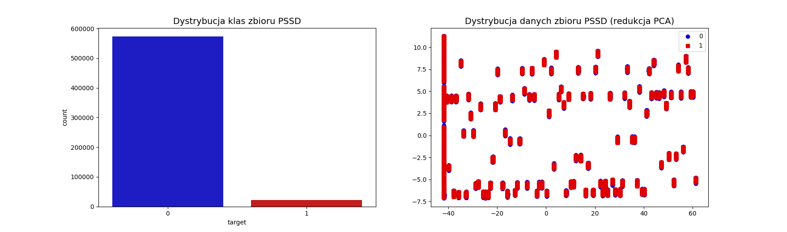

\newtheorem{theorem}{Twierdzenie}
<!-- -------------------------------- -->

\tableofcontents

\newpage

\listoffigures

\newpage

\listoftables

\newpage\null\newpage

# Wstęp

## Wprowadzenie

__Celem pracy było porównanie różnych metod selekcji cech w problemie trenowania algorytmów uczenia maszynowego na danych niezbalansowanych. W jej ramach, przedstawione i opisane zostały popularne obecnie metody selekcji oraz przeprowadzone zostały eksperymenty dla przykadowych zbiorów danych, zarówno rzeczywistych jak i syntetycznych, celem których było stworzenie rankingu algorytmów. Autor sprawdził, jak właściwie przeprowadzona selekcja wpływa na jakość wyników dostarczanych przez program klasyfikujący dane i jak przytoczone przez niego metody radzą sobie z danymi, w których występuje znaczna przewaga liczebności jednej klasy. Aspekt inżynieryjny polegał na implementacji zaproponowanych w pracy eksperymentów, co pozwoliło na kompleksowe porównanie algorytmów.__

__The purpose of this paper was to compare different feature selection methods in the problem of training machine learning algorithms on imbalanced datasets. As part of it, currently popular selection methods were presented and described, and experiments were conducted for example datasets - both real and synthetic, with the goal of which was to create a ranking of algorithms. The author of the paper examined how properly performed selection affects the quality of results provided by a data classification program and how methods cited by him deal with data in which one class is significantly imbalanced. The engineering aspect consisted in the implementation of the experiments proposed in the paper, which allowed for a comprehensive comparison of algorithms.__

\vspace{3mm}
Praca swoim zakresem objęła porównanie popularnych metod selekcji cech w ramach kilku wybranych zbiorów danych. Napisana w jej ramach biblioteka pozwoliła na stworzenie eksperymentów kompleksowo porównujących wyniki różnych algorytmów testowanych na kilkuset zestawach danych. Dane te posłużyć mogą do wyboru najodpowiedniejszej metody we wszelkich problemach klasyfikacyjnych, w których elementy wykazują szczególną nadreprezentacje jednej bądź kilku klas. Zamieszczone w pracy podsumowanie zawiera wyniki przeprowadzonych przez autora badań.

\vspace{3mm}
__Praca składa się z czterech rozdziałów:__

\vspace{3mm}
__Rozdział pierwszy__: Omówienie analizy wybranego problemu, przedstawienie motywacji podjęcia tego tematu oraz przegląd literatury. Opisano w nim podstawowe metody selekcji cech i wyjaśnienie różnicy pomiędzy selekcją oraz ekstrakcją cech. Zawarto opis szczegółowej charakterystyki zagadnienia i problemu jakim jest niezrównoważony rozkład klas w algorytmie uczenia maszynowego. W rozdziale zamieszczono szczegółowy opis poszczególnych, wykorzystanych później metod selekcji, wraz z ich matematyczną interpretacją.

\vspace{3mm}
__Rozdział drugi__: Założenia i plan eksperymentu. W rozdziale drugim zawarto informacje związane z inżynieryjnym aspektem pracy, czyli projekt systemu, szczegółowy plan poszczególnych eksperymentów i opis zbiorów danych, jakie użyto podczas doświadczeń. Swoim zakresem rozdział objął krótki opis użytych przez autora bibliotek oraz wykorzystywanych funkcji.

\vspace{3mm}
__Rozdział trzeci__: Podsumowanie uzyskanych wyników. W rozdziale zawarto rezultaty eksperymentów oraz testów opisanych w rozdziale drugim. Zamieszczone table i wykresy pozwalają na czytelną interpretacje danych.

\vspace{3mm}
__Rozdział czwarty__: W czwartym czwartym zawarto interpretację wyników oraz konfrontację ich z hipotezą postawioną na początku pracy. Wyjaśniono potencjalne zastosowanie przeprowadzonych w ramach pracy eksperymentów. Przedstawiono możliwości rozwoju projektu.

\vspace{3mm}
Udało się zrealizować wszystkie postawione cele.

\newpage\null\newpage

# Analiza problemu

__Uczenie maszynowe to bardzo dynamicznie rozwijająca się gałąź informatyki. Niezwykły rozwój wynika z zapotrzebowania na wykrywanie prawidłowości, na uogólnianie oraz precyzowanie danych. Takie możliwości pozwoliły na znalezienia zastosowania dla algorytmów sztucznej inteligencji w wielu różnych branżach - począwszy od medycyny, poprzez finanse, produkcję i przemysł rozrywkowy. Tak duży przekrój różnych zastosowań wymaga ciągłego ulepszania istniejących już wzorców oraz tworzenia nowych, lepszych i bardziej efektywnych algorytmów. W większości praktycznych problemów klasyfikacji obiektów, autor operuje na dużej liczbie cech. Warto jednak pamiętać, że w tym przypadku _wiele_ - nie oznacza lepszych rezultatów. Należy przytoczyć pojęcie "_przekleństwa wielowymiarowości_" [@weissgary2003]. Oznacza ono, że większy wymiar wymaga od programisty znacznie większej liczby danych, dodatkowo wraz ze wzrostem liczby cech wykładniczo rośnie liczba możliwych wariantów dopasowań, co znacznie zwiększa złożoność obliczeniową algorytmów.__

\vspace{3mm}
Aby uniknąć problemów generowanych przez zbyt dużą ilość atrybutów, a jednocześnie wykorzystać te, które zapewniają jak najlepszą separowalność klas, zazwyczaj pierwszym krokiem w zadaniu klasyfikacji jest selekcja lub ekstrakcja najodpowiedniejszych cech [@hallmark].

## Przegląd literatury

Zarówno sam problem selekcji cech jak i sposoby radzenia sobie z nierównomiernym rozkładem klas to - szczególnie w ostatnich latach - często poruszany problem, co skutkuje dużym przekrojem prac, również w ujęciu czysto dziedzinowym - jak wykorzystanie konkretnych algorytmów dla bardzo konkretnych zastosowań.

<!-- TODO: Do poprawy -->
<!-- Wstępną analizę problemu przedstawił Jakub Piątkowski w pracy _Analiza i rozwój metod doboru cech dla dużych problemów klasyfikacyjnych_. Autor wymiania istniejące metody doboru cech i szczegółowo je opisuje [7]. Jest to dobre wprowadzenie do problematyki klasyfikacji i selekcji cech, a każda przytoczona metoda ma również podłoże matematyczne opisane odpowienimi wzorami. W podobnej pracy _Redukcja wymiarowości i selekcja cech w zadaniach klasyfikacji i regresji z wykorzystaniem uczenia maszynowego_, twórca zacytował wyniki swoich eksperymentów, które pozwoliły mu na tworzenie rankingów algorytmów [@ziebapawel]. Szczegółowo do problemu podszedł mgr Wiesław Chmielnicki, w swojej rozprawie: _Efektywne metody selekcji cech i rozwiązywania problemu wieloklasowego w nadzorowanej klasyfikacji danych_. Oprócz opisu znanych metod, artykuł zawiera również sugestie dotyczące nowych algorytmów hybrydowych, które w niektórych przypadkach dają lepsze wyniki niż metody tradycyjne [17]. Mark A. Hall porusza interesujący temat w swojej książce _Correlation-based Feature Selection for Machine Learning_, badając wartość zestawu cech na podstawie korelacji pomiędzy nimi. Autor przeprowadził szereg eksperymentów, porównał swoją metodę z metodami powszechnie stosowanymi, starając się między innymi wyodrębnić problemy, dla których jego algorytm jest najbardziej skuteczny [@hallmark]. Twórcy pracy _A Survey on Evolutionary Computation Approaches to Feature Selection_ zajęli się przeglądem znanych metod tworząc dokument podsumowujący każdą z nich, z jej wadami oraz zaletami. Artykuł jest oparty na przeglądzie najnowszych prac w zadanej dziedzinie i pozwala na dobranie odpowiedniej metody do zadanego zadania [2]. Ważna dla tematu tej pracy jest również rozprawa _Zastosowanie wybranych metod przekształcania i selekcji danych oraz konstrukcji cech w zadaniach klasyfikacji i klasteryzacji_ mgr inż. Piotra Płońskiego, podsumowująca niejako cały proces uczenia maszynowego i roli, jaką pełni selekcja cech w kontekscie dobrze działającego systemu analizy danych [6]. W 2008 roku Chen Xuewen i Michael Wasikowski zaproponowali metodę zwaną FAST, która opiera się na powierzchni pod krzywą ROC, która jest generowana przez równomierne rozłożenie progów granicy decyzyjnej klasyfikatora pojedynczej cechy [@Wasikowski2010CombatingTS]. W 2014 roku D. Tiwari opisał algorytm wyboru cech dla niezrównoważonych zbiorów danych modyfikując popularny algorytm RELIEFF, aby rozwiązać problem nierównowagi klas [@TiwariDeepika]. W przypadku klas mniejszościowych metoda ta nadaje większą wagę atrybutom, co skutkuje wyższą wagą tych klas podczas samej klasyfikacji. Inna analiza CoIL Challenge 2000 przeprowadzona przez Elkana wykazała, że zwykłe algorytmy selekcji cech nie były wystarczająco dobre do zadania klasyfikacji danych niezbalansowanych [@CoILDataMining]. Na etapie selekcji należało rozważyć interakcję między różnymi cechami. Największą wadą, jaką znalazł w przypadku większości stosowanych metod selekcji cech, jest to, że nie rozważali oni wybierania wysoce skorelowanych cech, ponieważ uważano je za zbędne. Guyon i Elisseeff przeprowadzili solidną analizę teoretyczną. Wykazali, że same nieistotne cechy mogą być przydatne w połączeniu z innymi cechami, a połączenie dwóch silnie skorelowanych cech może być lepsze niż każda z nich niezależnie [@GuyonIntroduction]. -->

## Cel selekcji cech

Selekcja cech polega na identyfikacja tych elementów puli atrybutów, które uznawane są za najlepsze deskryptory rozważanych kategorii. Zaletą selekcji jest możliwość zbadania tych deskryptorów, które są istotne z punktu widzenia danego zadania klasyfikacji, czyli jednocześnie zrozumienia różnic między analizowanymi kategoriami. Wybór najbardziej istotnych atrybutów badanych obiektów przekłada się bezpośrednio na poprawne działanie klasyfikatora [hallmark]. Dyspozycja coraz większymi bazami danych zmusza do optymalizacji procesu. Gwałtownie rosnąca liczba cech stanowi poważny problem - powoduje nie tylko wydłużenie procesu uczenia oraz wzrost złożoności klasyfikatora, ale niesie ze sobą także ryzyko spadku prawdopodobieństwa poprawnej klasyfikacji. Związane jest to z tak zwanym "przekleństwem wymiarowości" [@ziebapawel]. Zjawisko to zachodzi zazwyczaj, gdy liczba cech znacznie przewyższa liczebność samego zbioru danych.
Zadaniem selekcji jest również lepsze zrozumienie problemu oraz zmniejszenie kosztów archiwizacji przyszłych danych. W kolejnych rozdziałach opisane zostaną trzy główne metody tworzenia algorytmów selekcji: metody rankingowe - zwane filtrami, metody opakowane oraz metody wbudowane [@10.1016/j.compeleceng.2013.11.024]. Dla każdej z wymienionych metod zostanie określona idea, oraz przedstawione zostaną algorytmy reprezentujące daną metodologie [@hallmark][@GuyonIntroduction][@ziebapawel].

## Podstawowy podział

W rozdziałach @sec:rank - @sec:embeded opisane zostały trzy główne metody tworzenia algorytmów selekcji. Podział ten i działanie każdej z metod obrazuje rysunek @fig:methods.

{#fig:methods}

### Metody rankingowe {#sec:rank}

Najprostsze podejście do problemu selekcji cech reprezentowane jest poprzez metody rankingowe, nazywane też filtrami [@10.1016/j.compeleceng.2013.11.024]. Jak sama nazwa wskazuje, do zadania selekcji przy pomocy metod rankingowych należy podejść wyróżniając w zbiorze cech następujące grupy: cechy istotne, nieistotne i redundantne. Istotne - to takie, które odróżniają od siebie klasy, nieistotne nie niosą informacji dla problemu klasyfikacji, a cechy redundantne to atrybuty których role z powodzeniem mogą przejąć inne cechy. Metody rankingowe polegają więc na znalezieniu pewnej miary pozwalającej stworzyć ranking cech, a następnie wybrać najlepsze, a odrzucić najgorsze atrybuty. Metody rankingowe zazwyczaj są najszybsze i - co istotne - nie zależą one od używanej metody analizy danych [4, 17]. Ich istotną wadą stanowi brak możliwości uwzględnienia zależności pomiędzy cechami [@TiwariDeepika]. Kolejne opisane typy metod selekcji tej wady nie posiadają. Podejście rankingowe do selekcji cech zostało zobrazowane na rysunku @fig:methods, w podpunkcie (a). Istnieje wiele popularnych filtrów, wśród których wyróżnić można najbardziej popularne - _chi-kwadrat_, _ANOVA_ oraz _RELIEF_ [@TiwariDeepika].

### Metody opakowane {#sec:wrapper}

Podstawowymi i najpopularniejszymi metodami selekcji cech są metody opakowane, tak zwane wrappery [@10.1016/j.compeleceng.2013.11.024]. W przeciwieństwie do metod rankingowych, w których algorytm selekcji i klasyfikator pozostają niezależne, w algorytmach opakowanych, ocena atrybutów dokonuje się przy użyciu konkretnego modelu. To właśnie efektywność samego klasyfikatora służy za miarę skuteczności metody. Zaletą metody jest jej uniwersalność i dokładność, natomiast wadą - wysoka złożoność obliczeniowa [@10.1016/j.compeleceng.2013.11.024]. Dla efektywności tych algorytmów istotny jest sposób ustalania podzbioru cech [4, 17]. Wśród wielu sposobów wyszukiwania właściwego podzbioru, wyróżnić można najprostszy - przeszukanie całego zbioru podzbiorów. Jest to jednak rozwiązanie bardzo kosztowne. Wobec tego typowymi strategiami są: przeszukiwanie w przód, przeszukiwanie wstecz oraz tworzenie indywidualnego rankingu [6]. Popularnym algorytmem implementującym metodę opakowaną jest _RFE_ - _Rekurencyjna eliminacja cech_ [@10.1016/j.compeleceng.2013.11.024]. Podejście opakowane do selekcji cech zostało zobrazowane na rysunku @fig:methods, w podpunkcie (b).

### Metody wbudowane {#sec:embeded}

Metody wbudowane zawierają się w algorytmie klasyfikacji i to na etapie tworzenia modelu przypisuje się poszczególnym cechom wagi lub przeprowadza się ich eliminację. Do algorytmów klasyfikacji z wbudowaną metodą selekcji zaliczyć można popularne LASSO i RIDGE [@7339682][@PEREIRA2016634][@MELKUMOVA2017746]. W literaturze natknąć się też można na podpięcie do tej kategorii metody wektorów nośnych (SVM) czy też analizy składowych głównych (PCA) [@7339682]. Zaletą tych metod jest ich szybkość, ponieważ użycie ich nie wiąże się z dodatkowymi operacjami na zbiorze [@10.1016/j.compeleceng.2013.11.024][@7339682][@MELKUMOVA2017746]. Podejście wbudowane do selekcji cech zostało zobrazowane na rysunku @fig:methods, w podpunkcie (c).

## Selekcja cech a ekstrakcja

Selekcja cech ma na celu wybranie pewnych atrybutów opisujących dane pod kątem tego, czy nadają się one do dalszego wykorzystania w klasyfikacji, przy jednoczesnym odrzuceniu innych danych [@HiroshiMotodaLiu]. Zawsze rozważana jest ona w kontekście kolejnych zadań i nie można oceniać jej skuteczności w oderwaniu od wyników metody klasyfikacji wykorzystującej wybrane cechy. W większości przypadków budowany jest złożony model, który może zawierać jeden lub więcej algorytmów selekcji i co najmniej jeden klasyfikator.

Ekstrakcja cech natomiast polega na utworzeniu nowego zestawu atrybutów poprzez liniową lub nieliniową kombinację oryginalnych danych. W przeciwieństwie do selekcji, gdzie celem jest zawsze uzyskanie podzbioru wszystkich atrybutów, wykorzystanie ekstrakcji wiąże się z wymiarem przestrzennym mniejszym, równym lub nawet większym od wymiaru przestrzeni startowej [@SOPHIAN200337][@HiroshiMotodaLiu]. Poprzez proces ekstrakcji, część początkowych cech zostaje utracona. Z tego powodu nie ekstrakcja, a selekcja cech jest obecnie najpowszechniejszą strategią służącą przygotowaniu reprezentacji analizowanych danych [@SOPHIAN200337].

## Problem niezrównoważonego rozkładu klas

Wśród wielu dobrze zbadanych i szeroko wykorzystywanych rozwiązań bazujących na uczeniu maszynowym, najbardziej obiecującymi są te, mające ratować ludzkie życie.
Złożone choroby, które trudno jest wykryć w ich początkowych stadiach, stanowią poważne dla niego zagrożenie. Postęp w dziedzinie sztucznej inteligencji i metodach statystycznych stworzyły nowe możliwości klasyfikacji i diagnozy najbardziej śmiertelnych chorób, takich jak rak, choroba Alzheimera, cukrzyca itp [@genes11070717]. Z przypadkami takimi wiąże się jednak problem niezrównoważonej dystrybucji klas [@MenaLuisGonzalezJesus].

Niezrównoważony rozkład ma miejsce, gdy co najmniej jedna z klas jest niewystarczająco reprezentowana i przytłoczona przez inne klasy. Algorytmy klasyfikacji często nie radzą sobie z niezrównoważonymi danych danymi, co stwarza wiele przeszkód w uczeniu się algorytmów i przedstawia liczne konsekwencje dla rzeczywistych zastosowań. Problem objawia się niedocenianiem przykładów klas mniejszościowych i powoduje niedokładne wyniki klasyfikacji w stosunku do przykładów klas większościowych. Klasyfikacja niezrównoważonego zbioru danych staje się trudniejsza przy ograniczonej liczbie próbek i ogromnej liczbie cech. Przykład takiej sytuacji zaobserwować można na rysunku @fig:imbalanced. Ilustracja przedstawia 200 elementów z których tylko 5% należy do klasy mniejszościowej - czerwonej.

{#fig:imbalanced}

Sytuacja przedstawiona na grafice jest dla algorytmu niewygodna, ponieważ większość tradycyjnych algorytmów uczenia maszynowego trenowana na podobnym zbiorze, obciążona zostanie w stosunku do klasy bardziej licznej [@SILVA201624]. Jednocześnie, zazwyczaj lepsze zrozumienie klas mniej licznych jest istotniejsze z punktu widzenia problemu w ujęciu biznesowym [@MenaLuisGonzalezJesus]. Problemem jest również określenie jakości wyników algorytmu. Jakość klasyfikacji - czyli dokładność, używana jako metryka ewaluacji może być w takim przypadku niewystarczająca, gdyż nawet model o skuteczności 95% - co jest na ogół wartością bardzo dobrą - mógłby w tym przypadku nie rozpoznawać żadnego elementu klasy mniejszościowej [@SILVA201624].

## Metody klasyfikacji danych niezbalansowanych

Problem nierównoważnego rozkładu przyciąga w ostatnim czasie zainteresowanie dużej części społeczności zajmującej się uczeniem maszynowym i eksploracją danych, zarówno ze środowisk akademickich jak i w przemyśle, co znajduje odbicie w dużej liczbie startupów opierających swoje produkty i usługi na rozwiązaniach _machine-learningowych_. W ciągu kilkunastu ostatnich lat wyklarowały się trzy główne podejścia do uczenia modeli na danych niezbalansowanych [@10.1007/11538059_91][@10.1007/11538059_91][@smote][@YenCluster][@adasyn]. Są to metody na poziomie danych, metody na poziomie algorytmów oraz metody hybrydowe.

### Metody na poziomie danych

Metody na poziomie danych (Data-level methods), modyfikują dostępne instancje problemu w celu jego zbalansowania. Można je dalej podzielić na podgrupy: metody próbkowania danych (data-sampling) i metody wyboru cech (feature selection methods) [@Leevy2018]. Metody nadpróbkowania i podpróbkowania stanowią dwie podgrupy metod próbkowania danych, w których próbkowanie danych z danego zbioru danych odbywa się losowo lub z wykorzystaniem określonego algorytmu. W procesie oversamplingu (nadpróbkowania) do danego zbioru danych dodawane są instancje klasy mniejszościowej (poprzez replikację), gdzie replikacja odbywa się losowo lub z wykorzystaniem algorytmów takich jak ADASYN [@adasyn]. W procesie undersamplingu (podpróbkowania) natomiast, większość wystąpień klasy zostanie usuniętych z danego zbioru danych, a usuwanie odbywa się w dużej mierze losowo. SMOTE (Synthetic Minority Over-Sampling), to technika próbkowania polegająca na sztucznym ponownym próbkowaniu zbioru danych. Końcowym jej wynikiem jest zbiór danych o zrównoważonym rozkładzie [@smote]. Chociaż metoda te może skutkować znacznie lepszymi wynikami w porównaniu z oryginalnym zestawem danych, istnieją poważne problemy związane z jej wykorzystaniem [@weissgary2003]. Po pobraniu zbyt małej liczby próbek wydajność klasyfikatora może ulec pogorszeniu z powodu potencjalnej utraty przydatnych przykładów klasy większościowej. Podobnie dodatkowe przypadki szkoleniowe wprowadzone przez nadmierne próbkowanie mogą zwiększyć złożoność obliczeniową klasyfikatora. W najgorszym przypadku dokładne kopie przykładów po nadmiernym próbkowaniu mogą prowadzić do nadmiernego dopasowania klasyfikatora [@Leevy2018]. Chociaż metody selekcji cech są powszechnie stosowane w celu poprawy wyników klasyfikacji, mogą one również pomóc w wyborze najbardziej wpływowych cech w celu wygenerowania unikalnej wiedzy w ramach klasyfikacji. Zmniejsza to niekorzystny wpływ nierównowagi klas na wyniki klasyfikacji [@Leevy2018].

### Metody na poziomie algorytmów

Metody na poziomie algorytmów (Algorithm-level methods), modyfikują istniejące algorytmy uczenia maszynowego. Można je podzielić na metody wrażliwe na koszty (cost-sensitive methods) i metody zintegrowane [@Leevy2018]. Pierwsza z nich opiera się na zasadzie przypisywania większej wagi instancjom w przypadku błędnej klasyfikacji. Na przykład fałszywie negatywnym przewidywaniom można przypisać wyższy koszt niż fałszywie dodatnim. Metody zintegrowane mogą być również stosowane jako metody wrażliwe na koszty, w przypadku których wynikiem klasyfikacji jest pewna kombinacja wielu klasyfikatorów zbudowanych na zbiorze danych [@Leevy2018]. Dwa powszechne typy metod uczenia zintegrowanego to Bagging i Boosting [@Quinlan96bagging]. Bagging minimalizuje wariancję, generując kilka zestawów uczących z danego zestawu danych i generując klasyfikator dla każdego zestawu uczącego, a następnie łącząc ich modele w celu ostatecznej klasyfikacji. Algorytmy wykorzystujące Boosting, podobne do algorytmu _AdaBoost_, tworzą serię klasyfikatorów, wszystkie stosowane do tego samego zestawu danych [@adaboost]. _AdaBoost_  wybiera tylko te cechy, o których wiadomo, że poprawiają moc predykcyjną modelu, zmniejszając wymiarowość i potencjalnie poprawiając czas wykonania, ponieważ nieistotne cechy nie muszą być obliczane. Na początku algorytm nadaje wszystkim próbkom równe wagi i prawdopodobieństwa wylosowania w kolejnej iteracji. Po każdej iteracji prawdopodobieństwa są aktualizowane. Próbka, która została poprawnie sklasyfikowana, ma mniejsze prawdopodobieństwo, że zostanie wylosowana w następnej iteracji, a błędnie sklasyfikowana próbka ma większe prawdopodobieństwo. W rezultacie klasyfikator w dalszej części serii tworzy zestaw treningowy składający się z trudnych do sklasyfikowania próbek. Metody uczenia jednoklasowego (OOC) - czyli mającego na celu identyfikacje obiektu jednej, określonej klasy, poprzez uczenie się przede wszystkim ze zbioru zawierającego tylko obiekty tej klasy, mają na celu zwalczenie problemu overfittingu. Występuje on przypadku większości klasyfikatorów uczących się na niezrównoważonych danych. Osiągane jest to poprzez podejście do tego problemu z punktu widzenia uczenia nienadzorowanego [@HempstalkOne][@SHIN2005395][@ErtekinSeyda]. Algorytmy jednoklasowe są konstruowane w taki sposób, aby rozpoznawać próbki z danej klasy i odrzucać próbki z innych klas. 

### Podejścia hybrydowe

Metody hybrydowe mają na celu rozwiązanie znanych problemów spowodowanych metodami próbkowania danych, metodami wyboru cech, metodami wrażliwymi na koszty i podstawowymi algorytmami uczenia się (takimi jak Naive Bayes [@LangarizadehMostafa]). W niektórych przypadkach podgrupy metod na poziomie danych lub podgrupy metod na poziomie algorytmu można łączyć jako ogólną metodę rozwiązywania problemu niezbalansowania klas. Na przykład popularny klasyfikator losowego lasu (Random Forest) jest wersją oryginalnego algorytmu losowego lasu decyzyjnego (Random Decision Forest) i jest zintegrowany z algorytmem uczenia się, który dodatkowo implementuje Bagging [@forest].

## Metody oparte o selekcję cech

Pojęcie przekleństwo wymiarowości mówi, że jeśli wiele cech jest zaszumionych, koszt użycia klasyfikatora może być bardzo wysoki, a wydajność może być poważnie zaniżona [@weissgary2003]. Ponieważ problemowi z nierównowagą klas często towarzyszy problem dużej wymiarowości zbioru danych, zastosowanie technik selekcji cech jest koniecznym działaniem [@weissgary2003]. Pomysłowe techniki próbkowania i metody algorytmiczne mogą nie wystarczyć do walki z wysokowymiarowymi problemami nierównowagi klas. 

Van der Putten i van Someren przeanalizowali zbiory danych z CoIL Challenge 2000 i stwierdzili, że wybór cech był bardziej istotny dla dobrych wyników niż wybór algorytmu klasyfikacji i najbardziej pomógł w walce z problemem nadmiernego dopasowania [@vanderPutten2004]. Forman odnotował podobną obserwację dotyczącą wysoce niezrównoważonych problemów klasyfikacji tekstu i stwierdził, że „żaden stopień sprytnej indukcji nie może zrekompensować braku sygnału predykcyjnego w przestrzeni wejściowej” [@DunjaMarko][@10.5555/944919.944974][@10.1145/1007730.1007741]. Badania te pokazują, że w wielowymiarowych zbiorach danych, sam dobór cech może zwalczyć problem nierównowagi klas. 

W ostatnich latach, radzenie sobie z niezrównoważonymi zbiorami danych za pomocą selekcji cech stało się popularne wśród społeczności zajmujących się eksploracją danych i uczeniem maszynowym [@CoILDataMining]. Wspomniane wcześniej techniki koncentrują się na próbkowaniu danych uczących w celu przezwyciężenia niezrównoważonego rozkładu klas. Metoda redukcji cech, taka jak selekcja cech, przyjmuje inne podejście do przezwyciężenia problemu. Ogólna koncepcja polega na uzyskaniu podzbioru cech, które optymalnie korygują dysproporcje między klasami w zbiorze danych i wybierają najlepsze cechy, które reprezentują obie klasy.

Przedstawione w rozdziałach @sec:cc - @sec:anova algorytmy należą do tradycyjnych, szeroko używanych metod selekcji cech [@jamali2013]. Omówione strategie należą do tak zwanych filtrów, czyli metod rankingowych. Jest to najbardziej naturalne podejście do rozpatrywanego tematu, gdyż opisane algorytmy nie są zależne od wbudowanego klasyfikatora. Pozwala to również na ich kompleksowe i obiektywne porównanie. 

### Correlation coefficient {#sec:cc}

Korelacja to miara liniowej zależności pomiędzy dwoma zmiennymi losowymi. Jest to więc poniekąd miara tego, jak silnie jedna zmienna zależy od drugiej. Jest to zazwyczaj bardzo użyteczna właściwość - w przypadku dwóch, silnie skorelowanych zmiennych, posiadając informacje o jednej zmiennej można przewidzieć wartości drugiej. W przypadku liniowych modeli uczenia maszynowego, częstym celem będzie znalezienie elementów silnie skorelowanych ze zmienną losową opisującą przynależność do klasy. Jednocześnie, dwie silnie skorelowane ze sobą zmienne dostarczają też redundantnych informacji. Zasadniczo można dokonać poprawnego sklasyfikowania z pomocą tylko jednego z tych atrybutów. Usunięcie drugiego może wręcz pomóc w zmniejszeniu wymiarowości i zbędnego szumu [32].

Współczynnik korelacji Pearsona to algorytm, który określa poziom zbieżności liniowej pomiędzy zmiennymi. Wynikiem tej metody są wartości od -1 do 1. Bezwzględna wartość współczynnika określa siłę zależności liniowej - wartości bliższe 1 wskazują na silniejszy związek [@10.1007/978-3-540-75175-5_30]. Znak współczynnika wskazuje kierunek zależności: znak dodatni wskazuje, że dwie zmienne rosną lub maleją względem siebie (pod względem korelacji), a znak ujemny wskazuje, że jedna zmienna rośnie, a druga maleje [@jamali2013]. Interpretacje wyników korelacji na przykładowych zbiorach danych zostały przedstawione na rysunku @fig:correlation_coef.

{#fig:correlation_coef}

Ogólna postać współczynnika przedstawiona została w równaniu @eq:correlation_coefficient:

$$ r={\frac {\sum _{i=1}^{n}(x_{i}-{\overline {x}})(y_{i}-{\overline {y}})}{{\sqrt {\sum _{i=1}^{n}(x_{i}-{\overline {x}})^{2}}}{\sqrt {\sum _{i=1}^{n}(y_{i}-{\overline {y}})^{2}}}}}, $$ {#eq:correlation_coefficient}

gdzie:

* $n$ jest liczebnością próbki
* $x_i$ oraz $y_i$ są indywidualnymi próbkami indeksowanymi po $i$
* ${\bar {x}}={\frac {1}{n}}\sum _{i=1}^{n}x_{i}$ - jest średnią arytmetyczną (podobnie dla ${\bar {y}}$).

Współczynnik korelacji Pearsona można wykorzystać do oceny związku między więcej niż dwiema zmiennym obliczając macierz relacji między każdą parą zmiennych w zbiorze danych. Rezultatem jest symetryczna macierz zwana macierzą korelacji.

### Chi-square {#sec:chi2}

Chi-square (chi-kwadrat lub $\chi^{2}$) jest testem statystycznym mierzącym niezależność cechy od etykiety klasy. Mierzy on zależność między zmiennymi stochastycznymi, więc użycie tej metody "usuwa" cechy, które z największym prawdopodobieństwem są niezależne od klasy, a zatem nie mają znaczenia dla klasyfikacji. Metoda polega na obliczeniu metryki $\chi^2$ pomiędzy wartością docelową a cechą i wyborze zmiennej o maksymalnym wyniku testu [@10.1007/978-3-540-75175-5_30].

Ogólna postać testu została przedstawiona w równaniu @eq:chi_square:

$$ \chi^{2}=\sum _{i=1}^{n}\left({\frac {O_{i}-E_{i}}{E_{i}}}\right)^{2}, $$ {#eq:chi_square}

gdzie:

* $O_i$ jest wartością mierzoną
* $E_i$ jest wartością oczekiwaną
* $n$ jest liczbą pomiarów.

Forman zauważył, że ten test może zachowywać się nieprawidłowo, gdy spodziewana jest niewielka liczba cech. Jest to dość powszechne w przypadku niezrównoważonych zbiorów danych [@10.5555/944919.944974]. Chociaż test chi-kwadrat zadowalająco uogólnia dane dyskretne, nie radzi sobie dobrze się podczas testowania danych ciągłych [@TiwariDeepika]. 

### Information Gain {#sec:ig}

Entropia warunkowa to entropia po podziale zbioru przy pomocy danego atrybutu [@TiwariDeepika]. Dla danego atrybutu $a$, entropia warunkowa wyraża się wzorem @eq:con_entropy:

$$ Ent(S | a) = \sum_{j=1}^{p}\frac{n_{s_j}}{n}Ent(S_j), $$ {#eq:con_entropy}

gdzie:

* $p$ to liczba wartości atrybutu a
* $S_j$ to zbiór przykładów z wartością atrybutu $v_j$
* $n_{s_j}$ to liczebność zbioru $S_j$
* $Ent(S_j)$ to entropia zbioru $S_j$, wyrażona wzorem @eq:entropy:

$$ Ent(S) = - \sum_{i=1}^{k}p_ilog_2p_i, $$  {#eq:entropy}

gdzie:

* $p_i$ to prawdopodobieństwo przynależności do klasy $i-tej$ 
* $S$ to zbiór przykładów
* $k$ liczba klas.

Im mniejsza wartość entropii warunkowej, tym większa jednorodność podziału [32]. Information Gain mierzy różnicę między entropią etykiet klas a entropią warunkową etykiet klas dla danej cechy [@TiwariDeepika]. Metoda ta ocenia przyrost informacji przy użyciu atrybutu. Dla danego atrybutu $a$:

$$ IG(S, a) = Ent(S) - Ent(S | a) $$ {#eq:information_gain}

Podobnie jak test chi-kwadrat, metoda _Information Gain_ dobrze uogólnia atrybuty dyskretne, ale nie radzi sobie atrybutami z danymi ciągłymi. Ponadto preferuje atrybuty o dużej liczbie wartości i może prowadzić do przeuczenia [32]. Problemy te rozwiązuje zmodyfikowana wersja algorytmu - _Gain Ratio_, który korzysta z tak zwanej _wartości wewnętrznej_, która koryguje obciążenie poprzez dostarczenie danych o wielkości zbioru.

### Relief i ReliefF {#sec:relief}

Grupa algorytmów _Relief_ jest jednym z najskuteczniejszych przedstawicieli opracowanych dotychczas metod filtrujących [@TiwariDeepika]. Większość metod filtrowania opracowanych w celach eksploracji danych i uczenia maszynowego zakłada warunkową niezależność atrybutów. Algorytmy Relief są bardzo pod tym względem rewolucyjne, ponieważ nie zakładają, że atrybuty są od siebie niezależne. Te algorytmy są zależne od kontekstu. Kiedy istnieje silny związek między atrybutami, jakość atrybutów może być poprawnie oszacowana, co sprawia, że algorytm ten jest jednym z najbardziej efektywnych algorytmów przetwarzania wstępnego [@TiwariDeepika].

Podstawową ideą algorytmów Relief jest oszacowanie jakości cech na podstawie tego, jak dobrze cecha może rozróżniać instancje, które są blisko siebie. Relief oblicza punktację dla każdej cechy, którą można następnie zastosować do selekcji cech. Punktacja opiera się na wyliczeniu różnic wartości cechy między parami najbliższych sąsiadów. Jeśli różnica wartości cechy zostanie zaobserwowana w sąsiedniej parze instancji z tą samą klasą, wynik funkcji maleje. Jeżeli natomiast różnica wartości cechy zostanie zaobserwowana w sąsiedniej parze instancji z różnymi wartościami klas, wynik funkcji rośnie [@reliefart]. Algorytm został pierwotnie zaprojektowany do zastosowania w problemach klasyfikacji binarnej. Relief zainspirował rodzinę algorytmów wyboru cech - RBA (Relief Based Alghoritms), w tym algorytm ReliefF [@reliefart]. Jest on dodatkowo przystosowany do działania w problemach wieloklasowych lub zbiorach z niekompletnymi danymi.

Metoda na wejściu przyjmuje wektor wartości cechy i klasy. Algorytm będzie powtarzany $m$ razy i rozpoczyna się z tablicą wag $W$ o długości równej ilości cech, wypełnioną zerami. Podczas każdej iteracji, algorytm rozpatruje wektor cech $X$ należący do losowej instancji i wektory cech instancji najbliższe $X$ (według odległości euklidesowej) z każdej cechy. Najbliższa instancja tej samej klasy nazywana jest _prawie trafioną_ (_near hit_), natomiast najbliższa instancja innej klasy - _prawie spudłowaną_ (_near miss_). Wektor wag aktualizowany jest według wzoru @eq:relief:

$$ W_i = W_i - (x_i - nearHit_i)^2 + (x_i - nearMiss_i)^2, $$ {#eq:relief}

gdzie:

* $W_i$ to $i-ty$ element wektora wag $W$ 
* $x_i$ to $i-ty$ element wektora $X$ 
* $nearHit_i$ to $i-ty$ element wektora _near hit_ 
* $nearMiss_i$ to $i-ty$ element wektora _near miss_.

{#fig:relief width=250px}

Waga danej cechy maleje, jeżeli różni się ona od tej cechy w pobliskich instancjach tej samej klasy bardziej, niż pobliskie instancje innych klas, a wzrasta w przeciwnym przypadku. Po $m$ iteracjach, każdy element wektora $W$ jest dzielony przez $m$. Tworzy on wtedy ranking cech [@reliefart].

Zaletą metod RBA jest to, że nie są zależne od heurystyki, działają w czasie wielomianowym niskiego rzędu, są odporne na zakłócenia, a także nadają się do danych binarnych lub ciągłych [@URBANOWICZ2018189][@KIRA1992249].

### ANOVA {#sec:anova}

ANOVA pochodzi od angielskiego "analysis of variance", czyli analiza wariancji. Jest to metoda, która wyjaśnia, z jakim prawdopodobieństwem wyodrębnione czynniki mogą być powodem różnic między obserwowanymi średnimi grupowymi. Algorytm polega na porównaniu wariancji międzygrupowej do wariancji wewnątrzgrupowej. ANOVA to jeden z algorytmów statystyki F (F-test) - od nazwiska twórcy, Ronalda Fishera [@KumarMukeshRath].

Analizę wariancji można podzielić na trzy grupy analiz:

* __jednoczynnikowa analiza wariancji__ - wpływ jednego czynnika międzygrupowego na zmienną zależną
* __wieloczynnikowa analiza wariancji__ - wpływ kliku czynników międzygrupowych na zmienną zależną
* __analiza wariancji dla czynników wewnątrzgrupowych__ - wpływ czynnika wewnątrzgrupowego na zmienną zależną, tzw. "powtarzane pomiary"

Analiza wariancji to stosunek wariancji, obliczona pomiędzy badanymi grupami a średnią wariancją, zaobserwowaną wewnątrz grup. Analiza ta jest metodą statystyczną pozwalającą na podział zaobserwowanej wariancji wyników na oddzielne części. Analizowana jest wariancja przypadająca na każdy z analizowanych czynników jak również wariancja błędu. Idealna sytuacja ma miejsce wtedy, gdy wariancja międzygrupowa jest duża, natomiast wariancja wewnątrzgrupowa - mała [@KumarMukeshRath][@anovavariance].

\newpage\null\newpage

# Założenia i plan eksperymentu

__Obiektywne porównanie przytoczonych algorytmów cech wymaga przeprowadzenia szeregu eksperymentów porównujących skuteczność popularnych metod selekcji cech. Praca swoim zakresem objęła eksperymenty przeprowadzone na kilkuset wybranych zbiorach danych. Użyto zarówno zbiorów rzeczywistych - to znaczy zebranych w ramach rzeczywistych pomiarów jak i syntetycznych - wygenerowanych przez algorytm. Bazy danych, użyte w ramach badań implikują skupienie na problemach dwuklasowych. Hipoteza, z którą twórca konfrontuje wyniki eksperymentów, to założenie że wszystkie, badane metody selekcji poradzą sobie podobnie z postawionym zadaniem, a poza względami wydajnościowymi, nie ma znaczenia funkcja, która zostanie użyta. Technologia, w jakiej zostaną przeprowadzone doświadczenie to jezyk Python w wersji `3.8` oraz biblioteki `sckit-learn` (`https://scikit-learn.org`), `numpy` (`https://numpy.org`). i `pandas` (`https://pandas.pydata.org/`)__

## Generowanie wyników

Wybrane przez autora metody selekcji cech należą do grupy tak zwanych filtrów. Tworzą one ranking cech, przydatny do zdefiniowania atrybutów, które będą używane przez algorytm w celu przeprowadzenia klasyfikacji. W celu prawidłowego porównania badanych algorytmów należy sprawdzić ich wyniki w połączeniu z całym procesem klasyfikowania. Zdecydowano się na klasyfikator KNN - K Najbliższych Sąsiadów. W metodzie tej, badany obiekt przydzielany jest do klasy, do której należy większość z jego sąsiadów [@KumarMukeshRath][@10.1007/978-3-540-39964-3_62].

{#fig:knn}

Algorytm przyjmuje zbiór danych uczących zawierający elementy, z których każda ma przypisaną klasę oraz wektor cech. Dany jest element $C$ z przypisanym wektorem cech $X_{1}\dots X_{n}$ dla którego prognoza odbywa się w następujący sposób:

1. Porównanie wartości cech dla elementu $C$ z wartościami cech dla każdego elementu w zbiorze uczącym.
2. Wybór $k$ (ustalona z góry liczba) najbliższych do $C$ elementów zbioru uczącego.
3. Uśrednienie wartości klasy dla wybranych elementów, w wyniku czego uzyskiwana jest prognoza.

## Ocena działania algorytmów

Określenie jakości działania algorytmu stanowi w badanych przypadkach problem. Dokładność (accuracy) używana jako metryka ewaluacji może być w takim  niewystarczająca, gdyż nawet model o skuteczności 95% - co jest na ogół wartością bardzo dobrą - w przypadku rozkładu 5/95 mógłby nie rozpoznawać żadnego elementu klasy mniejszościowej. Metrykami, które dostarczą bardziej wartościowe dane są:

- Macierz konfuzji: tabela pokazująca prawidłowe prognozy i typy nieprawidłowych przewidywań.
- Precyzja: liczba prawdziwie pozytywnych wyników podzielona przez wszystkie pozytywne przewidywania. Precyzja jest również nazywana pozytywną wartością predykcyjną. Jest miarą dokładności klasyfikatora. Niska precyzja wskazuje na dużą liczbę fałszywych wyników.
- Czułość: liczba prawdziwie pozytywnych wyników podzielona przez liczbę dodatnich wartości w danych testowych. Jest miarą kompletności klasyfikatora. Niska czułość wskazuje na dużą liczbę fałszywie negatywnych wyników.
- F1 Score: średnia harmoniczna precyzji i czułości, wyrażona wzorem @eq:f1:

$$ F1 Score = \frac{2 * (Recall * Precision)}{Recall + Precision} .$$  {#eq:f1}

Pod uwagę brane są funkcje straty (loss), która informuje o dopasowaniu modelu do danych, oraz dokładności (accuracy), która określa skuteczność klasyfikacji. W celu określenia, która z testowanych metod daje najlepsze wyniki klasyfikacji wykorzystany zostanie test statystyczny - test Wilcoxona [@NahmFrancis]. Do jego wykonania użyto wartości dokładności uzyskanych dla każdej z badanych metod.

## Generowanie zbioru treningowego i testowego {#sec:train_test}

W początkowym etapie uczenia maszynowego, programista dysponuje jedynie spójnym zbiorem danych. Jednym z kluczowych kroków w procesie jest podział zbioru na podzbiory: treningowy i testowy. Jest to konieczne w celu wydzielenia fragmentów, na których klasyfikator będzie się uczył i tych, na których nastąpi testowanie wyuczonego już klasyfikatora. Pominięcie tego kroku może skutkować błędnymi, wysokimi wynikami dokładności (accuracy). Istnieje kilka metod podziału zbioru. Najprostszym możliwym podejściem jest losowy podział zbiory na dwie części z zachowaniem proporcji ilościowej. Pozwala to na uzyskanie dwóch podzbiorów, lecz istnieje przy tym ryzyko, że losowość dokonała się w sposób, który wykaże błędną, zawyżoną dokładność. Rozwiązaniem tego problemu jest wielokrotny podział. Metodą, która zapewnia wielokrotny, sprawiedliwy podział, eliminujący prawdopodobieństwo występowania tych samych próbek w różnych zbiorach uczących jest _K-Fold Cross-Validation_, czyli tak zwana _walidacja krzyżowa_ [@10.1080/10485252.2017.1404598].

W algorytmie walidacji krzyżowej, zbiór dzielony jest losowo na $k$ równych podzbiorów. Następnie kolejno każdy z nich używa się jako zbiór testowy, a połączoną resztę - jako zbiór uczący. Finalnie, rezultaty uśrednia się w celu uzyskania jednorodnego wyniku.

{#fig:kfoldcross}

W ramach przeprowadzonych eksperymentów posłużono się funkcją _KFold_ z biblioteki _scikit-learn_ [@scikit_k_fold]. Podobnie jak inne funkcje z tej biblioteki, umożliwia ona zadeklarowanie ziarna losowości, co zapewnia możliwość powtórzenia użyskanych w ten sposób wyników.
<!-- Drugim sposobem podziału datasetów na zbiór uczący i testowy w przeprowadzonych eksperymentach jest ręczne wydzielenie tego drugiego ze zbioru wszystkich danych. Zbiór taki zawiera się z kilku elementów i posiada jednakową ilość elementów klas nadreprezentowanych i elementów klasy niedostatecznie reprezentowanej. Jest to dopuszczalny zabieg z uwagi na to, że filtrujące metody selekcji użyte w doświadczeniach nie korzystają z klasyfikatora ani zbioru testowego w procesie tworzenia rankingu cech. Niewielki wymiar nie zaburzy więc działania algorytmów a pozwoli określić jak naprawdę radzi sobie klasyfikator po przeprowadzonej selekcji. -->

## Zbiory danych

W ramach przeprowadzonych doświadczeń posłużono się 115 zbiorami danych. Wszystkie charakteryzowały się wysokim niezbalansowaniem i wykazywały nadreprezentację jednej bądź wielu cech. Rozdziały @sec:ccfd - @sec:custom zawierają szczegółowy opis dużych, starannie przygotowanych w ramach pracy zbiorów z różnych dziedzin nauki. Rozdział @sec:inne skrótowo opisuje pozostałe zbiory danych, uzyskane za pośrednictwem platformy _KEEL_.

### Credit Card Fraud Detection {#sec:ccfd}

Zbiór danych zawiera informacje o transakcjach dokonanych kartami kredytowymi we wrześniu 2013 roku, przez europejskich posiadaczy kart. Dataset składa się z zapisów transakcji, które miały miejsce w ciągu dwóch dni, w których miały miejsce 492 oszustwa z 284 807 wszystkich operacji. Zbiór jest wysoce niezbalansowany, a klasa pozytywna (oszustwa) stanowi 0,172% wszystkich transakcji [@ulb_2018].

Elementy zbioru składają się tylko z danych liczbowych, które są wynikiem transformacji PCA. Jest to podyktowane względami poufności - twórcy nie są w stanie dostarczyć oryginalnych wartości ani dodatkowych informacji o danych. Cechy $V1, V2,… V28$ są głównymi składnikami uzyskanymi za pomocą analizy składowych głównych, jedynymi cechami, które nie zostały przekształcone są "_Time_" i "_Amount_". Warość "_Time_" zawiera sekundy, które upłynęły między każdą transakcją a pierwszą transakcją w zbiorze danych. Funkcja "_Amount_" to kwota transakcji. Cecha "_Class_" jest zmienną odpowiedzi i przyjmuje wartość 1 w przypadku oszustwa i 0 w innym przypadku. Dystrybucja klas oraz danych została ukazana na rysunku @fig:ccfd_distribution. W celu ukazania dystrybucji danych na dwuwymiarowym wykresie, zastosowano ekstrakcję cech metodą _2-PCA_.

{#fig:ccfd_distribution}

Zbiór został pozyskany za pośrednictwem platformy `Kaggle` (`https://www.kaggle.com/`).

<!-- ### Porto Seguro Safe Driver {#sec:pssd}

Zbiór został pierwotnie stworzony w ramach konkursu. Celem wyzwania było przewidywanie prawdopodobieństwa, że kierowca zgłosi roszczenie ubezpieczeniowe co implikuje bardziej sprawiedliwy koszt ubezpieczenia na podstawie indywidualnych nawyków jazdy. Konkurs jest sponsorowany przez Porto Seguro - dużą firmę ubezpieczeniową samochodów i domów w Brazylii [@portoseguros]. Każdy wiersz odpowiada określonemu posiadaczowi polisy, a kolumny opisują ich cechy. Zmienna docelowa jest tu dogodnie nazywana celem (_target_) i wskazuje, czy ubezpieczający złożył w przeszłości roszczenie ubezpieczeniowe.

Kolumny opisane są w enigmatyczny sposób - skrótowcami, a twórcy nie dostarczyli dokumentacji do zbioru. Inspekcja przeprowadzona w ramach przygotowania danych, wskazuje jednak, że:

- Dne treningowe obejmują 59 zmiennych, w tym identyfikator i cel. W niektórych z nich istnieją wartości puste - _NA_.
- Nazwy cech wskazują, czy są to zmienne binarne (bin) czy kategorialne (cat). Reszta danych ma charakter ciągły.
- Nazwy cech wskazują na pewne właściwości: "_ind_"  prawdopodobnie odnosi się do osoby lub kierowcy, "_reg_" - do regionu, "_car_" - do samochodu.
- Istnieją cechy "_ps\_car\_11_" oraz "_ps\_car\_11\_cat_". To jedyny przypadek, w którym numeracja nie jest konsekwentna. Prawdopodobnie jest to spowodowane błędem w skrypcie, który utworzył nazwy zmiennych.
- Funkcje są zanonimizowane.

Dystrybucja klas oraz danych została ukazana na rysunku @fig:pssd_distribution. W celu ukazania dystrybucji danych na dwuwymiarowym wykresie, zastosowano ekstrakcję cech metodą _2-PCA_.

{#fig:pssd_distribution}

Zbiór został pozyskany za pośrednictwem platformy `Kaggle` (`https://www.kaggle.com/`). -->

### Health Insurance Cross Sell {#sec:hics}

Zbiór został pierwotnie stworzony w ramach konkursu. Celem wyzwania było przewidywanie prawdopodobieństwa, że klienci firmy ubezpieczeniowej będą zainteresowani ubezpieczeniem komunikacyjnym oferowanym przez firmę [@kumar_2020]. Każdy wiersz odpowiada określonemu posiadaczowi polisy, a kolumny opisują ich cechy. Zmienna docelowa jest tu dogodnie nazywana wynikiem (_result_) i wskazuje, czy ubezpieczający będzie zainteresowany zakupem polisy.

Zbiór danych został dobrze udokumentowany przez twórców. Każdy klient został opisany dwunastoma cechami i są to: płeć (gender), wiek (age), posiadanie prawa jazdy (driving_license), region zamieszkania klienta (region_code), informacja o poprzednim ubezpieczeniu (previously_insured), wiek pojazdu (vehicle_age), informacja o uszkodzeniach pojazdu (vehicle_damage), koszty ubezpieczenia (annual_premium), kanał kontaktu z klientem (policy_sales_channel) i czas jaki klient jest związany z firmą (vintage). Dane o płci, wieku samochodu i uszkodzeniach pojazdu są danymi tekstowymi. Dystrybucja klas oraz danych została ukazana na rysunku @fig:hics_distribution. W celu ukazania dystrybucji danych na dwuwymiarowym wykresie, zastosowano ekstrakcję cech metodą _2-PCA_.

{#fig:hics_distribution}

Zbiór został pozyskany za pośrednictwem platformy `Kaggle` (`https://www.kaggle.com/`).

### Mushroom Classification {#sec:mushroom}

Zestaw danych zawiera opisy próbek różnych gatunków grzybów, zaczerpnięte z The Audubon Society Field Guide to North American Mushrooms (1981) [@learning_2016]. Każdy gatunek jest określony jako zdecydowanie jadalny, zdecydowanie trujący lub o nieznanej jadalności (niezalecany). Ta ostatnia klasa została połączona z klasą trującą. Przewodnik jasno stwierdza, że nie ma prostej zasady określania jadalności grzyba co powinno uniemożliwić skuteczną klasyfikację. Każdy gatunek grzyba opisany jest za pomocą 23 cech, wśród których znajdują się cechy takie jak rozmiar i kształt kapelusza, rozmiar blaszek i przerw pomiędzy nimi, kolor, wysokość, typ pierścienia wokół pnia itd. Wszystkie cechy opisane są zmiennymi tekstowymi. Sam zbiór nie wykazuje cech niezbalansowania. Został odpowiednio dostosowany do celów eksperymentu, zostało to opisane w rozdziale @sec:mushroom_pre.

Dystrybucja klas oraz danych została ukazana na rysunku @fig:mushroom_distribution. W celu ukazania dystrybucji danych na dwuwymiarowym wykresie, zastosowano ekstrakcję cech metodą _2-PCA_.

{#fig:mushroom_distribution}

Zbiór został pozyskany za pośrednictwem platformy `Kaggle` (`https://www.kaggle.com/`).

### Zbiór 'Custom' {#sec:custom}

Zbiór custom został wygenerowany sztucznie z pomocą funkcji _make_classification_ biblioteki _scikit-learn_ [@scikitmakeclass]. Pozwoliło to na dobranie parametrów w taki sposób, aby zbiór odpowiadał jak najlepiej założeniom projektowym. Dataset składa się 100000 elementów. Kolumna _target_ wskazuje na przypasowanie elementu do jednej z dwóch klas. Zbiór jest niezbalansowany, jedynie 10% elementów należy do klasy pozytywnej. Każdy element opisany jest za pomocą 20 cech, z czego trzy z nich są najbardziej informatywne, a jedna jest zupełnie zbędna. Zbiór nie zawiera pustych danych. Dystrybucja klas oraz danych została ukazana na rysunku @fig:custom_distribution. W celu ukazania dystrybucji danych na dwuwymiarowym wykresie, zastosowano ekstrakcję cech metodą _2-PCA_.

{#fig:custom_distribution}

### Inne zbiory danych {#sec:inne}

W celu poprawnego i obiektywnego porównania wszystkich metod selekcji wykonano eksperymenty na dodatkowych 111 zbiorach udostępnionych przez platformę KEEL [@sci2s]. W tym celu stworzono program automatycznie importujący i przygotowujący zbiór do wykorzystania przez testowane algorytmy. Każdy ze zbiorów posiada pewne cechy wspólne - wszystkie one zostały stworzone w podobnym formacie, zawierają w większości cechy opisane numerycznie i jedynie dwie klasy - opisane za pomocą etykiet "_positive_" oraz "_negative_". Ponadto, klasą mniejszościową jest zawsze klasa "_positive_".

## Przygotowanie danych

Modele predykcyjne wymagają zazwyczaj danych  wysokiej jakości. Wstępne przetwarzanie i czyszczenie danych to ważne zadania, które należy wykonać, zanim zestaw danych będzie mógł zostać użyty do uczenia modelu. Nieprzetworzone dane są zwykle zaszumione i mogą zawierać błędne wartości lub luki. Modelowanie przy użyciu tego typu danych może dawać mylące wyniki. Szczególnie na takie zagrożenia narażone są dane rzeczywiste i zbiory zbierane z różnych źródeł. Typowe problemy z jakością danych to:

* Niekompletność: dane nie mają atrybutów lub zawierają brakujące wartości.
* Zakłócenia: dane zawierają błędne rekordy lub elementy odstające.
* Niespójność: dane zawierają rekordy powodujące niezgodności.

W celu odpowiedniego, wstępnego przetworzenia danych, do każdego zbioru należy podejść indywidualnie. Są jednak metody, które pozwalają poradzić sobie z większością napotkanych problemów. Do popularnych metod radzenia sobie z problemami wynikającymi ze źle przygotowanymi bazami danych należą:

* Uzupełnienie brakujących wartości.
* Likwidowanie wartości odstających (ang. outliers).
* Standaryzacja poprzez normalizację lub dyskretyzację.
* Redukcja wymiarów poprzez selekcję i ekstrakcję cech.
* Równoważenie danych poprzez usuwanie przypadków klas większościowych lub nadpróbkowanie klas mniejszościowych.
* Transformacja zmiennych (np. liniowa).
* Dodawanie nowych zmiennych w celu zwiększenia liczby cech (np. iloczynów istniejących zmiennych).
* Podział danych na dane treningowe i dane testowe.

Zbiory użyte w ramach eksperymentów należało w większości poddać wstępnej obróbce. Rozdziały @sec:ccfd_pre - @sec:inne_pre opisują działania podjęte w celu poprawienia jakości danych.

### Przygotowanie zbioru CCFD {#sec:ccfd_pre}

W zbiorze _Credit Card Fraud Detection_ nie występują puste wartości. Większość cech została wcześniej poddana transformacji metodą PCA czego efektem ubocznym jest ich wyskalowanie, które konieczne jest w przypadku użycia tej metody. Cechami wyróżniającymi się są _"Time"_ oraz _"Amount"_. Dystrybucja wartości dla tych cech ukazana jest na wykresach @fig:ccfd_t_m_distribution.

{#fig:ccfd_t_m_distribution}

Wartości te należało przeskalować, aby nie odstawały od innych danych. Użyto w tym celu metody _RobustScaler_ z biblioteki _scikit-learn_ [@scikit_robust].

### Przygotowanie zbioru HICS {#sec:hics_pre}

W zbiorze _Health Insurance Cross Sell_ nie występują puste wartości. Większość cech to cechy binarne, które nie potrzebują obróbki. Jak wspomniano w rozdziale @sec:hics, dane o płci, uszkodzeniach pojazdu i wieku samochodu są danymi tekstowymi. Kolumna _gender_ przyjmuje wartości _Male_ oraz _Female_, natomiast kolumna _vehicle_damage_ - _yes_ oraz _no_. Wartości te zostały przepisane na dane binarne: "_0_" i "_1_". Kolumna opisująca wiek pojazdu posiada 3 możliwe wartości tekstowe, które zostały przepisane na wartości liczbowe: "_0_", "_1_" i "_2_".

### Przygotowanie zbioru Mushroom {#sec:mushroom_pre}

Zbiór _Mushroom_ był początkowo zbiorem zbalanowanym. W celu niezbalansowania go, usunięto 90% elementów zakwalifikowanych jako grzyby trujące (zostawiając co dziesiąty element oznaczony klasą '_p_'). Ponadto, wszystkie cechy zbioru opisane zostały etykietami słownymi. Stworzyło to konieczność przepisania wszystkich elementów zbioru na etykiety numeryczne. Posłużono się w tym celu funkcją _LabelEncoder_ ze zbioru _scikit-learn_ [@scikitlabelenc]. Metoda ta enkoduje każdy element listy wartością pomiędzy 0 a n-1 gdzie $n$ to liczba wariantów cechy.

### Przygotowanie zbioru Custom {#sec:custom_pre}

Ponieważ zbiór _Custom_ został wygenerowany sztucznie, wszystkie parametry zostały dobrane tak, by nie zachodziła potrzeba jego ponownej obróbki. 

### Przygotowanie pozostałych zbiorów {#sec:inne_pre}

Zbiory z bazy danych _KEEL_ zostały przez twórców przygotowane do testów, bez konieczności uprzedniego przygotowywania danych. Z pośród 111 zbiorów, istniało kilka, zawierających cechy w formacie tekstowym. Funkcja przygotowująca sprawdza każdy zbiór pod kątem takich przypadków i w razie potrzeby podmienia takie atrybuty na dane numeryczne. Użyta została w tym celu metoda _LabelEncoder_ z biblioteki _scikit-learn_ [@scikitlabelenc]. Preprocessing pozostałych zbiorów ograniczył się do podmiany wartości "_positive_" oraz "_negative_" na wartości "_1_" i "_0_" na etapie parsowania zbioru.

## Eksperymenty

W celu wykonania analizy, przy pomocy bibliotek _scikit-learn_ oraz _pandas_, zaimplementowano metody opisane w rozdziałach @sec:cc - @sec:anova. Algorytmy _ANOVA_, _chi$^2$_ oraz _Information Gain_ mają gotową implementację w bibliotece _scikit-learn_ - kolejno funkcje _f_classif_ [@scikit_f_class], _chi2_ [@scikit_chi2] i _mutual_info_classif_ [@scikit_m_i_classif]. Zostały one wykorzystane w ramach funkcji _SelectKBest_, umożliwiającej zdefiniowanie metody selekcji cech oraz docelowej ilości atrybutów. Algorytm _Relieff_ wdrożony został przy użyciu biblioteki _sklearn_relief_ [@mungo]. Metoda _Correlation Coefficient_ zrealizowana została przy użyciu funkcji _corr_ z pakietu _pandas_, zwracającej korelację Pearsona pomiędzy parami wszystkich kolumn danego zbioru [@pandascorr]. Obie funkcje dostosowano tak, by odpowiadały swoim działaniem pozostałym trzem metodom. Eksperymenty zostały powtórzone kilka razy z różnymi ustawieniami w celu ustalenia optymalnej liczby cech dla każdego zbioru.

W ramach wszystkich zbiorów danych przeprowadzony został eksperyment badający skuteczność klasyfikacji bez wykonywania wcześniejszej selekcji cech oraz biorący pod uwagę różną ilość cech w procesie klasyfikacji.

W celu ułatwienia sprawnego i obiektywnego porównania wszystkich metod, w ramach pracy stworzono bibliotekę zawierającą fukcje przygotowujące dane, dzielące zbiór na podzbiory, przeprowadzające klasyfikacje oraz wyliczające wyniki eksperymentów. Rezultatem każdego doświadczenia jest plik w formacie _csv_. Plik ten zawierają nazwę zbioru użytego do klasyfikacji, nazwę metody selekcji sumaryczną ilość cech oraz ilość cech po przeprowadzonej selekcji, oraz dokładność, precyzję, macierz konfuzji, wartość _FPT_, wartość _TPR_ i wynik testu _F1 Score_ w 2 wariantach - przed selekcją i po selekcji cech.

Łącznie przeprowadzono 690 eksperymentów, po 115 dla każdej opisanej metody selekcji cech. Eksperymenty zawierają każdą permutację z zadanych zagadnień:

* Porównanie wyników dla każdego z 115 zbiorów danych.
* Porównanie wyników dla danych poddanych selekcji cech i klasyfikacji dla całego zbioru.
* Porównanie wyników dla każdej z 5 metod selekcji.

Wyniki eksperymentów opisane zostały w rozdziale +@sec:results - Wyniki.

\newpage\null\newpage

# Wyniki {#sec:results}

\newpage\null\newpage

# Wnioski

\newpage\null\newpage

# Bibliografia

::: {#refs}
:::

<!-- 
[4] \hspace{3mm} Efektywne metody selekcji cech i rozwiazywania problemu wieloklasowego w nadzorowanej klasyfikacji danych, Wieszław Chmielnicki, IPPT PAN, 2012
[6] \hspace{3mm} Zastosowanie wybranych metod przekształcania i selekcji danych oraz konstrukcji cech w zadaniach klasyfikacji i klasteryzacji, Piotr Płoński, Politechnika Warszawka, 2016.
[17] \hspace{3mm} Wiesław Chmielnicki, Katarzyna Stąpor, Efektywne metody selekcji cech i rozwiązywania problemu wieloklasowego w nadzorowanej klasyfikacji danych, Kraków 2012
[32] \hspace{3mm} Younes Charfaoui, Hands-on with Feature Selection Techniques: Filter Methods, 01.2020
[32] \hspace{3mm} Witold Andrzejewski & Paweł Boiński, Drzewa Decyzyjne, Politechnika Poznańska, Wydział Informatyki
[33] \hspace{3mm} Krzysztof Krawiec, Wybrane zagadnienia uczenia maszynowego, Politechnika Poznańska, Wydział Informatyki
 -->
\newpage\null\newpage

# Zawartość płyty CD {-}

Do pracy dołączono płytę CD o następującej zawartości:

- kody źródłowy biblioteki, programu eksperymentalnego i programów generujących wykresy znajdujące się w folderze `/src`
\vspace{3mm}
- otwartoźródłowe dane użyte do trenowania sieci neuronowych w katalogu `/data`
\vspace{3mm}
- katalog `/docs` zawierający kod źródłowy tej pracy
\vspace{3mm}
- katalog `/results` zawierający pliki wynikowe przeprowadzanych eksperymentów
\vspace{3mm}
- plik w formacie `pdf` zawierający tę pracę
